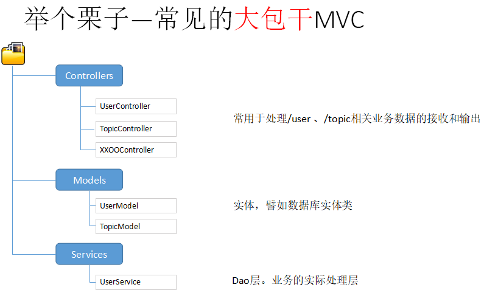
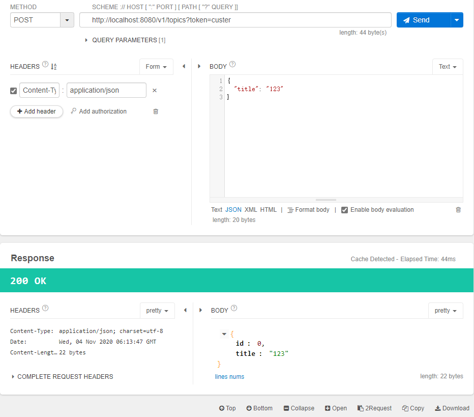

[toc]

### 01.最简单的服务启动

分几步
1、随便创建一个文件夹（不要有中文、空格和奇怪的字符串），比如 gin-basic

2、在 gin-basic下创建topic ，代表 话题相关API

3、cd进入topic执行:     `go mod init topic` 

4、在当前目录下执行    `go get  github.com/gin-gonic/gin`

5、用 goland 打开 topic 目录

```go
package main

import "github.com/gin-gonic/gin"

func main() {
	router := gin.Default()
	router.GET("/", func(c *gin.Context) {
		c.Writer.Write([]byte("Hello"))
	})
	router.Run() // 8080
}
```

返回 JSON 格式

```go
package main

import (
	"github.com/gin-gonic/gin"
	"net/http"
)

func main() {
	router := gin.Default()
	router.GET("/", func(c *gin.Context) {
		c.JSON(http.StatusOK, map[string]interface{}{
			"username": "custer",
		})
	})
	router.Run() // 8080
}
```

也可以这样修改

```go
package main

import (
	"github.com/gin-gonic/gin"
	"net/http"
)

func main() {
	m := make(map[string]interface{})
	m["username"] = "custer"
	router := gin.Default()
	router.GET("/", func(c *gin.Context) {
		c.JSON(http.StatusOK, m)
	})
	router.Run() // 8080
}
```

或这样实现

```go
package main

import (
	"github.com/gin-gonic/gin"
	"net/http"
)

type Topic struct {
	TopicID    int
	TopicTitle string
}

func main() {
	router := gin.Default()
	router.GET("/", func(c *gin.Context) {
		c.JSON(http.StatusOK, Topic{101, "话题标题"})
	})
	router.Run() // 8080
}
```

也可以使用内置的 `gin.H{}`

```go
package main

import (
	"github.com/gin-gonic/gin"
	"net/http"
)

func main() {
	router := gin.Default()
	router.GET("/", func(c *gin.Context) {
		c.JSON(http.StatusOK, gin.H{"TopicID": 101, "TopicTitle": "话题标题"})
	})
	router.Run() // 8080
}
```

### 02. API 的 URL 规则设计、带参数的路由

传统的一些API路径设计方式(仔细看看行不行)

- GET /topic/{topic_id} 获取帖子明细
- GET /topic/{user_name} 获取用户发布的帖子列表
- GET /topic/top 获取最热帖子列表

```go
package main

import (
	"github.com/gin-gonic/gin"
	"net/http"
)

func main() {
	router := gin.Default()
	router.GET("/topic/:topic_id", func(c *gin.Context) {
		c.String(http.StatusOK, "获取帖子ID为:%s", c.Param("topic_id"))
	})
	router.Run() // 8080
}
```

访问 http://localhost:8080/topic/12 可以看到 

>  获取帖子ID为:12

gin的路由使用的是httprouter库（请自行github一下）,性能好，相对功能够用。

但是目前不支持正则，也不支持 固定路径和参数路径共存。比如：

```go
package main

import (
	"github.com/gin-gonic/gin"
	"net/http"
)

func main() {
	router := gin.Default()
	router.GET("/topic/:topic_id", func(c *gin.Context) {
		c.String(http.StatusOK, "获取帖子ID为:%s", c.Param("topic_id"))
	})
	router.GET("/topic/top", func(c *gin.Context) {
		c.String(http.StatusOK, "获取最热帖子列表")
	})
	router.Run() // 8080
}
```

会出现错误

> panic: 'top' in new path '/topic/top' conflicts with existing wildcard ':topic_id' in existing prefix '/:topic_id'

`router.GET("/topic/:id", xxxoo)`
`router.GET("/topic/user", xxxoo)`

甚至 `"/topic/user/:username"`  也会冲突 

#### 重新设计API规则

1、api有版本信息
譬如
`/v1/xxxoo`
`/v2/xxxoo`

2、尽可能使用复数，且含义明确。名词最佳
  `/v1/topics`
  `/v1/users`
  `/v1/getusers`  //不推荐

3、 使用GET参数规划数据展现规则 
`/v1/users` //显示全部或默认条数
`/v1/users?limit=10`  //只显示10条

 `/v1/topics?username=xxxoo` //显示xxoo的帖子

```go
package main

import (
	"github.com/gin-gonic/gin"
)

func main() {
	router := gin.Default()
	router.GET("/v1/topics", func(c *gin.Context) {
		if c.Query("username") == "" {
			c.String(200, "获取帖子列表")
		} else {
			c.String(200, "获取用户=%s的帖子列表", c.Query("username"))
		}
	})
	router.GET("/v1/topics/:topic_id", func(c *gin.Context) {
		c.String(200, "获取topicid=%s的帖子", c.Param("topic_id"))
	})

	router.Run() // 8080
}
```

- 访问 http://localhost:8080/v1/topics 可以看到 `获取帖子列表`
- 访问 http://localhost:8080/v1/topics?username=custer 可以看到 `获取用户=custer的帖子列表`
- 访问 http://localhost:8080/v1/topics/12 可以看到 `获取topicid=12的帖子`

获取参数可以使用 `c.Query()` , 没有就返回为空，可以使用 `c.DefaultQuery("abc", 1)` 设置默认返回值。

### 03.是否要用 MVC 模式？




#### 路由分组

```go
package main

import (
	"github.com/gin-gonic/gin"
)

func main() {
	router := gin.Default()

	v1 := router.Group("/v1/topics")
	v1.GET("", func(c *gin.Context) {
		if c.Query("username") == "" {
			c.String(200, "获取帖子列表")
		} else {
			c.String(200, "获取用户=%s的帖子列表", c.Query("username"))
		}
	})
	v1.GET("/:topic_id", func(c *gin.Context) {
		c.String(200, "获取topicid=%s的帖子", c.Param("topic_id"))
	})

	router.Run() // 8080
}
```

使用代码块的方式区分作用域

```go
a:=1
if a == 1 {----------------------{
                    ============>   
}--------------------------------}
```

代码块和 v1 没有强关联但是可以很清晰的区分出来

```go
package main

import (
	"github.com/gin-gonic/gin"
)

func main() {
	router := gin.Default()

	v1 := router.Group("/v1/topics")
	{
		v1.GET("", func(c *gin.Context) {
			if c.Query("username") == "" {
				c.String(200, "获取帖子列表")
			} else {
				c.String(200, "获取用户=%s的帖子列表", c.Query("username"))
			}
		})
		v1.GET("/:topic_id", func(c *gin.Context) {
			c.String(200, "获取topicid=%s的帖子", c.Param("topic_id"))
		})
	}

	router.Run() // 8080
}
```

### 04. 简单 Dao 层代码封装

新建 `src` 目录，所有业务代码放入 `src` 目录下。

新建文件 话题相关的**数据库操作** ，`TopicDao.go`

```go
package src

import "github.com/gin-gonic/gin"

func GetTopicDetail(c *gin.Context) {
	c.String(200, "获取topicid=%s的帖子", c.Param("topic_id"))
}
```

修改路由，注意这里是不能加小括号的。否则变成执行 `GetTopicDetail` 函数了

```go
package main

import (
	"github.com/gin-gonic/gin"
	. "topic/src"
)

func main() {
	router := gin.Default()

	v1 := router.Group("/v1/topics")
	{
		v1.GET("/:topic_id", GetTopicDetail)
	}

	router.Run() // 8080
}

```

最简单的封装，实际业务放到单独的文件中。

#### 使用中间件模拟"鉴权"

之前我们的路由是

- `GET /v1/topics`  默认显示 所有 话题列表
- `GET /v1/topics?username=xxoo`  显示用户发表的帖子
- `GET /v1/topics/123` 显示帖子ID为123的详细内容

现在增加需求

- `POST /v1/topics`  外加JSON参数，即可进行帖子的新增 (注意，这玩意是需要登录的)
- `DELETE /v1/topics/123`  删除帖子 （注意这玩意儿也要登录）

接下来 我们现做简单的封装

`POST /v1/topics?token=xxxxxx`

比如需要登录的代码为

```go
func NewTopic(c *gin.Context) {
	// 判断登录
	c.String(200, "新增帖子")
}

func DeleteTopic(c *gin.Context) {
	// 判断登录
	c.String(200, "删除帖子")
}
```

路由

```go
package main

import (
	"github.com/gin-gonic/gin"
	. "topic/src"
)

func main() {
	router := gin.Default()

	v1 := router.Group("/v1/topics")
	{
		v1.GET("/:topic_id", GetTopicDetail)
		v1.POST("", NewTopic)
		v1.DELETE("/:topic_id", DeleteTopic)
	}

	router.Run() // 8080
}

```

使用 **gin** 的中间件,

```go
// MustLogin 必须登录
func MustLogin() gin.HandlerFunc {
	return func(c *gin.Context) {
		if _, status := c.GetQuery("token"); !status {
			c.String(http.StatusUnauthorized, "缺少 token 参数")
			c.Abort()
		} else {
			c.Next()
		}
	}
}
```

```go
package main

import (
	"github.com/gin-gonic/gin"
	. "topic/src"
)

func main() {
	router := gin.Default()

	v1 := router.Group("/v1/topics")
	{
		v1.GET("/:topic_id", GetTopicDetail)

		v1.Use(MustLogin())
		{
			v1.POST("", NewTopic)
			v1.DELETE("/:topic_id", DeleteTopic)
		}
	}

	router.Run() // 8080
}
```

- 访问 POST 请求 http://localhost:8080/v1/topics?token=123 可以看到 `新增帖子`
- 访问 DELETE 请求 http://localhost:8080/v1/topics/101?token=123 可以看到 `删除帖子`

### 05. 创建Model

创建帖子 model 文件 `TopicModel.go`

```go
package src

type Topic struct {
	TopicID    int
	TopicTitle string
}

// CreateTopic 临时创建实体
func CreateTopic(id int, title string) Topic {
	return Topic{id, title}
}
```

修改

```go
func GetTopicDetail(c *gin.Context) {
	c.JSON(200, CreateTopic(101, "帖子标题"))
}
```

访问 http://localhost:8080/v1/topics/123 可以看到 

```json
{
    "TopicID": 101,
    "TopicTitle": "帖子标题"
}
```

修改 `struct` 

```go
type Topic struct {
	TopicID    int    `json:"id"`
	TopicTitle string `json:"title"`
}
```

访问 http://localhost:8080/v1/topics/123 可以看到 

```json
{
    "id": 101,
    "title": "帖子标题"
}
```

#### 参数绑定Model的初步使用

1、query参数绑定 

```go
type TopicQuery struct {
	UserName string `json:"username" form:"username"`
	Page     int    `json:"page" form:"page" binding:"required"`
	PageSize int    `json:"pagesize" form:"pagesize"`
}
```

`form` (注意不是from)决定了绑定 `query` 参数的 `key` 到底是什么

修改函数 `GetTopicList`

```go
// GetTopicList 获取帖子列表
func GetTopicList(c *gin.Context) {
	query := TopicQuery{}
	err := c.BindQuery(&query)
	if err != nil {
		c.String(400, "参数错误:%s", err.Error())
	} else {
		c.JSON(200, query)
	}
}
```

路由

```go
package main

import (
	"github.com/gin-gonic/gin"
	. "topic/src"
)

func main() {
	router := gin.Default()

	v1 := router.Group("/v1/topics")
	{
		v1.GET("", GetTopicList)

		v1.GET("/:topic_id", GetTopicDetail)

		v1.Use(MustLogin())
		{
			v1.POST("", NewTopic)
			v1.DELETE("/:topic_id", DeleteTopic)
		}
	}

	router.Run() // 8080
}
```

访问 http://localhost:8080/v1/topics?username=custer&page=1&pagesize=10 可以看到

```json
{
    "username": "custer",
    "page": 1,
    "pagesize": 10
}
```

访问http://localhost:8080/v1/topics?username=custer&pagesize=10 可以看到

`参数错误:Key: 'TopicQuery.Page' Error:Field validation for 'Page' failed on the 'required' tag`

### 06. 内置验证器的初步使用

实现新增帖子

```go
func NewTopic(c *gin.Context) {
	topic := Topic{}
	err := c.BindJSON(&topic)
	if err != nil {
		c.String(400, "参数错误:%s", err.Error())
	} else {
		c.JSON(200, topic)
	}
}
```

`Topic` 结构体修改为

```go
type Topic struct {
	TopicID    int    `json:"id"`
	TopicTitle string `json:"title" binding:"required"`
}
```

访问 POST http://localhost:8080/v1/topics?token=custer 



#### POST参数绑定

**gin** 验证器来源于一个第三方库 https://github.com/go-playground/validator

文档 https://godoc.org/github.com/go-playground/validator

扩展下 `struct`

```go
type Topic struct {
	TopicID         int    `json:"id"`
	TopicTitle      string `json:"title" `
	TopicShortTitle string `json:"stitle"` // 短标题
	UserIP          string `json:"ip" `
	TopicScore      int    `json:"score"`
}
```

需求：

1、标题长度必须是4-----20 
2、短标题和 主标题 不能一样 `nefield`  必须一样使用 `eqfield`
3、userip必须是ipv4形式  
4、score要么不填`omitempty`，如果填必须大于5分

```go
type Topic struct {
	TopicID         int    `json:"id"`
	TopicTitle      string `json:"title"  binding:"min=4,max=20" `
	TopicShortTitle string `json:"stitle"  binding:"nefield=TopicTitle"`
	UserIP          string `json:"ip" binding:"ip4_addr"`
	TopicScore      int    `json:"score" binding:"omitempty,gt=5"`
}
```


