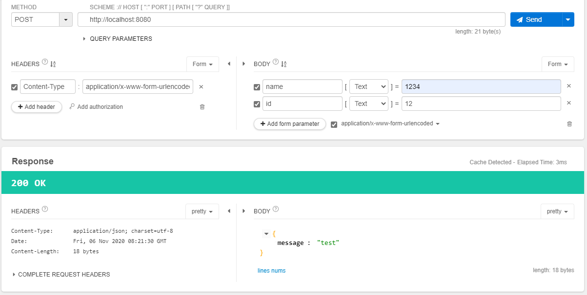

gin 开发代码技巧

[toc]

### 01. 实体定义技巧

最基础代码

```go
package main

import "github.com/gin-gonic/gin"

func main() {
	r := gin.New()
	r.GET("/", func(c *gin.Context) {
		
	})
}
```

其中 `func(c *gin.Context) {}` 可以封装成 `controller` 控制器单独处理业务。

比如最基本的实体定义代码如下

```go
package main

import "github.com/gin-gonic/gin"

type UserModel struct {
	UserID   int
	UserName string
}

func NewUserModel() *UserModel {
	return &UserModel{}
}

func main() {
	r := gin.New()
	r.GET("/", func(c *gin.Context) {
		user := NewUserModel()
		c.JSON(200, user)
	})
}
```

可以定义一个 `src` 目录，在 `src` 目录下再新建一个 `models` 目录，把所有的模型放入 `models` 里。

这样就可以把 `UserModel` 放入 `models` 文件夹里，这里建议再新建一个 `UserModel` 文件夹，

使用时可以 `package UserModel` 方便使用。

在 `UserModel` 文件夹里随便新建一个文件 `model.go`

```go
package UserModel

type UserModelImpl struct {
	UserID   int
	UserName string
}

func New() *UserModelImpl {
	return &UserModelImpl{}
}
```

这样再使用时 `UserModel.New()` 比较方便易懂

```go
package main

import (
	"ginskill/src/models/UserModel"
	"github.com/gin-gonic/gin"
)

func main() {
	r := gin.New()
	r.GET("/", func(c *gin.Context) {
		user := UserModel.New()
		c.JSON(200, user)
	})
	r.Run(":8080")
}
```

此时文件目录如下

```bash
└─src
    └─models
        └─UserModel
```

代码变动 [git commit](https://github.com/custer-go/learn-gin/commit/4c7bc60999f5ca8330e8f3041f06c1e91c404151#diff-2357d785d351a1c8beb39645ad84efb5d68e67b935ba83881b80a1e329ba2c64R1)

### 02. 实体带参数的初始化技巧

上面目录的好处就是借助包名 `UserModel.New()` 完成初始化，

如果希望对里面的属性进行赋值，有以下几种方式

#### 方案一：重写

```go
package UserModel

type UserModelImpl struct {
	UserID   int
	UserName string
}

func New() *UserModelImpl {
	return &UserModelImpl{}
}

func NewWithID(id int) *UserModelImpl {
	return &UserModelImpl{UserID: id}
}

func NewWithName(name string) *UserModelImpl {
	return &UserModelImpl{UserName: name}
}
```

#### 方案二：可变参数

新建 `attrs.go` 文件

```go
package UserModel

type UserModelAttrFunc func(u *UserModelImpl)

type UserModelAttrFuncs []UserModelAttrFunc

func (this UserModelAttrFuncs) Apply(u *UserModelImpl) {
	for _, f := range this {
		f(u)
	}
}
```

然后修改 `model.go` 文件为可变参数

```go
package UserModel

type UserModelImpl struct {
	UserID   int
	UserName string
}

func New(attrs ...UserModelAttrFunc) *UserModelImpl {
	u := &UserModelImpl{}
	// 对 u 里每个属性进行初始化
	// 强制类型转化。
	UserModelAttrFuncs(attrs).Apply(u)
	return u
}
```

这样在 `attrs.go` 中就可以对每个属性执行不同的初始化

```go
package UserModel

type UserModelAttrFunc func(u *UserModelImpl)

type UserModelAttrFuncs []UserModelAttrFunc

func WithUserID(id int) UserModelAttrFunc {
	return func(u *UserModelImpl) {
		u.UserID = id
	}
}
func WithUserName(name string) UserModelAttrFunc {
	return func(u *UserModelImpl) {
		u.UserName = name
	}
}

func (this UserModelAttrFuncs) Apply(u *UserModelImpl) {
	for _, f := range this {
		f(u)
	}
}
```

在初始化时 `user := UserModel.New()` 默认为空的初始化，实体实例化

`user := UserModel.New(UserModel.WithUserID(101))`

`user := UserModel.New(UserModel.WithUserID(101), UserModel.WithUserName("custer"))`

代码变动 [git commit](https://github.com/custer-go/learn-gin/commit/d5e05d62292d7ebbf732acd25c40a9470785d719#diff-2357d785d351a1c8beb39645ad84efb5d68e67b935ba83881b80a1e329ba2c64L8)

### 03. 链式调用

比如 `user := UserModel.New(UserModel.WithUserID(101))`  初始化之后还想修改属性 `user.Set()`

或者 `user := UserModel.New().UserID()` 这样只能修改一个属性，怎么修改多个属性

```go
package UserModel

type UserModelImpl struct {
	UserID   int
	UserName string
}

// New 初始化实例
func New(attrs ...UserModelAttrFunc) *UserModelImpl {
	u := &UserModelImpl{}
	// 对 u 里每个属性进行初始化
	// 强制类型转化。
	UserModelAttrFuncs(attrs).Apply(u)
	return u
}

// Mutate 修改实例属性
func (this *UserModelImpl) Mutate(attrs ...UserModelAttrFunc) *UserModelImpl {
	UserModelAttrFuncs(attrs).Apply(this)
	return this
}
```

调用

```go
package main

import (
   "ginskill/src/models/UserModel"
   "github.com/gin-gonic/gin"
)

func main() {
   r := gin.New()
   r.GET("/", func(c *gin.Context) {
      user := UserModel.New().
         Mutate(UserModel.WithUserID(3)).
         Mutate(UserModel.WithUserName("custer"))
      c.JSON(200, user)
   })
   r.Run(":8080")
}
```

也可以写成这样

```go
user := UserModel.New().
   Mutate(UserModel.WithUserID(3),
      UserModel.WithUserName("custer"))
```

代码变动 [git commit](https://github.com/custer-go/learn-gin/commit/6e55e5f9240b2f3b94a17539d1e6f7b341698b08#diff-2357d785d351a1c8beb39645ad84efb5d68e67b935ba83881b80a1e329ba2c64L8)

### 04. 参数验证和error处理:基本方法

修改模型 `model.go` 提交参数时表单的 `form` 是 `name`

```go
type UserModelImpl struct {
	UserID   int `json:"id"`
	UserName string `json:"name" form:"name" binding:"min=4"`
}
```

基本使用

```go
package main

import (
	"ginskill/src/models/UserModel"
	"github.com/gin-gonic/gin"
)

func main() {
	r := gin.New()
	r.POST("/", func(c *gin.Context) {
		user := UserModel.New()
		if err := c.ShouldBind(user); err != nil {
			c.JSON(400, gin.H{"message": err.Error()})
		} else {
			c.JSON(200, user)
		}
	})
	r.Run(":8080")
}
```

#### 封装错误返回中间件

在 `src` 目录下新建 `common` 文件夹，并新建 `middlewares.go` 文件

```go
package common

import "github.com/gin-gonic/gin"

// ErrorHandler 错误处理中间件
func ErrorHandler() gin.HandlerFunc {
	return func(c *gin.Context) {
		defer func() {
			if e := recover(); e != nil {
				c.JSON(400, gin.H{"message": e})
			}
		}()
		c.Next()
	}
}
```

在 `main` 中使用中间件

```go
package main

import (
	"ginskill/src/common"
	"ginskill/src/models/UserModel"
	"github.com/gin-gonic/gin"
)

func main() {
	r := gin.New()
	r.Use(common.ErrorHandler())
	r.POST("/", func(c *gin.Context) {
		user := UserModel.New()
		if err := c.ShouldBind(user); err != nil {
			panic(err.Error())
		} else {
			c.JSON(200, user)
		}
	})
	r.Run(":8080")
}
```

#### 封装单返回值的错误处理

新建文件夹 `result` , 新建文件`error_result.go`

```go
package result

type ErrorResult struct {
	err error
}

func (this *ErrorResult) Unwrap() interface{} {
	if this.err != nil {
		panic(this.err.Error())
	}
	return nil
}

func Result(err error) *ErrorResult {
	return &ErrorResult{err: err}
}
```

在 `main.go` 中就可以使用

```go
package main

import (
	"ginskill/src/common"
	"ginskill/src/models/UserModel"
	"ginskill/src/result"
	"github.com/gin-gonic/gin"
)

func main() {
	r := gin.New()
	r.Use(common.ErrorHandler())
	r.POST("/", func(c *gin.Context) {
		user := UserModel.New()
		result.Result(c.ShouldBind(user)).Unwrap()
		c.JSON(200, user)
	})
	r.Run(":8080")
}
```

代码变动 [git commit](https://github.com/custer-go/learn-gin/commit/7e59ef32fcc5aabeac308e16538b8dcaa484da0f#diff-2357d785d351a1c8beb39645ad84efb5d68e67b935ba83881b80a1e329ba2c64L1)

### 05. error处理技巧(2):支持多返回值

先定义一个 `test/test.go` 文件，返回两个值

```go
package test

import (
	"fmt"
	"github.com/gin-gonic/gin"
)

func GetInfo(id int) (gin.H, error) {
	if id > 10 {
		return gin.H{"message": "test"}, nil
	} else {
		return nil, fmt.Errorf("test error")
	}
}
```

修改错误的封装 `error_result.go` 支持两个返回值

```go
package result

import "fmt"

type ErrorResult struct {
	data interface{}
	err  error
}

func (this *ErrorResult) Unwrap() interface{} {
	if this.err != nil {
		panic(this.err.Error())
	}
	return this.data
}

func Result(vs ...interface{}) *ErrorResult {
	if len(vs) == 1 {
		if vs[0] == nil {
			return &ErrorResult{nil, nil}
		}
		if e, ok := vs[0].(error); ok {
			return &ErrorResult{nil, e}
		}
	}
	if len(vs) == 2 {
		if vs[1] == nil {
			return &ErrorResult{vs[0], nil}
		}
		if e, ok := vs[1].(error); ok {
			return &ErrorResult{vs[0], e}
		}
	}
	return &ErrorResult{nil, fmt.Errorf("error result format")}
}
```

修改 `main.go` 进行测试

```go
package main

import (
	"ginskill/src/common"
	"ginskill/src/models/UserModel"
	"ginskill/src/result"
	"ginskill/src/test"
	"github.com/gin-gonic/gin"
)

func main() {
	r := gin.New()
	r.Use(common.ErrorHandler())
	r.POST("/", func(c *gin.Context) {
		user := UserModel.New()
		result.Result(c.ShouldBind(user)).Unwrap()
		c.JSON(200, result.Result(test.GetInfo(user.UserID)).Unwrap())
	})
	r.Run(":8080")
}
```

在测试页面提交 POST 请求，



注意提交 `id` 参数，要在 `model.go` 中修改

```go
type UserModelImpl struct {
	UserID   int `json:"id" form:"id"`
	UserName string `json:"name" form:"name" binding:"min=4"`
}
```

代码变动 [git commit]()

### 06. JSON输出的封装技巧

模型验证 `result.Result(c.ShouldBind(user)).Unwrap()` 如果有错误就会被中间件处理 `r.Use(common.ErrorHandler())`，没有错误就返回 JSON `c.JSON(200, result.Result(test.GetInfo(user.UserID)).Unwrap())`

#### 封装 controller 控制器

在 `src` 目录下新建文件夹 `handlers` ，新建函数 `user_handler.go` 文件

```go
package handlers

import (
	"ginskill/src/models/UserModel"
	"ginskill/src/result"
	"ginskill/src/test"
	"github.com/gin-gonic/gin"
)

func UserList(c *gin.Context) {
	user := UserModel.New()
	result.Result(c.ShouldBind(user)).Unwrap()
	c.JSON(200, result.Result(test.GetInfo(user.UserID)).Unwrap())
}
```

修改 `main.go` 文件

```go
package main

import (
	"ginskill/src/common"
	"ginskill/src/handlers"
	"github.com/gin-gonic/gin"
)

func main() {
	r := gin.New()
	r.Use(common.ErrorHandler())
	r.POST("/users", handlers.UserList)
	r.Run(":8080")
}
```

#### 封装 JSON 输出

新建一个 `common_handler.go` 文件

```go
package handlers

import (
	"github.com/gin-gonic/gin"
	"sync"
)

type JSONResult struct {
	Message string      `json:"message"`
	Code    string      `json:"code"`
	Result  interface{} `json:"result"`
}

func NewJSONResult(message string, code string, result interface{}) *JSONResult {
	return &JSONResult{Message: message, Code: code, Result: result}
}

// 每次使用都需要初始化 JSONResult 实例，这个是没有必要的，所以把相关内容放入到 临时对象池
// 临时对象池
var ResultPool *sync.Pool

func init() {
	ResultPool = &sync.Pool{
		New: func() interface{} {
			return NewJSONResult("", "", nil)
		},
	}
}

type ResultFunc func(message string, code string, result interface{})

// 定义函数对 {message: "xxx", code: "10001", result: nil} 进行封装
func OK(c *gin.Context) ResultFunc {
	return func(message string, code string, result interface{}) {
		r := ResultPool.Get().(*JSONResult)
		defer ResultPool.Put(r)
		r.Message = message
		r.Code = code
		r.Result = result
		c.JSON(200, r)
	}
}
```

在 `user_handler.go` 中使用

```go
package handlers

import (
	"ginskill/src/models/UserModel"
	"ginskill/src/result"
	"ginskill/src/test"
	"github.com/gin-gonic/gin"
)

func UserList(c *gin.Context) {
	user := UserModel.New()
	result.Result(c.ShouldBind(user)).Unwrap()
	OK(c)("user_list", "10000", result.Result(test.GetInfo(user.UserID)).Unwrap())
}
```

代码变动 [git commit](https://github.com/custer-go/learn-gin/commit/8341e85c43b8667f4457c74ad950310451a902aa#diff-2357d785d351a1c8beb39645ad84efb5d68e67b935ba83881b80a1e329ba2c64L2)

### 07. JSON输出的封装技巧(2):进阶

当在业务处理中返回出错的 `JSON` 信息时，如下

```go
package handlers

import (
	"ginskill/src/models/UserModel"
	"ginskill/src/result"
	"github.com/gin-gonic/gin"
)

func UserList(c *gin.Context) {
	user := UserModel.New()
	result.Result(c.ShouldBind(user)).Unwrap()
	if user.UserID > 10 {
		OK(c)("user_list", "10000", "user_list")
	} else {
		Error(c)("user_list", "10000", "error")
	}
}
```

在 `comment_handler.go` 中可以添加 `Error()` 处理函数

```go
// Error 返回出错的 JSON 业务
func Error(c *gin.Context) ResultFunc {
	return func(message string, code string, result interface{}) {
		r := ResultPool.Get().(*JSONResult)
		defer ResultPool.Put(r)
		r.Message = message
		r.Code = code
		r.Result = result
		c.JSON(400, r)
	}
}
```

上面代码与 `OK()` 函数基本重复，不同的地方在于 `c.JSON(400, r)`

封装

```go
package handlers

import (
	"fmt"
	"github.com/gin-gonic/gin"
	"sync"
)

type JSONResult struct {
	Message string      `json:"message"`
	Code    string      `json:"code"`
	Result  interface{} `json:"result"`
}

func NewJSONResult(message string, code string, result interface{}) *JSONResult {
	return &JSONResult{Message: message, Code: code, Result: result}
}

// 每次使用都需要初始化 JSONResult 实例，这个是没有必要的，所以把相关内容放入到 临时对象池
// 临时对象池
var ResultPool *sync.Pool

func init() {
	ResultPool = &sync.Pool{
		New: func() interface{} {
			return NewJSONResult("", "", nil)
		},
	}
}

type ResultFunc func(message string, code string, result interface{}) func(output Output)
type Output func(c *gin.Context, v interface{})

// 定义函数对 {message: "xxx", code: "10001", result: nil} 进行封装
// R 装饰 ResultFunc，返回 Output 函数
func R(c *gin.Context) ResultFunc {
	return func(message string, code string, result interface{}) func(output Output) {
		r := ResultPool.Get().(*JSONResult)
		defer ResultPool.Put(r)
		r.Message = message
		r.Code = code
		r.Result = result
		//c.JSON(200, r)
		return func(output Output) {
			output(c, r)
		}
	}
}

func OK(c *gin.Context, v interface{}) {
	c.JSON(200, v)
}

func Error(c *gin.Context, v interface{}) {
	c.JSON(400, v)
}
func OK2String(c *gin.Context, v interface{}) {
	c.String(200, fmt.Sprintf("%v", v))
}
```

**对象值的赋值** 和 **输出** 进行了分离

```go
package handlers

import (
	"ginskill/src/models/UserModel"
	"ginskill/src/result"
	"github.com/gin-gonic/gin"
)

func UserList(c *gin.Context) {
	user := UserModel.New()
	result.Result(c.ShouldBind(user)).Unwrap()
	if user.UserID > 10 {
		R(c)("user_list", "10000", "user_list")(OK)
	} else {
		R(c)("user_list", "10000", "error")(Error)
	}
}
```

代码变动 [git commit](https://github.com/custer-go/learn-gin/commit/4132c2860307c6bad1b60ac578e345078d575a75#diff-dde14bd9dc13d0834cd238ae4a9826e100a31a87778f29768b28fefa2b2ada91L1)

### 08. Gorm V2学习:基本初始化

安装

`go get -u gorm.io/gorm`

`go get -u gorm.io/driver/mysql`

连接到数据库

```go
var Orm *gorm.DB

func InitDB() {
	Orm = gormDB()
}
func gormDB() *gorm.DB {
	// 参考 https://github.com/go-sql-driver/mysql#dsn-data-source-name 获取详情
	dsn := "user:pass@tcp(127.0.0.1:3306)/dbname?charset=utf8mb4&parseTime=True&loc=Local"
	db, err := gorm.Open(mysql.Open(dsn), &gorm.Config{})
	if err != nil {
		log.Fatal(err)
	}
	// 获取通用数据库对象 sql.DB ，然后使用其提供的功能
	sqlDB, err := db.DB()
	if err != nil {
		log.Fatal(err)
	}
	// SetMaxIdleConns 用于设置连接池中空闲连接的最大数量。
	sqlDB.SetMaxIdleConns(10)
	// SetMaxOpenConns 设置打开数据库连接的最大数量。
	sqlDB.SetMaxOpenConns(100)
	// SetConnMaxLifetime 设置了连接可复用的最大时间。
	sqlDB.SetConnMaxLifetime(time.Hour)
	return db
}
```

实体名和表明没有关联关系

```go
package UserModel

type UserModelImpl struct {
	UserID   int    `json:"id" form:"id"`
	UserName string `json:"name" form:"name" binding:"min=4"`
}

func (*UserModelImpl) TableName() string {
	return "users"
}
```

### 09. 操作单表查询的代码封装和技巧(1)

创建文件夹 `data` 所有数据从这个文件夹中取，在 `data` 下新建文件夹 `getter` 表示取数据。

在 `src/data/getter` 目录下新建 `user_getter.go` 文件，表示获取用户相关数据。

```go
package getter

import (
	"ginskill/src/dbs"
	"ginskill/src/models/UserModel"
)

// 对外使用的接口
var UserGetter IUserGetter

func init() {
	UserGetter = NewUserGetterImpl() // 业务更改，可以更换实现类
}

// IUserGetter 接口
type IUserGetter interface {
	GetUserList() []*UserModel.UserModelImpl // 返回实体列表
}

// UserGetterImpl 实现 IUserGetter 接口
type UserGetterImpl struct{}

// NewUserGetterImpl IUserGetter 接口的实现类
func NewUserGetterImpl() *UserGetterImpl {
	return &UserGetterImpl{}
}

// GetUserList 实现
func (this *UserGetterImpl) GetUserList() (users []*UserModel.UserModelImpl) {
	dbs.Orm.Find(&users)
	return
}

```

这样实现方式变动了也没有关系，因为这里一律操作的都是接口。

在 `user_handler.go` 中调用

```go
package handlers

import (
	"ginskill/src/data/getter"
	"github.com/gin-gonic/gin"
)

func UserList(c *gin.Context) {
	R(c)(
		"get_user_list",
		"10001",
		getter.UserGetter.GetUserList(),
	)(OK)
}
```

代码变动 [git commit](https://github.com/custer-go/learn-gin/commit/f418601fe5c49ba8abbf37cf5d3f83bc46cf97ea#diff-2357d785d351a1c8beb39645ad84efb5d68e67b935ba83881b80a1e329ba2c64L3)

### 10. 操作单表查询的代码封装和技巧（2）

获取用户详情 GET `/users/:id` 

#### 第1步：新建路由

```go
func main() {
	dbs.InitDB()

	r := gin.New()
	r.Use(common.ErrorHandler())
	r.GET("/users", handlers.UserList)
	r.GET("/users/:id", handlers.UserDetail)
	r.Run(":8080")
}

```

#### 第2步：handler 处理函数

```go
// UserDetail 获取用户详情
func UserDetail(c *gin.Context) {
	// id := c.Param("id") 判断
	// 1. 获取 id
	id := &struct { // 使用匿名 struct 简化判断
		ID int `uri:"id" binding:"required,gt=1"`
	}{}
	// 2. 绑定
	result.Result(c.ShouldBindUri(id)).Unwrap() // 如果出错会发生panic然后被中间件捕捉
	// 3. 取值
	R(c)(
		"get_user_detail",
		"10001",
		getter.UserGetter.GetUserByID(id.ID).Unwrap(),
	)(OK)
}
```

#### 第3步：获取数据接口

```go
package getter

import (
	"fmt"
	"ginskill/src/dbs"
	"ginskill/src/models/UserModel"
	"ginskill/src/result"
)

// 对外使用的接口
var UserGetter IUserGetter

func init() {
	UserGetter = NewUserGetterImpl() // 业务更改，可以更换实现类
}

// IUserGetter 接口
type IUserGetter interface {
	GetUserList() []*UserModel.UserModelImpl // 返回实体列表
	GetUserByID(id int) *result.ErrorResult
}

// UserGetterImpl 实现 IUserGetter 接口
type UserGetterImpl struct{}

// NewUserGetterImpl IUserGetter 接口的实现类
func NewUserGetterImpl() *UserGetterImpl {
	return &UserGetterImpl{}
}

// GetUserList 实现
func (this *UserGetterImpl) GetUserList() (users []*UserModel.UserModelImpl) {
	dbs.Orm.Find(&users)
	return
}

// GetUserByID 通过 id 获取 user 数据
func (this *UserGetterImpl) GetUserByID(id int) *result.ErrorResult {
	user := UserModel.New()
	db := dbs.Orm.Where("user_id=?", id).Find(user)
	if db.Error != nil || db.RowsAffected == 0 {
		return result.Result(nil, fmt.Errorf("not found user, id = %d", id))
	}
	return result.Result(user, nil)
}
```

代码变动 [git commit ](https://github.com/custer-go/learn-gin/commit/58e631a8c5549eb0cc5629dc1750ef741e678618#diff-2357d785d351a1c8beb39645ad84efb5d68e67b935ba83881b80a1e329ba2c64L13)

### 11. gin自定义验证(1):基本写法

查看在 [gin-basic 中的自定义验证函数 topicurl](https://github.com/custer-go/learn-gin/tree/main/01.gin-basic#07-%E8%87%AA%E5%AE%9A%E4%B9%89%E9%AA%8C%E8%AF%81%E5%99%A8%E7%BB%93%E5%90%88%E6%AD%A3%E5%88%99%E9%AA%8C%E8%AF%81json%E5%8F%82%E6%95%B0)

修改用户模型 `UserModelImpl`

```go
type UserModelImpl struct {
	UserID      int    `json:"id" form:"id"`
	UserName    string `json:"name" form:"name" binding:"required,UserName"`
	UserPwd     string `json:"user_pwd" binding:"required,min=4"`
	UserAddtime string `json:"addtime"`
}
```

自定义验证，比如是专门针对用户名做的一些验证规则，把他们写入专门的自定义函数里面

官方文档的自定义验证： https://github.com/gin-gonic/gin#custom-validators

在 `src` 目录下新建文件夹 `validators` 放所有的验证。

新建文件 `common.go`

```go
package validators

import (
	"github.com/gin-gonic/gin/binding"
	"github.com/go-playground/validator/v10"
	"log"
)

var myvalid *validator.Validate

func init() {
	if v, ok := binding.Validator.Engine().(*validator.Validate); ok {
		myvalid = v
	} else {
		log.Fatal("error validator")
	}
}
```

在包内使用，比如在 `username.go` 文件中自定义验证

```go
package validators

import (
	"github.com/go-playground/validator/v10"
	"log"
)

func init() {
	if err := myvalid.RegisterValidation("UserName", VUserName); err != nil {
		log.Fatal("validator UserName error")
	}
}

var VUserName validator.Func = func(fl validator.FieldLevel) bool {
	uname, ok := fl.Field().Interface().(string) // 断言
	if ok && len(uname) >= 4 {
		return true
	}
	return false // true 表示验证通过，false 表示验证不通过
}
```

在 `main.go` 中引用新建的 `validator` 包，初始化 `init` 函数，注册自定义的验证函数。

```go
package main

import (
	"ginskill/src/common"
	"ginskill/src/dbs"
	"ginskill/src/handlers"
	_ "ginskill/src/validators" // 不调用，仅引用，执行 init 函数即可
	"github.com/gin-gonic/gin"
)

func main() {
	dbs.InitDB()

	r := gin.New()
	r.Use(common.ErrorHandler())
	r.GET("/users", handlers.UserList)
	r.GET("/users/:id", handlers.UserDetail)
	r.POST("/users", handlers.UserSave)
	r.Run(":8080")
}
```

处理保存的逻辑`UserSave()`

```go
func UserSave(c *gin.Context) {
	u := UserModel.New()
	result.Result(c.ShouldBindJSON(u)).Unwrap()
	R(c)(
		"save_user",
		"10001",
		"true",
	)(OK)
}
```

代码变动 [git commit](https://github.com/custer-go/learn-gin/commit/5fc540f6c3351b31146ea8aef2164cde158d9747#diff-2357d785d351a1c8beb39645ad84efb5d68e67b935ba83881b80a1e329ba2c64L4)

### 12. gin自定义验证(2):进阶封装自定义验证

针对字段的专项验证器

比如针对用户名的规则比较多，有本身 `tag` 的验证，还有自定义的验证。

可以把所有相关用户名验证的相关规则，全部封装到 `UserName` 里面。

在自定义验证规则 `username.go` 文件中修改代码，这样每个字段的自定义验证有专门的文件。

```go
package validators

import (
	"github.com/go-playground/validator/v10"
)

// init 注册自定义验证
func init() {
	// tag 规则强制转换为自定义的规则名 UserName
	registerValidation("UserName", UserName("required,min=4").toFunc())
}

// UserName 就是规则
type UserName string // 用户名是 string 类型

// 针对用户名的验证规则
func (this UserName) toFunc() validator.Func {
	return func(fl validator.FieldLevel) bool {
		v, ok := fl.Field().Interface().(string) // 断言
		if ok {
			return this.validate(v)
		}
		return false
	}
}

func (this UserName) validate(v string) bool {
	// 本身的 tag 验证
	if err := myvalid.Var(v, string(this)); err != nil { // 单字段验证
		return false
	}
	// 其他自定义验证
	if len(v) > 8 {
		return false
	}
	return true
}
```

注册自定义验证的封装在 `common.go` 文件中。

```go
package validators

import (
	"fmt"
	"github.com/gin-gonic/gin/binding"
	"github.com/go-playground/validator/v10"
	"log"
)

var myvalid *validator.Validate

func init() {
	if v, ok := binding.Validator.Engine().(*validator.Validate); ok {
		myvalid = v
	} else {
		log.Fatal("error validator")
	}
}

func registerValidation(tag string, fn validator.Func) {
	err := myvalid.RegisterValidation(tag, fn)
	if err != nil {
		log.Fatal(fmt.Sprintf("validator %s error", tag))
	}
}
```

代码变动 [git commit](https://github.com/custer-go/learn-gin/commit/16bc57ef72d26a034a769d90f5e6be7e61f0dfe4#diff-d67aa6c13b62099661bc3de53c44d17c170c00618d34432b6681e8dadf1583e4L1)

### 13. gin自定义验证(3):自定义验证错误信息

可以使用官方提供的方法，也可以使用 `gin` 中间件完成。

在错误拦截的中间件 `error_result.go` 中新增匹配自定义验证失败的错误提示

```go
func (this *ErrorResult) Unwrap() interface{} {
	if this.err != nil {
		validators.CheckErrors(this.err) // 如果匹配到这里就会 panic
		panic(this.err.Error())          // 没有匹配到继续走这个 panic
	}
	return this.data
}
```

在 `src/validators/common.go` 中 `CheckErrors` 断言是否是验证错误

```go
package validators

import (
	"fmt"
	"github.com/gin-gonic/gin/binding"
	"github.com/go-playground/validator/v10"
	"log"
)

var myvalid *validator.Validate
var validatorError map[string]string

func init() {
	// 包初始化时 make，所以在运行过程中不会增加或减少，所以是线程安全的。
	validatorError = make(map[string]string)
	if v, ok := binding.Validator.Engine().(*validator.Validate); ok {
		myvalid = v
	} else {
		log.Fatal("error validator")
	}
}

func registerValidation(tag string, fn validator.Func) {
	err := myvalid.RegisterValidation(tag, fn)
	if err != nil {
		log.Fatal(fmt.Sprintf("validator %s error", tag))
	}
}

// CheckErrors 断言是否是验证错误
func CheckErrors(errors error) {
	if errs, ok := errors.(validator.ValidationErrors); ok {
		for _, err := range errs { // 如果是验证错误，看有没有自定义的错误信息
			if v, exists := validatorError[err.Tag()]; exists {
				panic(v)
			}
		}
	}
}

// tagErrMsg 默认的 tag 出错信息
func tagErrMsg() {
	validatorError["min"] = "位数太少"
}
```

自定义的错误信息

```go
package validators

import (
	"github.com/go-playground/validator/v10"
)

// init 注册自定义验证
func init() {
  tagErrMsg()
	// tag 规则强制转换为自定义的规则名 UserName
	registerValidation("UserName", UserName("required,min=4").toFunc())
}

// UserName 就是规则
type UserName string // 用户名是 string 类型

// 针对用户名的验证规则
func (this UserName) toFunc() validator.Func {
	validatorError["UserName"] = "用户名必须在4-8位之间" // 自定义出错信息
	return func(fl validator.FieldLevel) bool {
		v, ok := fl.Field().Interface().(string) // 断言
		if ok {
			return this.validate(v)
		}
		return false
	}
}

func (this UserName) validate(v string) bool {
	// 本身的 tag 验证
	if err := myvalid.Var(v, string(this)); err != nil { // 单字段验证
		return false
	}
	// 其他自定义验证
	if len(v) > 8 {
		return false
	}
	return true
}
```

代码变动 [git commit](https://github.com/custer-go/learn-gin/commit/3280b06c33c1206a51ca831d5e583abc2c931ce0#diff-1b4ce57cb768ca202c0a42ede0c0f70ea0abaeb68b8a212e951e3a595965b03dL1)

### 14. DB查询技巧(1):使用SQL拼装工具

之前使用的 `gorm` 语句 `dbs.Orm.Find(&users)`，这里使用 `SQL` 拼接工具，把代码重构下。

好处是 1. 复杂 `SQL` 可以直接使用原生，2. `orm` 更换不需要大的改动。

第三方库地址: https://github.com/Masterminds/squirrel

`go get -u github.com/Masterminds/squirrel` 

新建个测试文件 `test.go` 来看下基本使用

```go
package main

import (
	"fmt"
	"github.com/Masterminds/squirrel"
)

func main() {
	fmt.Println(squirrel.Select("user_id", "user_name").
		From("users").
		Where("user_id=?", 123).
		OrderBy("user_id desc").
		Limit(10).ToSql())
}
```

运行 `go run test.go` 可以看到控制台信息：

`SELECT user_id, user_name FROM users WHERE user_id=? ORDER BY user_id desc LIMIT 10 [123] <nil>`

返回3个值，第1个是 sql 语句，第2个是参数为 `[]interface{}` ，第3个是错误。

之前获取用户数据的相关操作在 `src/data/getter/user_getter.go` 文件中，

现在我们对获取数据进行封装，在 `src/data` 目录下新建 `mappers`，放和 `SQL` 相关的内容。

新建文件 `user_mapper.go`

```go
package mappers

import "github.com/Masterminds/squirrel"

type UserMapper struct{}

func (*UserMapper) GetUserList() *SqlMapper {
	return Mapper(squirrel.Select("user_id", "user_name").
		From("users").
		OrderBy("user_id desc").
		Limit(10).ToSql())
}
```

`GetUserList()` 返回的就是 `sql` 语句，使用 `sql` 拼接工具，就是 

`squirrel.Select("user_id", "user_name").
		From("users").
		Where("user_id=?", 123).
		OrderBy("user_id desc").
		Limit(10).ToSql()`

可以把返回的前两个参数保存到 `strcut` 中，最后一个参数错误可以用中间件处理。

因此这里再写一个保存到自定义 `struct` 的文件 `sql_mapper.go` 通用类。

```go
package mappers

type SqlMapper struct {
	Sql  string
	Args []interface{}
}

func NewSqlMapper(sql string, args []interface{}) *SqlMapper {
	return &SqlMapper{Sql: sql, Args: args}
}

// Mapper 转换返回值生成 SqlMapper
func Mapper(sql string, args []interface{}, err error) *SqlMapper {
	if err != nil {
		panic(err.Error())
	}
	return NewSqlMapper(sql, args)
}
```

到这里，`GetUserList()` 就完成了封装，在 `src/data/getter/user_getter.go` 中修改代码

```go
package getter

import (
	"fmt"
	"ginskill/src/data/mappers"
	"ginskill/src/dbs"
	"ginskill/src/models/UserModel"
	"ginskill/src/result"
)

// 对外使用的接口
var UserGetter IUserGetter

func init() {
	UserGetter = NewUserGetterImpl() // 业务更改，可以更换实现类
}

// IUserGetter 接口
type IUserGetter interface {
	GetUserList() []*UserModel.UserModelImpl // 返回实体列表
	GetUserByID(id int) *result.ErrorResult
}

// UserGetterImpl 实现 IUserGetter 接口
type UserGetterImpl struct {
	// 注入 UserMapper
	userMapper *mappers.UserMapper
}

// NewUserGetterImpl IUserGetter 接口的实现类
func NewUserGetterImpl() *UserGetterImpl {
	return &UserGetterImpl{userMapper: &mappers.UserMapper{}} // 在构造函数中赋值
}

// GetUserList 实现
func (this *UserGetterImpl) GetUserList() (users []*UserModel.UserModelImpl) {
	//dbs.Orm.Find(&users)
	sqlMapper := this.userMapper.GetUserList()
	dbs.Orm.Raw(sqlMapper.Sql, sqlMapper.Args).Find(&users) // 不管这个 ORM 是 gorm 还是 xorm 都可以执行原生 sql
	return
}

// GetUserByID 通过 id 获取 user 数据
func (this *UserGetterImpl) GetUserByID(id int) *result.ErrorResult {
	user := UserModel.New()
	db := dbs.Orm.Where("user_id=?", id).Find(user)
	if db.Error != nil || db.RowsAffected == 0 {
		return result.Result(nil, fmt.Errorf("not found user, id = %d", id))
	}
	return result.Result(user, nil)
}
```

代码变动 [git commit ](https://github.com/custer-go/learn-gin/commit/c1e9bc2ab2a4857e909039963351807628dcafd1#diff-ea201d1f4c74f3879aa9afde55923f139e932bc2b6c6f447e25959395db3fab8L2)

### 15. DB查询技巧(2):进一步简化SQL调用

上面拼接 `sql` 并手动调用 `orm` 可以进一步封装

`sqlMapper := this.userMapper.GetUserList()`

`dbs.Orm.Raw(sqlMapper.Sql, sqlMapper.Args).Find(&users)`

首先对 `SqlMapper` 进行扩展

```go
// File: src/data/mapper/sql_mapper.go
package mappers

import (
	"ginskill/src/dbs"
	"gorm.io/gorm"
)

type SqlMapper struct {
	Sql  string
	Args []interface{}
}

func NewSqlMapper(sql string, args []interface{}) *SqlMapper {
	return &SqlMapper{Sql: sql, Args: args}
}

// Mapper 转换返回值生成 SqlMapper
func Mapper(sql string, args []interface{}, err error) *SqlMapper {
	if err != nil {
		panic(err.Error())
	}
	return NewSqlMapper(sql, args)
}

// Query 对 SqlMapper 进行查询的封装
func (this *SqlMapper) Query() *gorm.DB {
	return dbs.Orm.Raw(this.Sql, this.Args)
}

// Exec 对 SqlMapper 进行执行 update/delete/inset 的封装
func (this *SqlMapper) Exec() *gorm.DB {
	return dbs.Orm.Exec(this.Sql, this.Args...)
}
```

这样就可以直接执行 `this.userMapper.GetUserList().Query().Find(&users)`

```go
// GetUserList 实现
func (this *UserGetterImpl) GetUserList() (users []*UserModel.UserModelImpl) {
	//dbs.Orm.Find(&users)
	//sqlMapper := this.userMapper.GetUserList()
	//dbs.Orm.Raw(sqlMapper.Sql, sqlMapper.Args).Find(&users) // 不管这个 ORM 是 gorm 还是 xorm 都可以执行原生 sql
	this.userMapper.GetUserList().Query().Find(&users)
	return
}
```

再对获取用户详情也进行修改

```go
// File: src/data/mappers/user_mapper.go
package mappers

import "github.com/Masterminds/squirrel"

type UserMapper struct{}

func (*UserMapper) GetUserList() *SqlMapper {
	return Mapper(squirrel.Select("user_id", "user_name").
		From("users").
		OrderBy("user_id desc").
		Limit(10).ToSql())
}

func (*UserMapper) GetUserDetail(id int) *SqlMapper {
	return Mapper(squirrel.Select("user_id", "user_name").
		From("users").Where("user_id=?", id).ToSql())
}
```

这样获取用户详情的 orm 操作也可以统一

```go
// File: src/data/getter/user_getter.go
package getter

import (
	"fmt"
	"ginskill/src/data/mappers"
	"ginskill/src/models/UserModel"
	"ginskill/src/result"
)

// 对外使用的接口
var UserGetter IUserGetter

func init() {
	UserGetter = NewUserGetterImpl() // 业务更改，可以更换实现类
}

// IUserGetter 接口
type IUserGetter interface {
	GetUserList() []*UserModel.UserModelImpl // 返回实体列表
	GetUserByID(id int) *result.ErrorResult
}

// UserGetterImpl 实现 IUserGetter 接口
type UserGetterImpl struct {
	// 注入 UserMapper
	userMapper *mappers.UserMapper
}

// NewUserGetterImpl IUserGetter 接口的实现类
func NewUserGetterImpl() *UserGetterImpl {
	return &UserGetterImpl{userMapper: &mappers.UserMapper{}} // 在构造函数中赋值
}

// GetUserList 实现
func (this *UserGetterImpl) GetUserList() (users []*UserModel.UserModelImpl) {
	//dbs.Orm.Find(&users)
	//sqlMapper := this.userMapper.GetUserList()
	//dbs.Orm.Raw(sqlMapper.Sql, sqlMapper.Args).Find(&users) // 不管这个 ORM 是 gorm 还是 xorm 都可以执行原生 sql
	this.userMapper.GetUserList().Query().Find(&users)
	return
}

// GetUserByID 通过 id 获取 user 数据
func (this *UserGetterImpl) GetUserByID(id int) *result.ErrorResult {
	user := UserModel.New()
	//db := dbs.Orm.Where("user_id=?", id).Find(user)
	db := this.userMapper.GetUserDetail(id).Query().Find(user)
	if db.Error != nil || db.RowsAffected == 0 {
		return result.Result(nil, fmt.Errorf("not found user, id = %d", id))
	}
	return result.Result(user, nil)
}
```

代码变动  [git commit ](https://github.com/custer-go/learn-gin/commit/edd4d31d03e72f9d463b9ae4dbc395fee17ef5a0#diff-ea201d1f4c74f3879aa9afde55923f139e932bc2b6c6f447e25959395db3fab8L3)

### 16. DB查询技巧(3):新增数据练习

练习新增数据，来到 `main.go` 首先对新增 `hanlder` 进行处理。

之前在 `src/handlers/user_handler.go` 中强制返回 `true`

```go
func UserSave(c *gin.Context) {
	u := UserModel.New()
	result.Result(c.ShouldBindJSON(u)).Unwrap()
	R(c)(
		"save_user",
		"10001",
		"true",
	)(OK)
}
```

第1步，来到 `src/data/mappers/user_mapper.go` 增加新增用户的 `sql` 

```go
// AddNewUser 新增用户，传入用户实体
func (*UserMapper) AddNewUser(user *UserModel.UserModelImpl) *SqlMapper {
	return Mapper(squirrel.Insert(user.TableName()).
		Columns("user_name", "user_pwd", "user_addtime").
		Values(user.UserName, user.UserPwd, time.Now()).ToSql())
}
```

新增数据，在 `src/data` 目录下新增 `setter` 目录，新增 `user_setter.go` 文件

```go
package setter

import (
	"ginskill/src/data/mappers"
	"ginskill/src/models/UserModel"
	"ginskill/src/result"
)

var UserSetter IUserSetter

func init() {
	UserSetter = NewUserSetterImpl()
}

type IUserSetter interface {
	SaveUser(impl *UserModel.UserModelImpl) *result.ErrorResult
}

type UserSetterImpl struct {
	userMapper *mappers.UserMapper
}

func NewUserSetterImpl() *UserSetterImpl {
	return &UserSetterImpl{userMapper: &mappers.UserMapper{}}
}

func (this *UserSetterImpl) SaveUser(user *UserModel.UserModelImpl) *result.ErrorResult  {
	ret := this.userMapper.AddNewUser(user).Exec()
	return result.Result(ret.RowsAffected, ret.Error)
}
```

最后修改 `handler` 

```go
func UserSave(c *gin.Context) {
	u := UserModel.New()
	result.Result(c.ShouldBindJSON(u)).Unwrap()
	R(c)(
		"save_user",
		"10001",
		setter.UserSetter.SaveUser(u).Unwrap(),
	)(OK)
}
```

代码变动 [git commit]()

