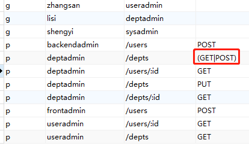
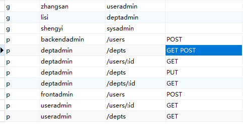

### 策略数据:

表示 部门管理员 可以对 depts 路由 进行 GET 和 POST 请求。

p    deptadmin    /depts    GET

p    deptadmn    /depts    POST

### 两种方案

#### 使用 casbin 内置 RegexMatch(k1,k2) 函数，k2 是正则。

具体写法 regexMatch(r.act, p.act)

假设 r.act 是 GET，并假设 p.act 是 POST 和 GET

这好比 r.act 是符合 p.act 的正则匹配。

```bash
[request_definition]
r = sub, obj, act

[policy_definition] 
p = sub, obj, act

[role_definition]
g = _, _

[policy_effect]
e = some(where (p.eft == allow))
                                                       修改为正则匹配
[matchers]                                        ↓ ↓ ↓ ↓ ↓ ↓ ↓ ↓ ↓ ↓ ↓ ↓
m = g(r.sub, p.sub) && keyMatch2(r.obj, p.obj) && regexMatch(r.act, p.act) 
```



#### 自定义匹配函数



```go
// File: matchers.go
package lib

import (
	"fmt"
	"strings"
)

func init() {
	E.AddFunction("methodMatch", func(arguments ...interface{}) (i interface{}, e error) {
		if len(arguments) == 2 {
			k1, k2 := arguments[0].(string), arguments[1].(string)
			return MethodMatch(k1, k2), nil
		}
		return nil, fmt.Errorf("methodMatch failed.")
	})

}

// 自定义匹配函数 匹配空格
func MethodMatch(key1 string, key2 string) bool {
	ks := strings.Split(key2, " ")
	for _, s := range ks {
		if s == key1 {
			return true
		}
	}
	return false
}
```

```go
[request_definition]
r = sub, obj, act

[policy_definition] 
p = sub, obj, act

[role_definition]
g = _, _

[policy_effect]
e = some(where (p.eft == allow))
                                                       修改为正则匹配
[matchers]                                        ↓ ↓ ↓ ↓ ↓ ↓ ↓ ↓ ↓ ↓ ↓ ↓
m = g(r.sub, p.sub) && keyMatch2(r.obj, p.obj) && methodMatch(r.act, p.act) 
```

