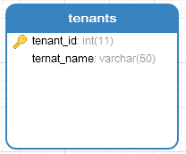
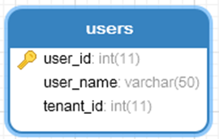
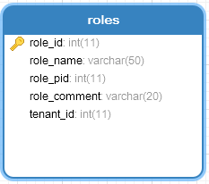
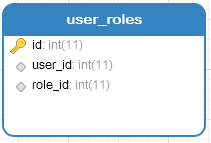
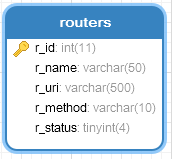
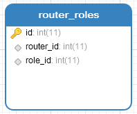

##   基本模式

1. 独立数据库（database）

每个租户有不同数据库，数据隔离级别最高，但成本也高

2. 共享数据库，隔离数据架构（scheme、表）

多个或所有租户共享同一个数据库，但每个租户有不同的数据表

3. 共享数据表和数据结构

共用同一张表，通过 tenantID 区分租户的数据。这种方案成本最低，共享程度最高，隔离级别最低。

### 之前的表


| **User_id** | **User_name** |
| ----------- | ------------- |
| 101         | Shenyi        |
| 102         | Lisi          |
| 103         | zhangsan      |

### 表的拆分

租户表

| **tenant_****id** | **tenant_****name** |
| ----------------- | ------------------- |
| 1                 | 租户1               |
| 2                 | 租户2               |
| 2                 | 租户3               |

用户表

| **User_id** | **User_name** | **Tenant_****id** |
| ----------- | ------------- | ----------------- |
| 101         | Shenyi        | 1                 |
| 102         | Lisi          | 2                 |
| 103         | zhangsan      | 3                 |


## 配置文件

```bash
[request_definition]
r = sub, dom, obj, act

[policy_definition]
p = sub, dom, obj, act

[role_definition]
g = _, _, _

[policy_effect]
e = some(where (p.eft == allow))

[matchers]
m = g(r.sub, p.sub, r.dom) && r.dom == p.dom && r.obj == p.obj && r.act == p.act
```

多了一个 dom 域的表示

|      |        |         |         |      |
| ---- | ------ | ------- | ------- | ---- |
| p    | admin  | domain1 | /depts  | GET  |
| p    | admin  | domain2 | /depts  | POST |
| g    | shenyi | admin   | domain1 |      |
| g    | lisi   | admin   | domain2 |      |

```go
package main

import (
	"github.com/casbin/casbin/v2"
	"log"
)

func main() {
	sub:= "lisi" // 想要访问资源的用户。
	obj:= "/depts" // 将被访问的资源。
	act:= "POST" // 用户对资源执行的操作。
	e,_:= casbin.NewEnforcer("resources/model_t.conf","resources/p_t.csv")

	ok,err:= e.Enforce(sub,"domain2", obj, act)
	if err==nil && ok {
		log.Println("运行通过")
	}
}
```


## 租户基本权限表设计(6张表)

### 表结构（变动的部分）

tenants租户表也就是域

<----------------------------             

​                                        根据业务这个可以共用角色数据

​                                        也可以分开（但是会数据冗余）

  --------------------------tenant_id可以冗余到这张表。

 ### 表结构（不动的部分）

--------------------------

为了方便，也可以冗余 tenant_id 到两者的关系表中。

```sql
/*
 rbac-domain.sql
 Navicat Premium Data Transfer

 Source Server         : mysql57
 Source Server Type    : MySQL
 Source Server Version : 50721
 Source Host           : localhost:3307
 Source Schema         : mytest

 Target Server Type    : MySQL
 Target Server Version : 50721
 File Encoding         : 65001

 Date: 14/10/2020 13:38:30
*/

SET NAMES utf8mb4;
SET FOREIGN_KEY_CHECKS = 0;

-- ----------------------------
-- Table structure for roles
-- ----------------------------
DROP TABLE IF EXISTS `roles`;
CREATE TABLE `roles`  (
  `role_id` int(11) NOT NULL AUTO_INCREMENT,
  `role_name` varchar(50) CHARACTER SET utf8mb4 COLLATE utf8mb4_bin NULL DEFAULT NULL,
  `role_pid` int(11) NULL DEFAULT 0,
  `role_comment` varchar(20) CHARACTER SET utf8mb4 COLLATE utf8mb4_bin NULL DEFAULT NULL,
  `tenant_id` int(11) NULL DEFAULT 0,
  PRIMARY KEY (`role_id`) USING BTREE,
  INDEX `TenantId`(`tenant_id`) USING BTREE
) ENGINE = InnoDB AUTO_INCREMENT = 11 CHARACTER SET = utf8mb4 COLLATE = utf8mb4_bin ROW_FORMAT = Dynamic;

-- ----------------------------
-- Records of roles
-- ----------------------------
INSERT INTO `roles` VALUES (2, 'deptadmin', 0, '部门管理员', 1);
INSERT INTO `roles` VALUES (3, 'deptselecter', 7, '部门查询员', 1);
INSERT INTO `roles` VALUES (7, 'deptupdater', 2, '部门编辑员', 1);
INSERT INTO `roles` VALUES (8, 'deptadmin', 0, '部门管理员', 2);
INSERT INTO `roles` VALUES (9, 'deptselecter', 10, '部门查询员', 2);
INSERT INTO `roles` VALUES (10, 'deptupdater', 8, '部门编辑员', 2);

-- ----------------------------
-- Table structure for router_roles
-- ----------------------------
DROP TABLE IF EXISTS `router_roles`;
CREATE TABLE `router_roles`  (
  `id` int(11) NOT NULL AUTO_INCREMENT,
  `router_id` int(11) NULL DEFAULT NULL,
  `role_id` int(11) NULL DEFAULT NULL,
  PRIMARY KEY (`id`) USING BTREE,
  UNIQUE INDEX `router_id`(`router_id`, `role_id`) USING BTREE
) ENGINE = InnoDB AUTO_INCREMENT = 17 CHARACTER SET = utf8mb4 COLLATE = utf8mb4_bin ROW_FORMAT = Dynamic;

-- ----------------------------
-- Records of router_roles
-- ----------------------------
INSERT INTO `router_roles` VALUES (13, 1, 3);
INSERT INTO `router_roles` VALUES (15, 1, 9);
INSERT INTO `router_roles` VALUES (14, 3, 7);
INSERT INTO `router_roles` VALUES (16, 3, 10);

-- ----------------------------
-- Table structure for routers
-- ----------------------------
DROP TABLE IF EXISTS `routers`;
CREATE TABLE `routers`  (
  `r_id` int(11) NOT NULL AUTO_INCREMENT,
  `r_name` varchar(50) CHARACTER SET utf8mb4 COLLATE utf8mb4_bin NULL DEFAULT NULL,
  `r_uri` varchar(500) CHARACTER SET utf8mb4 COLLATE utf8mb4_bin NULL DEFAULT NULL,
  `r_method` varchar(10) CHARACTER SET utf8mb4 COLLATE utf8mb4_bin NULL DEFAULT NULL,
  `r_status` tinyint(4) NULL DEFAULT NULL,
  PRIMARY KEY (`r_id`) USING BTREE
) ENGINE = InnoDB AUTO_INCREMENT = 4 CHARACTER SET = utf8mb4 COLLATE = utf8mb4_bin ROW_FORMAT = Dynamic;

-- ----------------------------
-- Records of routers
-- ----------------------------
INSERT INTO `routers` VALUES (1, '部门列表', '/depts', 'GET', 1);
INSERT INTO `routers` VALUES (3, '新增部门', '/depts', 'POST', 1);

-- ----------------------------
-- Table structure for tenants
-- ----------------------------
DROP TABLE IF EXISTS `tenants`;
CREATE TABLE `tenants`  (
  `tenant_id` int(11) NOT NULL AUTO_INCREMENT,
  `tenant_name` varchar(50) CHARACTER SET utf8mb4 COLLATE utf8mb4_bin NULL DEFAULT NULL,
  PRIMARY KEY (`tenant_id`) USING BTREE
) ENGINE = InnoDB AUTO_INCREMENT = 3 CHARACTER SET = utf8mb4 COLLATE = utf8mb4_bin ROW_FORMAT = Dynamic;

-- ----------------------------
-- Records of tenants
-- ----------------------------
INSERT INTO `tenants` VALUES (1, 'domain1');
INSERT INTO `tenants` VALUES (2, 'domain2');

-- ----------------------------
-- Table structure for user_roles
-- ----------------------------
DROP TABLE IF EXISTS `user_roles`;
CREATE TABLE `user_roles`  (
  `id` int(11) NOT NULL AUTO_INCREMENT,
  `user_id` int(11) NOT NULL,
  `role_id` int(11) NOT NULL,
  PRIMARY KEY (`id`) USING BTREE,
  UNIQUE INDEX `user_id`(`user_id`, `role_id`) USING BTREE,
  INDEX `role_id`(`role_id`) USING BTREE
) ENGINE = InnoDB AUTO_INCREMENT = 3 CHARACTER SET = utf8mb4 COLLATE = utf8mb4_bin ROW_FORMAT = Dynamic;

-- ----------------------------
-- Records of user_roles
-- ----------------------------
INSERT INTO `user_roles` VALUES (1, 1, 3);
INSERT INTO `user_roles` VALUES (2, 2, 10);

-- ----------------------------
-- Table structure for users
-- ----------------------------
DROP TABLE IF EXISTS `users`;
CREATE TABLE `users`  (
  `user_id` int(11) NOT NULL AUTO_INCREMENT,
  `user_name` varchar(50) CHARACTER SET utf8mb4 COLLATE utf8mb4_bin NULL DEFAULT NULL,
  `tenant_id` int(11) NULL DEFAULT NULL,
  PRIMARY KEY (`user_id`) USING BTREE,
  INDEX `tenant_id`(`tenant_id`) USING BTREE,
  CONSTRAINT `users_ibfk_1` FOREIGN KEY (`tenant_id`) REFERENCES `tenants` (`tenant_id`) ON DELETE RESTRICT ON UPDATE RESTRICT
) ENGINE = InnoDB AUTO_INCREMENT = 3 CHARACTER SET = utf8mb4 COLLATE = utf8mb4_bin ROW_FORMAT = Dynamic;

-- ----------------------------
-- Records of users
-- ----------------------------
INSERT INTO `users` VALUES (1, 'shenyi', 1);
INSERT INTO `users` VALUES (2, 'lisi', 2);

SET FOREIGN_KEY_CHECKS = 1;
```

## 租户权限数据初始化、多租户访问方式

### 访问方式

常用的有 二级域名的方式

domain1.xxx.com/depts

domain2.xxx.com/detps

或

xxx.com/domain1/depts

xxx.com/domain2/depts


## 超级管理员

1. 直接在中间件中写死

   在 middleware 文件函数 func RBAC() gin.HandlerFunc {} 中，检查到用户是 admin 或 root ，就直接 c.Next()

2. 在 casbin 配置文件中设置

比如写死 `r.sub=="admin"`

3. 写个自定义匹配函数

```bash
[request_definition]
r = sub, dom, obj, act

[policy_definition]
p = sub, dom, obj, act

[role_definition]
g = _, _, _

[policy_effect]
e = some(where (p.eft == allow))

[matchers]
m = g(r.sub, p.sub, r.dom) && r.dom == p.dom && keyMatch2(r.obj,p.obj) && methodMatch(r.act,p.act) || isSuper(r.sub)
```

修改 matchers.go 文件

```go
package lib

import (
	"fmt"
	"strings"
)

var ADMIN = []string{"admin", "root"}

func init() {
	E.AddFunction("methodMatch", func(arguments ...interface{}) (i interface{}, e error) {
		if len(arguments) == 2 {
			k1, k2 := arguments[0].(string), arguments[1].(string)
			return MethodMatch(k1, k2), nil
		}
		return nil, fmt.Errorf("methodMatch failed.")
	})

	E.AddFunction("isSuper", func(arguments ...interface{}) (i interface{}, e error) {
		if len(arguments) == 1 {
			user := arguments[0].(string)
			return IsSuperAdmin(user), nil
		}
		return nil, fmt.Errorf("superMatch error")
	})
}

func IsSuperAdmin(userName string) bool {
	for _, user := range ADMIN {
		if user == userName {
			return true
		}
	}
	return false
}

// 自定义匹配函数 匹配空格
func MethodMatch(key1 string, key2 string) bool {
	ks := strings.Split(key2, " ")
	for _, s := range ks {
		if s == key1 {
			return true
		}
	}
	return false
}
```

## 策略生效范围

### 角色特例权限的实现

关注下配置文件中的

```bash
[policy_effect]
e = some(where (p.eft == allow))
```

> 官方的解释是：
> 如果存在任意一个决策结果为allow的匹配规则，则最终决策结果为allow，即allow-override。
>
>  其中p.eft 表示策略规则的决策结果，可以为allow 或者deny .  默认是allow

| **Policy effect**                                            | **意义**       | **示例**        |
| ------------------------------------------------------------ | -------------- | --------------- |
| some(where (p.eft == allow))                                 | allow-override | ACL, RBAC, etc. |
| !some(where (p.eft == deny))                                 | deny-override  | Deny-override   |
| some(where (p.eft == allow)) && !some(where (p.eft == deny)) | allow-and-deny | Allow-and-deny  |
| priority(p.eft) \|\| deny                                    | priority       | Priority        |

比如默认的配置文件

```bash
[request_definition]
r = sub, obj, act

[policy_definition]
p = sub, obj, act

[role_definition]
g = _, _

[policy_effect]
e = some(where (p.eft == allow))


[matchers]
m = g(r.sub, p.sub) && r.obj == p.obj && r.act == p.act
```

|      |        |        |        |
| ---- | ------ | ------ | ------ |
| p    | role1  | /depts | GET    |
| p    | role1  | /depts | POST   |
| p    | role1  | /depts | DELETE |
| p    | shenyi | /depts | POST   |
| g    | shenyi | role1  |        |
| g    | lisi   | role1  |        |


修改角色特例权限 需要加 eft，取值有 allow 和 deny 两种

|      |        |        |        |       |
| ---- | ------ | ------ | ------ | ----- |
| p    | role1  | /depts | GET    | allow |
| p    | role1  | /depts | POST   | allow |
| p    | role1  | /depts | DELETE | allow |
| p    | shenyi | /depts | POST   | deny  |
| g    | shenyi | role1  |        |       |
| g    | lisi   | role1  |        |       |

```bash
[request_definition]
r = sub, obj, act

[policy_definition]
p = sub, obj, act, eft

[role_definition]
g = _, _
               必须有一条是 allow 并且 不能存在任何为 deny 的匹配规则
[policy_effect]   ↓↓↓↓↓↓↓↓↓         ↓↓↓↓↓↓↓↓↓↓↓↓↓↓↓↓↓↓↓↓↓↓↓↓↓↓
e = some(where (p.eft == allow)) && !some(where (p.eft == deny))


[matchers]
m = g(r.sub, p.sub) && r.obj == p.obj && r.act == p.act
```

```go
package main

import (
	"github.com/casbin/casbin/v2"
	"log"
)

func main() {
	e,_:= casbin.NewEnforcer("resources/model.conf","resources/p.csv")

	ok,err:= e.Enforce("shenyi", "/depts", "POST")
	if err==nil && ok {
		log.Println("shenyi,运行通过")
	}
	ok,err= e.Enforce("lisi", "/depts", "POST")
	if err==nil && ok {
		log.Println("lisi,运行通过")
	}
}
```

