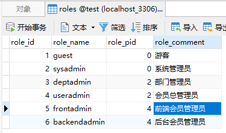
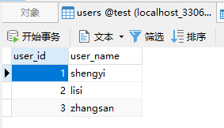
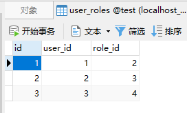
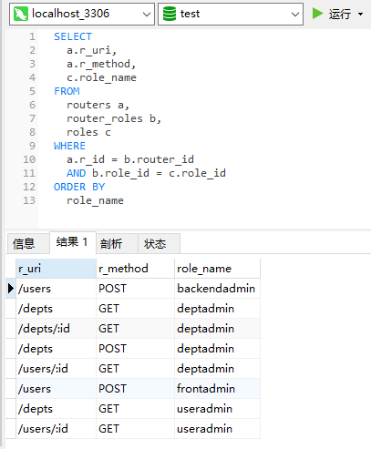
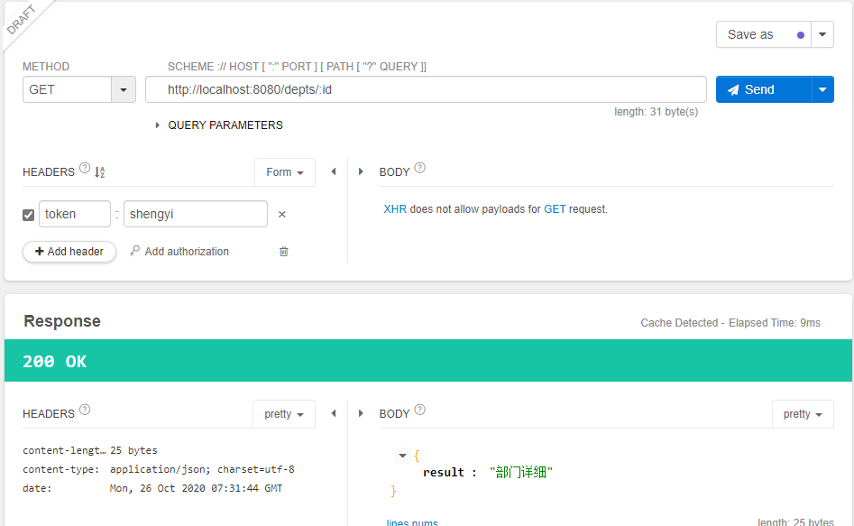
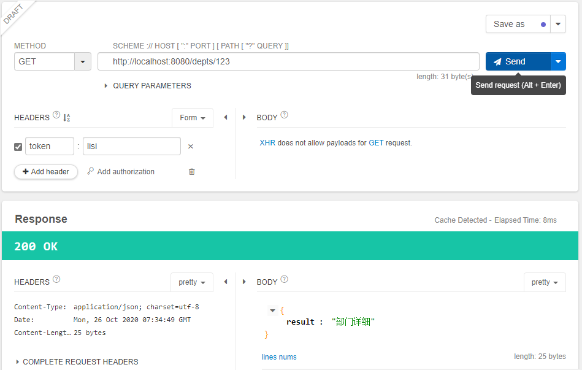

### 简单表设计

#### 角色和用户

这三表是独立且固定的

 

#### 角色和路由

角色表可以和任意业务进行关联


### 角色初始化

#### 角色表



首先初始化用户角色：

- 角色之间存在上下级关系

这里有两种方式：

1. 取出 pid = 0 的数据，然后递归遍历，再次查询数据库，直至遍历出所有下级。
2. 加载全部，然后用程序递归。

```go
package lib

import "gin-casbin/models"

type RoleRel struct {
	PRole string
	Role  string
}

func (this *RoleRel) String() string {
	return this.PRole + ":" + this.Role
}

// 获取角色
func GetRoles(pid int, m *[]*RoleRel, pname string) {
	proles := make([]*models.Role, 0)
	Gorm.Where("role_pid=?", pid).Find(&proles)
	if len(proles) == 0 {
		return
	}
	for _, item := range proles {
		if pname != "" {
			*m = append(*m, &RoleRel{pname, item.RoleName})

		}
		GetRoles(item.RoleId, m, item.RoleName)
	}
}
```


#### 用户表



#### 用户角色关联表



#### SQL 查询

取出用户名和角色名，通过用户表、用户角色关联表和角色表

```sql
SELECT
	a.user_name,
	c.role_name 
FROM
	users a,
	user_roles b,
	roles c 
WHERE
	a.user_id = b.user_id 
	AND b.role_id = c.role_id 
ORDER BY
	a.user_id DESC
```


```go
// 获取用户名和角色名
func GetUserRoles() (users []*models.Users) {
	Gorm.Select("a.user_name, c.role_name").
		Table("users a, user_roles b, roles c").
		Where("a.user_id=b.user_id and b.role_id=c.role_id").
		Order("a.user_id desc").Find(&users)
	return
}
```


#### 路由表


```go
package models

import "fmt"

type Routers struct {
	RouterId     int    `gorm:"column:r_id;primaryKey"`
	RouterName   string `gorm:"column:r_name"`
	RouterUri    string `gorm:"column:r_uri"`
	RouterMethod string `gorm:"column:r_method"`
	RoleName     string
}

func (this *Routers) TableName() string {
	return "roles"
}

func (this *Routers) String() string {
	return fmt.Sprintf("%s-%s", this.RouterName, this.RoleName)
}
```

#### SQL 语句

```sql
SELECT
	a.r_uri,
	a.r_method,
	c.role_name 
FROM
	routers a,
	router_roles b,
	roles c 
WHERE
	a.r_id = b.router_id 
	AND b.role_id = c.role_id 
ORDER BY
	role_name
```



```go
// File: rbacinit.go
// 获取路由和角色对应关系
func GetRouterRoles() (routers []*models.Routers) {
	Gorm.Select("a.r_uri, a.r_method, c.role_name").
		Table("routers a, router_roles b, roles c").
		Where("a.r_id = b.router_id and b.role_id = c.role_id").
		Order("role_name").Find(&routers)
	return
}

// File: assessinit.go
	// 初始化路由角色
	routerRoles := GetRouterRoles()
	for _, rr := range routerRoles {
		_, err := E.AddPolicy(rr.RoleName, rr.RouterUri, rr.RouterMethod)
		if err != nil {
			log.Fatal(err)
		}
	}
```

#### 使用 keymatch2 完成路由参数匹配



```toml
[request_definition]
r = sub, obj, act

[policy_definition] 
p = sub, obj, act

[role_definition]
g = _, _

[policy_effect]
e = some(where (p.eft == allow))

[matchers]
m = g(r.sub, p.sub) && keyMatch2(r.obj, p.obj) && r.act == p.act
```

