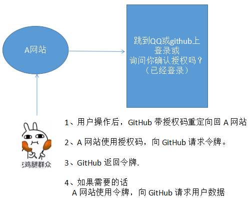

### 01. oauth2基本概念

OAuth2（开放授权）

> 是一个开放标准，允许用户授权第三方移动应用访问他们存储在另外的服务提供者上的信息，而不需要将用户名和密码提供给第三方移动应用或分享他们数据的所有内容，OAuth2.0是OAuth协议的延续版本，但不向后兼容OAuth 1.0即完全废止了OAuth1.0 
>
>  最常见的场景就是 QQ登录、微信登录、github登录等

https://github.com/go-oauth2/oauth2

`go get -u github.com/go-oauth2/oauth2/v4`

四种模式

**授权码模式** (Authorization Code) 一般只使用这个，后面3个基本不用~~~

简化模式 (Implicit)

密码模式 (Resource Owner Password Credentials)

客户端模式 (Client Credentials)

```shell
     +--------+                               +---------------+
     |        |--(A)- Authorization Request ->|   Resource    |
     |        |                               |     Owner     |
     |        |<-(B)-- Authorization Grant ---|               |
     |        |                               +---------------+
     |        |
     |        |                               +---------------+
     |        |--(C)-- Authorization Grant -->| Authorization |
     | Client |                               |     Server    |
     |        |<-(D)----- Access Token -------|               |
     |        |                               +---------------+
     |        |
     |        |                               +---------------+
     |        |--(E)----- Access Token ------>|    Resource   |
     |        |                               |     Server    |
     |        |<-(F)--- Protected Resource ---|               |
     +--------+                               +---------------+
```



### 02. 客户端请求授权码：基本参数

请求参数

| 参数名称      | 参数含义                         | 是否必须 |
| ------------- | -------------------------------- | -------- |
| response_type | 授权类型，此处的值为code         | 必须     |
| client_id     | 客户端 ID                        | 必须     |
| redirect_uri  | 重定向 URI                       | 必须     |
| scope         | 申请的权限范围，多个逗号隔开     | 可选     |
| state         | 客户端的当前状态，可以指定任意值 | 可选     |

授权码返回

| 参数名称 | 参数含义                                          | 是否必须 |
| -------- | ------------------------------------------------- | -------- |
| code     | 授权码。认证服务器返回的授权码                    | 必须     |
| state    | 如果A中请求包含这个参数，资源服务器原封不动的返回 | 可选     |

客户端代码

```go
package main

import (
	"github.com/gin-gonic/gin"
	"net/url"
)

func main() {
	r := gin.Default()
	r.LoadHTMLGlob("public/*")
	codeUrl, _ := url.ParseRequestURI("http://localhost:8080/getcode")
	loginUrl := "http://127.0.0.1:8081/auth?" +
		"response_type=code&client_id=clienta&redirect_uri=" +
		codeUrl.String()

	r.GET("/", func(c *gin.Context) {
		c.HTML(200, "a-index.html", map[string]string{
			"loginUrl": loginUrl,
		})
	})
	r.GET("/getcode", func(c *gin.Context) {
		code, _ := c.GetQuery("code")
		c.JSON(200, gin.H{"code": code})
	})
	r.Run(":8080")
}
```

服务端代码

```dago
package main

import (
	"github.com/gin-gonic/gin"
	"github.com/go-oauth2/oauth2/v4/manage"
	"github.com/go-oauth2/oauth2/v4/models"
	"github.com/go-oauth2/oauth2/v4/server"
	"github.com/go-oauth2/oauth2/v4/store"
	"log"
	"net/http"
)

func main() {
	manager := manage.NewDefaultManager()                 // 1. 创建管理对象
	manager.MustTokenStorage(store.NewMemoryTokenStore()) // 保存 token

	clientStore := store.NewClientStore() // 2. 客户端和服务端关联
	err := clientStore.Set("clienta", &models.Client{
		ID:     "clienta", // a 网站 id
		Secret: "123",
		Domain: "http://localhost:8080",
	})
	if err != nil {
		log.Fatal(err)
	}
	manager.MapClientStorage(clientStore) // 映射 client store

	// 3. 创建 http server
	srv := server.NewDefaultServer(manager)
	srv.SetUserAuthorizationHandler(userAuthorizationHandler)

	r := gin.New()
	// 相应授权码
	r.GET("/auth", func(c *gin.Context) {
		err := srv.HandleAuthorizeRequest(c.Writer, c.Request)
		if err != nil {
			log.Println(err)
		}
	})
	r.GET("/login", func(c *gin.Context) {
		c.HTML(200, "login.html", nil)
	})
	r.LoadHTMLGlob("public/*.html")
	r.Run(":8081")
}

// userAuthorizationHandler 确保授权时跳转到登录页面 login.html
func userAuthorizationHandler(w http.ResponseWriter, r *http.Request) (userID string, err error) {
	w.Header().Set("Location", "/login")
	w.WriteHeader(302)

	return
}
```

代码变动 [git commit](https://github.com/custer-go/learn-gin/commit/50fe1de9b43f3efd5777a0dd4331fbe9290d26e7#diff-da6e607e95bad42ffe69d9ebe05a342ad7ac388011ff6371da7515533a4d50f6R1)

### 03. 客户端请求授权码：获取授权码

上面实现了点击 `使用第三方账号登录` 跳转到第三方的服务，发现没有登录，因此跳转到登录页。

下面要实现的是在登录页输入正确的用户名和密码登录之后跳转到原先 a 网站的页面上。并显示出授权码。

一旦用户登录成功，使用 `session` 保存用户信息，这里使用第三方库 https://github.com/gorilla/sessions

`go get github.com/gorilla/sessions`

新建 `utils` 文件夹，新建 `session.go` 文件

```go
package utils

import (
	"github.com/gin-gonic/gin"
	"github.com/gorilla/sessions"
	"net/http"
)

var sessionStore = sessions.NewCookieStore([]byte("123456"))

func init() {
	sessionStore.Options.Domain = "127.0.0.1:8001"
	sessionStore.Options.Path = "/"
	sessionStore.Options.MaxAge = 0 // 关闭浏览器就清除 session
}

// SaveUserSession 保存当前用户的信息
func SaveUserSession(c *gin.Context, userID string) {
	s, err := sessionStore.Get(c.Request, "LoginUser")
	if err != nil {
		panic(err.Error())
	}
	s.Values["userID"] = userID
	err = s.Save(c.Request, c.Writer) // save 保存
	if err != nil {
		panic(err.Error())
	}
}

// GetUserSession 获取用户信息
func GetUserSession(r *http.Request) string {
	if s, err := sessionStore.Get(r, "LoginUser"); err == nil {
		if s.Values["userID"] != nil {
			return s.Values["userID"].(string)
		}
	}
	return ""
}
```

新建`middlewares.go`

```,zgo
package utils

import "github.com/gin-gonic/gin"

// ErrorHandler 错误处理中间件
func ErrorHandler() gin.HandlerFunc {
	return func(context *gin.Context) {
		defer func() {
			if e := recover(); e != nil {
				context.JSON(400, gin.H{"message": e})
			}
		}()
		context.Next()
	}
}
```

中间件的配置，在 `s.go` 中

```go
r.Use(utils.ErrorHandler())
```

修改登录的页面 `login.html`

```html
<!DOCTYPE html>
<html lang="en">
<head>
    <meta charset="UTF-8">
    <title>Title</title>
    <style>
        .body{margin:50px auto;text-align: center}
    </style>
</head>
<body>
 <div class="body">
     <form method="post">
     <div>
         <span>用户名:</span>
         <input type="text" name="userName"/>
     </div>
     <div>
         <span>密码:</span>
         <input type="password" name="userPass"/>
     </div>
     <div><input type="submit" value="登录"/></div>
        <div style="color: red">{{.error}}</div>
     </form>
 </div>
</body>
</html>
```

然后把 

```go
r.GET("/login", func(c *gin.Context) {
   c.HTML(200, "login.html", nil)
})
```

修改为

```go
package main

import (
	"gin-oauth2/utils"
	"github.com/gin-gonic/gin"
	"github.com/go-oauth2/oauth2/v4/manage"
	"github.com/go-oauth2/oauth2/v4/models"
	"github.com/go-oauth2/oauth2/v4/server"
	"github.com/go-oauth2/oauth2/v4/store"
	"log"
	"net/http"
)

func main() {
	manager := manage.NewDefaultManager()                 // 1. 创建管理对象
	manager.MustTokenStorage(store.NewMemoryTokenStore()) // 保存 token

	clientStore := store.NewClientStore() // 2. 客户端和服务端关联
	err := clientStore.Set("clienta", &models.Client{
		ID:     "clienta", // a 网站 id
		Secret: "123",
		Domain: "http://localhost:8080",
	})
	if err != nil {
		log.Fatal(err)
	}
	manager.MapClientStorage(clientStore) // 映射 client store

	// 3. 创建 http server
	srv := server.NewDefaultServer(manager)
	srv.SetUserAuthorizationHandler(userAuthorizationHandler)

	r := gin.New()
	r.Use(utils.ErrorHandler())
	// 相应授权码
	r.GET("/auth", func(c *gin.Context) {
		err := srv.HandleAuthorizeRequest(c.Writer, c.Request)
		if err != nil {
			log.Println(err)
		}
	})
	r.Any("/login", func(c *gin.Context) {
		data := map[string]string{
			"error": "",
		}
		if c.Request.Method == http.MethodPost {
			// 对提交的信息进行处理
			uname, upass := c.PostForm("userName"), c.PostForm("userPass")
			if uname+upass == "custer123" {
				utils.SaveUserSession(c, uname)
				c.Redirect(302, "/auth?"+c.Request.URL.RawQuery)
				return
			} else {
				data["error"] = "用户名密码错误"
			}
		}
		c.HTML(200, "login.html", data)
	})
	r.LoadHTMLGlob("public/*.html")
	r.Run(":8081")
}

// userAuthorizationHandler 确保授权时跳转到登录页面 login.html
func userAuthorizationHandler(w http.ResponseWriter, r *http.Request) (userID string, err error) {
	if userID = utils.GetUserSession(r); userID == "" {
		w.Header().Set("Location", "/login?"+r.URL.RawQuery)
		w.WriteHeader(302)
	}
	return
}
```

代码变动 [git commit]()