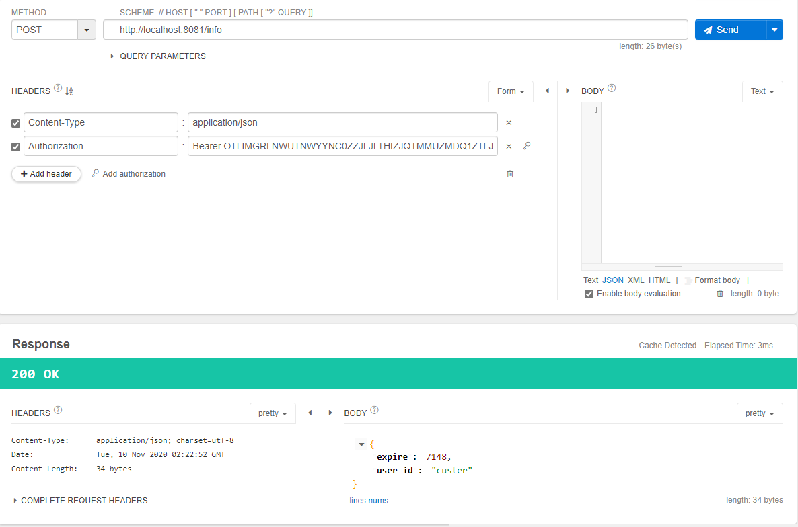
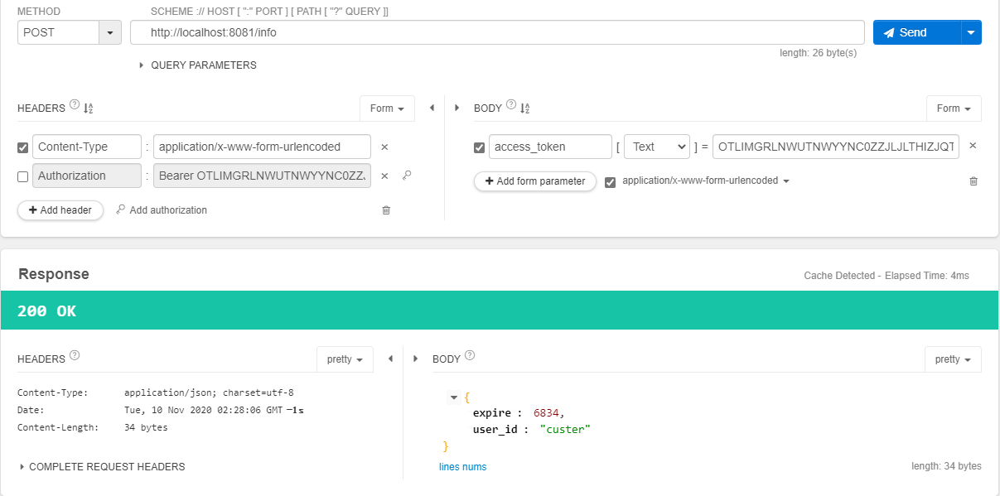
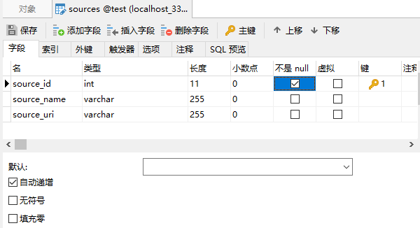
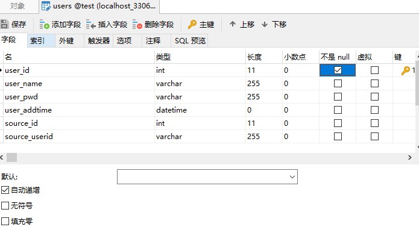

### 01. oauth2基本概念

OAuth2（开放授权）

> 是一个开放标准，允许用户授权第三方移动应用访问他们存储在另外的服务提供者上的信息，而不需要将用户名和密码提供给第三方移动应用或分享他们数据的所有内容，OAuth2.0是OAuth协议的延续版本，但不向后兼容OAuth 1.0即完全废止了OAuth1.0 
>
>  最常见的场景就是 QQ登录、微信登录、github登录等

https://github.com/go-oauth2/oauth2

`go get -u github.com/go-oauth2/oauth2/v4`

四种模式

**授权码模式** (Authorization Code) 一般只使用这个，后面3个基本不用~~~

简化模式 (Implicit)

密码模式 (Resource Owner Password Credentials)

客户端模式 (Client Credentials)

```shell
     +--------+                               +---------------+
     |        |--(A)- Authorization Request ->|   Resource    |
     |        |                               |     Owner     |
     |        |<-(B)-- Authorization Grant ---|               |
     |        |                               +---------------+
     |        |
     |        |                               +---------------+
     |        |--(C)-- Authorization Grant -->| Authorization |
     | Client |                               |     Server    |
     |        |<-(D)----- Access Token -------|               |
     |        |                               +---------------+
     |        |
     |        |                               +---------------+
     |        |--(E)----- Access Token ------>|    Resource   |
     |        |                               |     Server    |
     |        |<-(F)--- Protected Resource ---|               |
     +--------+                               +---------------+
```


### 02. 客户端请求授权码：基本参数

请求参数

| 参数名称      | 参数含义                         | 是否必须 |
| ------------- | -------------------------------- | -------- |
| response_type | 授权类型，此处的值为code         | 必须     |
| client_id     | 客户端 ID                        | 必须     |
| redirect_uri  | 重定向 URI                       | 必须     |
| scope         | 申请的权限范围，多个逗号隔开     | 可选     |
| state         | 客户端的当前状态，可以指定任意值 | 可选     |

授权码返回

| 参数名称 | 参数含义                                          | 是否必须 |
| -------- | ------------------------------------------------- | -------- |
| code     | 授权码。认证服务器返回的授权码                    | 必须     |
| state    | 如果A中请求包含这个参数，资源服务器原封不动的返回 | 可选     |

客户端代码

```go
package main

import (
	"github.com/gin-gonic/gin"
	"net/url"
)

func main() {
	r := gin.Default()
	r.LoadHTMLGlob("public/*")
	codeUrl, _ := url.ParseRequestURI("http://localhost:8080/getcode")
	loginUrl := "http://127.0.0.1:8081/auth?" +
		"response_type=code&client_id=clienta&redirect_uri=" +
		codeUrl.String()

	r.GET("/", func(c *gin.Context) {
		c.HTML(200, "a-index.html", map[string]string{
			"loginUrl": loginUrl,
		})
	})
	r.GET("/getcode", func(c *gin.Context) {
		code, _ := c.GetQuery("code")
		c.JSON(200, gin.H{"code": code})
	})
	r.Run(":8080")
}
```

服务端代码

```go
package main

import (
	"github.com/gin-gonic/gin"
	"github.com/go-oauth2/oauth2/v4/manage"
	"github.com/go-oauth2/oauth2/v4/models"
	"github.com/go-oauth2/oauth2/v4/server"
	"github.com/go-oauth2/oauth2/v4/store"
	"log"
	"net/http"
)

func main() {
	manager := manage.NewDefaultManager()                 // 1. 创建管理对象
	manager.MustTokenStorage(store.NewMemoryTokenStore()) // 保存 token

	clientStore := store.NewClientStore() // 2. 客户端和服务端关联
	err := clientStore.Set("clienta", &models.Client{
		ID:     "clienta", // a 网站 id
		Secret: "123",
		Domain: "http://localhost:8080",
	})
	if err != nil {
		log.Fatal(err)
	}
	manager.MapClientStorage(clientStore) // 映射 client store

	// 3. 创建 http server
	srv := server.NewDefaultServer(manager)
	srv.SetUserAuthorizationHandler(userAuthorizationHandler)

	r := gin.New()
	// 相应授权码
	r.GET("/auth", func(c *gin.Context) {
		err := srv.HandleAuthorizeRequest(c.Writer, c.Request)
		if err != nil {
			log.Println(err)
		}
	})
	r.GET("/login", func(c *gin.Context) {
		c.HTML(200, "login.html", nil)
	})
	r.LoadHTMLGlob("public/*.html")
	r.Run(":8081")
}

// userAuthorizationHandler 确保授权时跳转到登录页面 login.html
func userAuthorizationHandler(w http.ResponseWriter, r *http.Request) (userID string, err error) {
	w.Header().Set("Location", "/login")
	w.WriteHeader(302)

	return
}
```

代码变动 [git commit](https://github.com/custer-go/learn-gin/commit/50fe1de9b43f3efd5777a0dd4331fbe9290d26e7#diff-da6e607e95bad42ffe69d9ebe05a342ad7ac388011ff6371da7515533a4d50f6R1)

### 03. 客户端请求授权码：获取授权码

上面实现了点击 `使用第三方账号登录` 跳转到第三方的服务，发现没有登录，因此跳转到登录页。

下面要实现的是在登录页输入正确的用户名和密码登录之后跳转到原先 a 网站的页面上。并显示出授权码。

一旦用户登录成功，使用 `session` 保存用户信息，这里使用第三方库 https://github.com/gorilla/sessions

`go get github.com/gorilla/sessions`

新建 `utils` 文件夹，新建 `session.go` 文件

```go
package utils

import (
	"github.com/gin-gonic/gin"
	"github.com/gorilla/sessions"
	"net/http"
)

var sessionStore = sessions.NewCookieStore([]byte("123456"))

func init() {
	sessionStore.Options.Domain = "127.0.0.1:8081"
	sessionStore.Options.Path = "/"
	sessionStore.Options.MaxAge = 0 // 关闭浏览器就清除 session
}

// SaveUserSession 保存当前用户的信息
func SaveUserSession(c *gin.Context, userID string) {
	s, err := sessionStore.Get(c.Request, "LoginUser")
	if err != nil {
		panic(err.Error())
	}
	s.Values["userID"] = userID
	err = s.Save(c.Request, c.Writer) // save 保存
	if err != nil {
		panic(err.Error())
	}
}

// GetUserSession 获取用户信息
func GetUserSession(r *http.Request) string {
	if s, err := sessionStore.Get(r, "LoginUser"); err == nil {
		if s.Values["userID"] != nil {
			return s.Values["userID"].(string)
		}
	}
	return ""
}
```

新建`middlewares.go`

```go
package utils

import "github.com/gin-gonic/gin"

// ErrorHandler 错误处理中间件
func ErrorHandler() gin.HandlerFunc {
	return func(context *gin.Context) {
		defer func() {
			if e := recover(); e != nil {
				context.JSON(400, gin.H{"message": e})
			}
		}()
		context.Next()
	}
}
```

中间件的配置，在 `s.go` 中

```go
r.Use(utils.ErrorHandler())
```

修改登录的页面 `login.html`

```html
<!DOCTYPE html>
<html lang="en">
<head>
    <meta charset="UTF-8">
    <title>Title</title>
    <style>
        .body{margin:50px auto;text-align: center}
    </style>
</head>
<body>
 <div class="body">
     <form method="post">
     <div>
         <span>用户名:</span>
         <input type="text" name="userName"/>
     </div>
     <div>
         <span>密码:</span>
         <input type="password" name="userPass"/>
     </div>
     <div><input type="submit" value="登录"/></div>
        <div style="color: red">{{.error}}</div>
     </form>
 </div>
</body>
</html>
```

然后把 

```go
r.GET("/login", func(c *gin.Context) {
   c.HTML(200, "login.html", nil)
})
```

修改为

```go
package main

import (
	"gin-oauth2/utils"
	"github.com/gin-gonic/gin"
	"github.com/go-oauth2/oauth2/v4/manage"
	"github.com/go-oauth2/oauth2/v4/models"
	"github.com/go-oauth2/oauth2/v4/server"
	"github.com/go-oauth2/oauth2/v4/store"
	"log"
	"net/http"
)

func main() {
	manager := manage.NewDefaultManager()                 // 1. 创建管理对象
	manager.MustTokenStorage(store.NewMemoryTokenStore()) // 保存 token

	clientStore := store.NewClientStore() // 2. 客户端和服务端关联
	err := clientStore.Set("clienta", &models.Client{
		ID:     "clienta", // a 网站 id
		Secret: "123",
		Domain: "http://localhost:8080",
	})
	if err != nil {
		log.Fatal(err)
	}
	manager.MapClientStorage(clientStore) // 映射 client store

	// 3. 创建 http server
	srv := server.NewDefaultServer(manager)
	srv.SetUserAuthorizationHandler(userAuthorizationHandler)

	r := gin.New()
	r.Use(utils.ErrorHandler())
	// 相应授权码
	r.GET("/auth", func(c *gin.Context) {
		err := srv.HandleAuthorizeRequest(c.Writer, c.Request)
		if err != nil {
			log.Println(err)
		}
	})
	r.Any("/login", func(c *gin.Context) {
		data := map[string]string{
			"error": "",
		}
		if c.Request.Method == http.MethodPost {
			// 对提交的信息进行处理
			uname, upass := c.PostForm("userName"), c.PostForm("userPass")
			if uname+upass == "custer123" {
				utils.SaveUserSession(c, uname)
				c.Redirect(302, "/auth?"+c.Request.URL.RawQuery)
				return
			} else {
				data["error"] = "用户名密码错误"
			}
		}
		c.HTML(200, "login.html", data)
	})
	r.LoadHTMLGlob("public/*.html")
	r.Run(":8081")
}

// userAuthorizationHandler 确保授权时跳转到登录页面 login.html
func userAuthorizationHandler(w http.ResponseWriter, r *http.Request) (userID string, err error) {
	if userID = utils.GetUserSession(r); userID == "" {
		w.Header().Set("Location", "/login?"+r.URL.RawQuery)
		w.WriteHeader(302)
	}
	return
}
```

代码变动 [git commit](https://github.com/custer-go/learn-gin/commit/bf67092b04c442ea0ef6288b41eaa52fe5310fba#diff-49dab0ade8de98d1e754c8aba53f725f0ebcb8a86e3a20ea8e901e9525f270d7L4)

### 04. 客户端使用授权码请求token

上面的代码登录之后跳转到 http://localhost:8080/getcode?code=MGY2NDZJZGYTMWIYNY0ZOGVLLWI1NJYTYMRJOTVKZTGXMZE0 并获取到了授权码 `code`

go 的 `oauth2` 的客户端库 https://github.com/golang/oauth2，在 `a` 网站里需要安装这个库，安装

`go get golang.org/x/oauth2`

客户端 `a` 的代码

```go
package main

import (
	"github.com/gin-gonic/gin"
	"golang.org/x/oauth2"
)

const authServerURL = "http://127.0.0.1:8081"

var (
	oauth2Config = oauth2.Config{
		ClientID:     "clienta",
		ClientSecret: "123",
		Scopes:       []string{"all"},
		RedirectURL:  "http://localhost:8080/getcode",
		Endpoint: oauth2.Endpoint{
			AuthURL:  authServerURL + "/auth",  // 获取授权码地址
			TokenURL: authServerURL + "/token", // 获取 token 地址
		},
	}
)

func main() {
	r := gin.Default()
	r.LoadHTMLGlob("public/*")
	//codeUrl, _ := url.ParseRequestURI("http://localhost:8080/getcode")
	//loginUrl := "http://127.0.0.1:8081/auth?" +
	//	"response_type=code&client_id=clienta&redirect_uri=" +
	//	codeUrl.String()
	// state 参数，传递给服务端，验证通过会原封不动的传回客户端，
	// 在 /getcode 里理论上需要对 state 进行判断，防止被串改。
	loginUrl := oauth2Config.AuthCodeURL("myclient")

	r.GET("/", func(c *gin.Context) {
		c.HTML(200, "a-index.html", map[string]string{
			"loginUrl": loginUrl,
		})
	})
	r.GET("/getcode", func(c *gin.Context) {
		code, _ := c.GetQuery("code")
		//c.JSON(200, gin.H{"code": code})
		token, err := oauth2Config.Exchange(c, code)
		if err != nil {
			c.JSON(400, gin.H{"message": err.Error()})
		} else {
			c.JSON(200, token)
		}
	})
	r.Run(":8080")
}
```

服务端 `s.go` 代码修改

```go
package main

import (
	"gin-oauth2/utils"
	"github.com/gin-gonic/gin"
	"github.com/go-oauth2/oauth2/v4/manage"
	"github.com/go-oauth2/oauth2/v4/models"
	"github.com/go-oauth2/oauth2/v4/server"
	"github.com/go-oauth2/oauth2/v4/store"
	"log"
	"net/http"
)

var srv *server.Server

func main() {
	manager := manage.NewDefaultManager()                 // 1. 创建管理对象
	manager.MustTokenStorage(store.NewMemoryTokenStore()) // 保存 token

	clientStore := store.NewClientStore() // 2. 客户端和服务端关联
	err := clientStore.Set("clienta", &models.Client{
		ID:     "clienta", // a 网站 id
		Secret: "123",
		Domain: "http://localhost:8080",
	})
	if err != nil {
		log.Fatal(err)
	}
	manager.MapClientStorage(clientStore) // 映射 client store

	// 3. 创建 http server
	srv = server.NewDefaultServer(manager)
	srv.SetUserAuthorizationHandler(userAuthorizationHandler)

	r := gin.New()
	r.Use(utils.ErrorHandler())
	// 相应授权码
	r.GET("/auth", func(c *gin.Context) {
		err := srv.HandleAuthorizeRequest(c.Writer, c.Request)
		if err != nil {
			log.Println(err)
		}
	})
	r.POST("/token", func(c *gin.Context) {
		err := srv.HandleTokenRequest(c.Writer, c.Request)
		if err != nil {
			panic(err.Error())
		}
	})
	r.Any("/login", func(c *gin.Context) {
		data := map[string]string{
			"error": "",
		}
		if c.Request.Method == http.MethodPost {
			// 对提交的信息进行处理
			uname, upass := c.PostForm("userName"), c.PostForm("userPass")
			if uname+upass == "custer123" {
				utils.SaveUserSession(c, uname)
				c.Redirect(302, "/auth?"+c.Request.URL.RawQuery)
				return
			} else {
				data["error"] = "用户名密码错误"
			}
		}
		c.HTML(200, "login.html", data)
	})
	r.LoadHTMLGlob("public/*.html")
	r.Run(":8081")
}

// userAuthorizationHandler 确保授权时跳转到登录页面 login.html
func userAuthorizationHandler(w http.ResponseWriter, r *http.Request) (userID string, err error) {
	if userID = utils.GetUserSession(r); userID == "" {
		w.Header().Set("Location", "/login?"+r.URL.RawQuery)
		w.WriteHeader(302)
	}
	return
}
```

代码变动 [git commit](https://github.com/custer-go/learn-gin/commit/d2280d2bd5666b7fa5d14438f6a0b1457c7fd48d#diff-da6e607e95bad42ffe69d9ebe05a342ad7ac388011ff6371da7515533a4d50f6L2)

### 05. 客户端使用token获取用户信息

在服务端 `s.go` 中增加使用token获取用户信息的路由 `POST /info`

```go
	// 根据 token 返回用户信息
	r.POST("/info", func(c *gin.Context) {
		token, err := srv.ValidationBearerToken(c.Request)
		if err != nil {
			panic(err.Error())
		}
		ret := gin.H{
			"user_id": token.GetUserID(),
			"expire": int64(token.GetAccessCreateAt().
				Add(token.GetAccessExpiresIn()).
				Sub(time.Now()).Seconds())}
		c.JSON(200, ret)
	})
```

客户端请求用户信息的方式

OAuth 2.0 定义了获取 Access Token 的方法

第一种 :放在头里

```http
GET /info  HTTP/1.1
Host: server.example.com
Authorization: Bearer xxxxxooo
```

先通过 http://localhost:8080 点击第三方登录跳转到 服务端登录页面，登录成功后跳转回 http://localhost:8080/getcode?code=Y2QZMTFKYZYTZMQ1ZC0ZYJI0LTLJNGETZDM2NJZHMDJMNDC2&state=myclient，可以看到返回的 json

```json
{
    "access_token": "OTLIMGRLNWUTNWYYNC0ZZJLJLTHIZJQTMMUZMDQ1ZTLJYTZM",
    "token_type": "Bearer",
    "refresh_token": "NWRHYMQ2NDGTNWU4MC01YWJILWI0ZTATMJYZNGIWMZIXYZFM",
    "expiry": "2020-11-10T12:22:01.3254618+08:00"
}
```

发送 POST 请求



第二种：放到Form参数里

```http
Content-Type: application/x-www-form-urlencoded
access_token=xxoxooxoo
```



客户端可以请求`GET /info?access_token=`  修改代码  `a.go`

```go
	// 根据 token 返回用户信息
	r.POST("/info", func(c *gin.Context) {
		token, err := srv.ValidationBearerToken(c.Request)
		if err != nil {
			panic(err.Error())
		}
		ret := gin.H{
			"user_id": token.GetUserID(),
			"expire": int64(token.GetAccessCreateAt().
				Add(token.GetAccessExpiresIn()).
				Sub(time.Now()).Seconds())}
		c.JSON(200, ret)
	})
```

客户端写 `http.Requet` 请求服务端获取用户信息 `utils/user.go`

```go
package utils

import (
	"io/ioutil"
	"net/http"
	"strings"
)

func GetUserInfo(url string, token string, isBearer bool) string {
	var (
		err  error
		req  *http.Request
		resp *http.Response
	)
	if isBearer {
		req, err = http.NewRequest("POST", url, nil)
		if err != nil {
			panic(err.Error())
		}
		req.Header.Set("Authorization", "Bearer "+token)
	} else {
		req, err = http.NewRequest("POST", url, strings.NewReader("access_token="+token))
		req.Header.Set("Content-Type", "application/x-www-form-urlencoded")
		if err != nil {
			panic(err.Error())
		}
	}
	resp, err = http.DefaultClient.Do(req)
	if err != nil {
		panic(err.Error())
	}
	defer resp.Body.Close()
	b, _ := ioutil.ReadAll(resp.Body)
	return string(b)
}
```

直接在浏览器访问 http://localhost:8080/info?token=MMVJYJU1ZWMTZGQ1YI0ZNZBILTHIOTMTYMFIZMIXOWUYNMJM 就可以查看到用户信息

```json
{
    "expire": 7032,
    "user_id": "custer"
}
```

代码变动 [git commit](https://github.com/custer-go/learn-gin/commit/204e8f6311c52b1ef45083ba2a2ad38a5296dd05#diff-da6e607e95bad42ffe69d9ebe05a342ad7ac388011ff6371da7515533a4d50f6L1)

### 06. oauth2下用户表的设计案例

一般网站如果第一次使用第三方账号登录，它会跳回到原网站 a，需要注册并绑定账号。

这个过程就是 a 网站和第三方网站绑定的过程。

`sources` 表记录第三方账号的来源



`users` 用户表增加第三方账号来源



- `source_id` : 来源 ID
- `source_username` : 来源的用户名(或者叫做唯一标识)
- 其中 `user_name` ：唯一索引
- `source_id` 和 ` source_userid` :联合唯一索引

注意几个规则：

- 对于 自主注册的用户：`source_id` 是0 ，` source_userid `也是空的

- 对于 `oauth2` 登录的用户，取到 `token` 后，请求并获取 `userid`

  1、如果该用户 ID 在 `source_userid` 中找到，则自动登录

   2、否则要求用户注册，并绑定该用户 ID

`go get -u gorm.io/gorm` `go get gorm.io/driver/mysql`

新增 `models` 目录，包含 `soures.go` 文件和 `users.go` 模型文件

```go
package models

type Source struct {
	SourceID   int    `gorm:"column:source_id"`
	SourceName string 
}
```

```go
package models

type UserModel struct {
	UserID       int `gorm:"column:user_id"`
	UserName     string
	UserPwd      string
	SourceID     string `gorm:"column:source_id"`
	SourceUserId string `gorm:"column:source_userid"`
}
func (*UserModel) TableName() string {
	return "users"
}
```

在目录 `utils` 下增加文件`dbinit.go` 和  `userrepo.go`

```go
package utils

import (
	"gorm.io/driver/mysql"
	"gorm.io/gorm"
	"log"
	"time"
)

var Gorm *gorm.DB

func init() {
	Gorm = gormDB()
}

func gormDB() *gorm.DB {
	dsn := "root:root1234@tcp(127.0.0.1:3306)/test?charset=utf8mb4&parseTime=True&loc=Local"
	db, err := gorm.Open(mysql.Open(dsn), &gorm.Config{})
	if err != nil {
		log.Fatal(err)
	}
	// 获取通用数据库对象 sql.DB ，然后使用其提供的功能
	sqlDB, err := db.DB()
	if err != nil {
		log.Fatal(err)
	}
	// SetMaxIdleConns 用于设置连接池中空闲连接的最大数量。
	sqlDB.SetMaxIdleConns(10)
	// SetMaxOpenConns 设置打开数据库连接的最大数量。
	sqlDB.SetMaxOpenConns(100)
	// SetConnMaxLifetime 设置了连接可复用的最大时间。
	sqlDB.SetConnMaxLifetime(time.Hour)
	return db
}
```


```go
package utils

import (
	"fmt"
	"gin-oauth2/models"
)

// @sourceName 来源名，需要判断是否存在
// @sourceUserID 来源网站请求获得的 userID
// 下面代码是为了能够演示方便，方便看懂，请自行优化
func GetUserName(sourceName string, sourceUserID string) *models.UserModel {
	// 1. 到 sources 表查找 sourceName 是否存在
	source := &models.Source{}
	if err := Gorm.Table("sources").Where("source_name=?", sourceName).First(source).Error; err != nil {
		panic(fmt.Errorf("error source:%v", err.Error()))
	}
	// 2. 在用户表中查找 sourceID 和 sourceUserID
	userModel := &models.UserModel{}
	if err := Gorm.Table("users").Where("source_id=? and source_userid=?",
		source.SourceID, sourceUserID).First(userModel).Error; err != nil {
		// 代表用户没有在该网站登录
		return nil
	} else { // 如果存在就返回用户数据
		return userModel
	}
}

```

我们在 a 网站点击第三方登录跳转的链接增加 `source` 来源

```go
var (
	oauth2Config = oauth2.Config{
		ClientID:     "clienta",
		ClientSecret: "123",
		Scopes:       []string{"all"},
		RedirectURL:  "http://localhost:8080/github/getcode",
		Endpoint: oauth2.Endpoint{
			AuthURL:  authServerURL + "/auth",  // 获取授权码地址
			TokenURL: authServerURL + "/token", // 获取 token 地址
		},
	}
)
```

在路由增加 `/:source/getcode` 参数

```go
	r.GET("/:source/getcode", func(c *gin.Context) {
		source := c.Param("source")                  // 来源
		code, _ := c.GetQuery("code")                // 得到授权码
		token, err := oauth2Config.Exchange(c, code) // 请求 token
		if err != nil {
			c.JSON(400, gin.H{"message": err.Error()})
		} else {
			//c.JSON(200, token)
			// 通过第三方登录平台提交 token，获取用户在第三方平台的用户 ID
			passport := utils.GetUserInfo(authServerURL+"/info", token.AccessToken, true)
			user := utils.GetUserName(source, passport.UserID)
			if user == nil {
				c.String(200, "您需要注册并绑定账号")
			} else {
				c.String(200, "您在本站的用户名是: %s", user.UserName)
			}
		}
	})
```

通过第三方登录平台提交 token，获取用户在第三方平台的用户 ID

```go
passport := utils.GetUserInfo(authServerURL+"/info", token.AccessToken, true)
```

相应在 `utils/user.go` 中修改

```go
package utils

import (
	"encoding/json"
	"io/ioutil"
	"net/http"
	"strings"
)

type OAuthUser struct {
	UserID string `json:"user_id"`
	Expire int64  `json:"expire"`
}

func GetUserInfo(url string, token string, isBearer bool) *OAuthUser {
	var (
		err  error
		req  *http.Request
		resp *http.Response
	)
	if isBearer {
		req, err = http.NewRequest("POST", url, nil)
		if err != nil {
			panic(err.Error())
		}
		req.Header.Set("Authorization", "Bearer "+token)
	} else {
		req, err = http.NewRequest("POST", url, strings.NewReader("access_token="+token))
		req.Header.Set("Content-Type", "application/x-www-form-urlencoded")
		if err != nil {
			panic(err.Error())
		}
	}
	resp, err = http.DefaultClient.Do(req)
	if err != nil {
		panic(err.Error())
	}
	defer resp.Body.Close()
	b, _ := ioutil.ReadAll(resp.Body)
	//return string(b)
	oauthUser := &OAuthUser{}
	err = json.Unmarshal(b, oauthUser)
	if err != nil {
		panic(err.Error())
	}
	return oauthUser
}
```

代码变动 [git commit](https://github.com/custer-go/learn-gin/commit/6ca5de3db176c86d15ca3503428ffdeea7d03fe2#diff-da6e607e95bad42ffe69d9ebe05a342ad7ac388011ff6371da7515533a4d50f6L13)

### 07. 演示：注册并绑定第三方账号

表 `sources` 和 `users` 的`sql` 语句

```sql
SET NAMES utf8mb4;
SET FOREIGN_KEY_CHECKS = 0;

-- ----------------------------
-- Table structure for sources
-- ----------------------------
DROP TABLE IF EXISTS `sources`;
CREATE TABLE `sources`  (
  `source_id` int(11) NOT NULL AUTO_INCREMENT,
  `source_name` varchar(20) CHARACTER SET utf8mb4 COLLATE utf8mb4_general_ci NULL DEFAULT NULL,
  `source_uri` varchar(500) CHARACTER SET utf8mb4 COLLATE utf8mb4_general_ci NULL DEFAULT NULL,
  PRIMARY KEY (`source_id`) USING BTREE
) ENGINE = InnoDB AUTO_INCREMENT = 3 CHARACTER SET = utf8mb4 COLLATE = utf8mb4_general_ci ROW_FORMAT = Dynamic;

-- ----------------------------
-- Records of sources
-- ----------------------------
INSERT INTO `sources` VALUES (1, 'jtthink', 'http://oauth.jtthink.com');
INSERT INTO `sources` VALUES (2, 'github', 'http://github.com');

-- ----------------------------
-- Table structure for users
-- ----------------------------
DROP TABLE IF EXISTS `users`;
CREATE TABLE `users`  (
  `user_id` int(11) NOT NULL AUTO_INCREMENT,
  `user_name` varchar(50) CHARACTER SET utf8mb4 COLLATE utf8mb4_general_ci NULL DEFAULT NULL,
  `user_pwd` varchar(50) CHARACTER SET utf8mb4 COLLATE utf8mb4_general_ci NULL DEFAULT NULL,
  `user_addtime` datetime(0) NULL DEFAULT CURRENT_TIMESTAMP,
  `source_id` int(11) NULL DEFAULT 0,
  `source_userid` varchar(50) CHARACTER SET utf8mb4 COLLATE utf8mb4_general_ci NULL DEFAULT NULL,
  PRIMARY KEY (`user_id`) USING BTREE,
  UNIQUE INDEX `user_name`(`user_name`) USING BTREE,
  UNIQUE INDEX `source_idname`(`source_id`, `source_userid`) USING BTREE
) ENGINE = InnoDB AUTO_INCREMENT = 7 CHARACTER SET = utf8mb4 COLLATE = utf8mb4_general_ci ROW_FORMAT = Dynamic;

-- ----------------------------
-- Records of users
-- ----------------------------
INSERT INTO `users` VALUES (2, 'zhangsan', '123', '2020-09-29 15:21:44', 0, 'a');
INSERT INTO `users` VALUES (3, 'lisi', '123', '2020-09-24 15:21:11', 0, '');
INSERT INTO `users` VALUES (6, 'wangwu', '123', '2020-10-20 00:25:45', 1, 'shenyi');

SET FOREIGN_KEY_CHECKS = 1;
```

修改 `a.go` 

```go
	// 注册用户
	r.Any("/user/reg", func(c *gin.Context) {
		data := map[string]string{
			"error":   "",
			"message": "",
		}
		c.HTML(200, "reg.html", data)
	})
	r.GET("/github/getcode", func(c *gin.Context) {
		//source := c.Param("source")                  // 来源
		source := "github"
		code, _ := c.GetQuery("code")                // 得到授权码
		token, err := oauth2Config.Exchange(c, code) // 请求 token
		if err != nil {
			c.JSON(400, gin.H{"message": err.Error()})
		} else {
			//c.JSON(200, token)
			// 通过第三方登录平台提交 token，获取用户在第三方平台的用户 ID
			passport := utils.GetUserInfo(authServerURL+"/info", token.AccessToken, true)
			user := utils.GetUserName(source, passport.UserID)
			if user == nil {
				//c.String(200, "您需要注册并绑定账号")
				c.Redirect(302, "/user/reg?token="+token.AccessToken+"&source=github")
			} else {
				c.String(200, "您在本站的用户名是: %s", user.UserName)
			}
		}
	})
```

增加了`reg.html`

```html
<!DOCTYPE html>
<html lang="en">
<head>
    <meta charset="UTF-8">
    <title>注册用户</title>
</head>
<body>
<div class="body">
    <form method="post">
        <div>
            <span>用户名:</span>
            <input type="text" name="userName"/>
        </div>
        <div>
            <span>密码:</span>
            <input type="password" name="userPass"/>
        </div>
        <div>
            <span>确认密码密码:</span>
            <input type="password" name="userPass2"/>
        </div>
        <div><input type="submit" value="注册"/></div>
        <div>{{.message}}</div>
        <div style="color: red">{{.error}}</div>
    </form>
</div>
</body>
</html>
```

完善 `a.go` 的注册代码

```go
package main

import (
	"fmt"
	"gin-oauth2/utils"
	"github.com/gin-gonic/gin"
	"golang.org/x/oauth2"
)

const authServerURL = "http://127.0.0.1:8081"

var (
	oauth2Config = oauth2.Config{
		ClientID:     "clienta",
		ClientSecret: "123",
		Scopes:       []string{"all"},
		RedirectURL:  "http://localhost:8080/github/getcode",
		Endpoint: oauth2.Endpoint{
			AuthURL:  authServerURL + "/auth",  // 获取授权码地址
			TokenURL: authServerURL + "/token", // 获取 token 地址
		},
	}
)

func main() {
	r := gin.Default()
	r.LoadHTMLGlob("public/*")
	// state 参数，传递给服务端，验证通过会原封不动的传回客户端，
	// 在 /getcode 里理论上需要对 state 进行判断，防止被串改。
	loginUrl := oauth2Config.AuthCodeURL("myclient")

	r.GET("/", func(c *gin.Context) {
		c.HTML(200, "a-index.html", map[string]string{
			"loginUrl": loginUrl,
		})
	})
	// 注册用户
	r.Any("/user/reg", func(c *gin.Context) {
		data := map[string]string{
			"error":   "",
			"message": "",
		}
		if c.Request.Method == "POST" {
			userID := "" // 第三方账号 ID
			if c.Query("token") != "" {
				passport := utils.GetUserInfo(authServerURL+"/info", c.Query("token"), true)
				userID = passport.UserID
			}
			source := c.Query("source")
			uname, upass, upass2 := c.PostForm("userName"), c.PostForm("userPass"), c.PostForm("userPass2")
			user, err := utils.AddNewUser(uname, upass, upass2, userID, source)
			if err != nil {
				data["error"] = err.Error()
			} else {
				if userID != "" {
					data["message"] = fmt.Sprintf("账号绑定成功,您的用户名是%s,第三方账号是:%s", user.UserName, userID)
				} else {
					data["message"] = fmt.Sprintf("账号创建成功,您的用户名是%s", user.UserName)
				}
			}
		}
		c.HTML(200, "reg.html", data)
	})
	r.GET("/github/getcode", func(c *gin.Context) {
		//source := c.Param("source")                  // 来源
		source := "github"
		code, _ := c.GetQuery("code")                // 得到授权码
		token, err := oauth2Config.Exchange(c, code) // 请求 token
		if err != nil {
			c.JSON(400, gin.H{"message": err.Error()})
		} else {
			//c.JSON(200, token)
			// 通过第三方登录平台提交 token，获取用户在第三方平台的用户 ID
			passport := utils.GetUserInfo(authServerURL+"/info", token.AccessToken, true)
			user := utils.GetUserName(source, passport.UserID)
			if user == nil {
				//c.String(200, "您需要注册并绑定账号")
				c.Redirect(302, "/user/reg?token="+token.AccessToken+"&source=github")
			} else {
				c.String(200, "您在本站的用户名是: %s", user.UserName)
			}
		}
	})
	r.Run(":8080")
}
```

增加 `utils/userrepo.go` 文件的 `AddNewUser()` 函数

```go
func AddNewUser(userName string , pwd1 string,pwd2 string,userID string,sourceName string ) (*models.UserModel,error) {
	if pwd1!=pwd2{
		return nil,fmt.Errorf("密码不一致")
	}
	source:=&models.Source{}
	if sourceName!=""{ //说明有来源， 则要判断。否则不判断
		if err:=Gorm.Table("sources").Where("source_name=?",sourceName).First(source).Error;err!=nil{
			return nil,fmt.Errorf("来源不合法:%s",err.Error())
		}
	}
	user:=&models.UserModel{UserName:userName,UserPwd:pwd1,SourceID:source.SourceID,SourceUserId:userID}
	if err:=Gorm.Table("users").Create(user).Error;err!=nil{
		return nil ,fmt.Errorf("注册用户失败:%s",err.Error())
	}else{
		return user,nil
	}
}
```

代码变动 [git commit](https://github.com/custer-go/learn-gin/commit/b3d597e2cae900ce7b0f27da1ff6befac5fd8430#diff-da6e607e95bad42ffe69d9ebe05a342ad7ac388011ff6371da7515533a4d50f6L1)

### 退出登录，清除 session

服务端 `s.go`

```go
	// 注销 token
	r.GET("/logout", func(c *gin.Context) {
		token, err := srv.Manager.LoadAccessToken(c, c.Query("access_token"))
		if err != nil {
			panic(err.Error())
			return
		}
		utils.DeleteUserSession(c)
		err = manager.RemoveAccessToken(c, token.GetAccess())
		if err != nil {
			panic(err.Error())
			return
		}
		c.Redirect(301, c.Query("redirect_uri"))
	})
```

清除 `session` 

```go
// DeleteUserSession oauth2 服务端使用： 删除当前session
func DeleteUserSession(c *gin.Context) {
	s, err := sessionStore.Get(c.Request, "LoginUser")
	if err == nil {
		s.Options.MaxAge = -1             // 清除 session
		err = s.Save(c.Request, c.Writer) // 保存操作
		if err != nil {
			panic(err.Error())
		}
	} else {
		panic(err.Error())
	}
}
```

登录之后拿得到的 `token` 访问 `POST /info` 可以看到信息

```json
{
    "expire": 7181,
    "user_id": "custer"
}
```

注销请求 `http://localhost:8081/logout?access_token=NJE4M2IZNJATMJYYMI0ZZWI5LWEYMJMTYZFJZGUYMZQ5NMEY&redirect_uri=baidu.com`

再拿这个 `token` 访问 `POST /info`  `{ "message": "invalid access token" }`

代码变动 [git commit]()