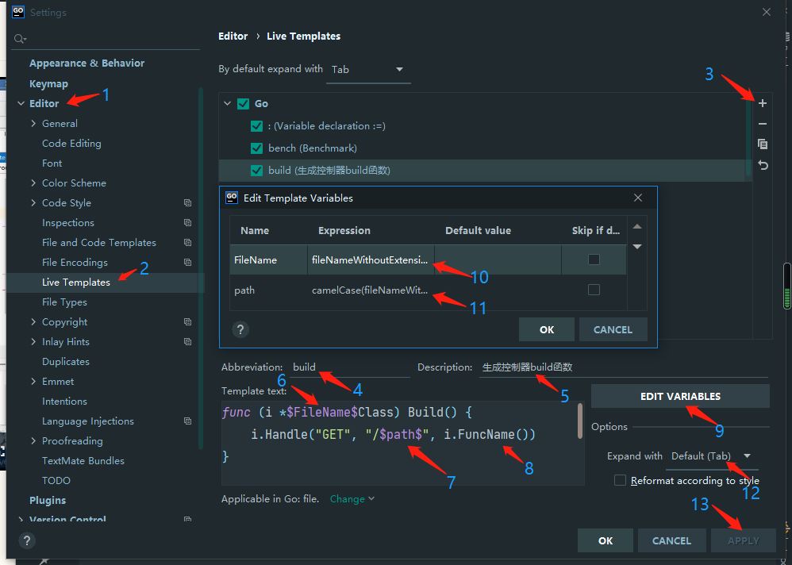
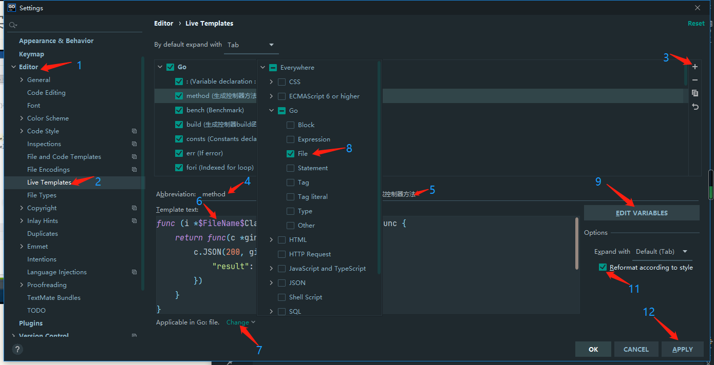
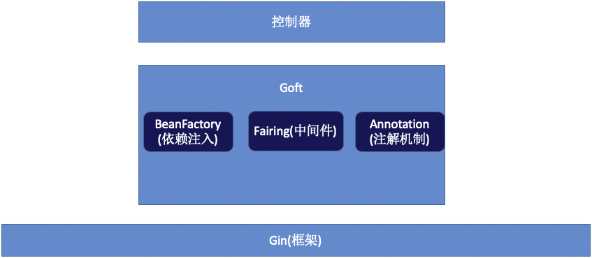
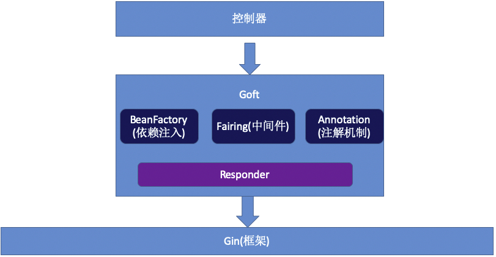

gin 脚手架研发

[toc]

### 01. 从零开始

新建目录 `src/cmd/main.go`

```go
package main

import "github.com/gin-gonic/gin"

func main() {
	r := gin.New()
	r.Handle("GET", "/", func(c *gin.Context){
		c.JSON(200, gin.H{"result":"success"})
	})

	r.Run(":8080")
}
```

请求 http://localhost:8080/ 可以看到 `{ "result": "success" }`

### 02. 隐藏路由和业务方法

```go
package main

import (
	. "gin-up/src/classes"
	"github.com/gin-gonic/gin"
)

func main() {
	r := gin.New()
	NewIndexClass(r).Build() // 路由和业务方法隐藏

	r.Run(":8080")
}
```

在 `src` 目录下新建 `classes` 目录和 `index.go` 文件

```go
package classes

import "github.com/gin-gonic/gin"

// IndexClass 嵌套 *gin.Engine
type IndexClass struct {
	*gin.Engine // gin.New() 创建的
	// 嵌套，好比继承，但不是继承
}

// NewIndexClass 所谓的构造函数
func NewIndexClass(e *gin.Engine) *IndexClass {
	return &IndexClass{Engine: e} // 需要赋值，因为是指针
}

// GetIndex 业务方法，函数名根据业务而起
func (i *IndexClass) GetIndex() gin.HandlerFunc {
	return func(c *gin.Context) {
		c.JSON(200, gin.H{
			"result": "index ok",
		})
	}
}

// Build 把业务的路由隐藏在 Build 函数
func (i *IndexClass) Build() {
	i.Handle("GET", "/", i.GetIndex())
}
```

代码变动 [git commit](https://github.com/custer-go/learn-gin/commit/d103180c4c866f505adcbc9b9b367b26dda12397#diff-5f86647f5f70db405f26a54014d77b1d15d913f96b612dc6763b8870041577d8R1)

### 03. 自定义快捷模板

在 `src/classes` 目录下新建 `User.go` 文件，注意**文件名统一首字母大写** 以便于使用快捷模板

```go
func (this *$FileName$Class) Build() {
	this.Handle("GET", "/$path$", this.FuncName())
}
```



```go
func (this *$FileName$Class) FuncName() gin.HandlerFunc {
	return func(c *gin.Context) {
		c.JSON(200, gin.H{
			"result": "success",
		})
	}
}
```



这样在 `User.go` 中，手写 

```go
package classes

import "github.com/gin-gonic/gin"

// UserClass *gin.Engine 的嵌套
type UserClass struct {
	*gin.Engine
}
```

鼠标放到 `type UserClass struct {` 右键选择 `generate` 再选择 `constructor` 自动生成 **构造函数**。

```go
// NewUserClass UserClass generate constructor
func NewUserClass(engine *gin.Engine) *UserClass {
	return &UserClass{Engine: engine}
}
```

然后使用快捷键盘 `method` 自动生成 **控制器函数**

```go
// UserList 控制器方法
func (this *UserClass) UserList() gin.HandlerFunc {
	return func(c *gin.Context) {
		c.JSON(200, gin.H{
			"result": "success",
		})
	}
}
```

继续使用快捷键 `build` 自动生成 **控制器 build 方法**

```go
func (this *UserClass) Build() {
	this.Handle("GET", "/user", this.UserList())
}
```

最后在 `main.go` 中调用 `NewUserClass(r).Build()`

代码变动 [git commit](https://github.com/custer-go/learn-gin/commit/64c4800eb89dc38914dca1c1f3aba11a1b880187#diff-8d9e1f78703b2eb32787b5d6fcdc6da3201ad241fb4c572b6bbe8eb8284031e3R1)

### 04. 封装 gin 成自己的框架 goft

现在 `main.go` 的代码形式是

```go
func main() {
	r := gin.New()
	NewIndexClass(r).Build() // 路由和业务方法隐藏
	NewUserClass(r).Build() // 控制器
	r.Run(":8080")
}
```

还有一些问题：

1. 如果控制器多了，代码还是冗余
2. 各个控制器代码之前，没有约束(没有接口规范)

新建目录 `src\goft` 和文件 `Goft.go`

```go
package goft

import "github.com/gin-gonic/gin"

// Goft 嵌套 *gin.Engine
type Goft struct {
	*gin.Engine
}

// Ignite Goft 的构造函数，发射、燃烧，富含激情的意思
func Ignite() *Goft {
	return &Goft{Engine: gin.New()}
}

// Launch 最终启动函数，相当于 r.Run()
func (this *Goft) Launch() {
	this.Run(":8080")
}

// Mount 挂载控制器，定义接口，接口里的方法作为参数，控制器实现接口就可以传进来
func (this *Goft) Mount() {

}
```

在 `src/goft` 目录下新建 `IClass.go` 文件，定义接口

```go
package goft

type IClass struct {
	Build(goft *Goft)
}
```

修改业务控制器 `src/classes/User.go` 代码，删除 `*gin.Engine`，

使得业务控制器和服务器没有强关联，否则耦合太高。

```go
// UserClass 
type UserClass struct {}

// NewUserClass UserClass generate constructor
func NewUserClass() *UserClass {
	return &UserClass{}
}
```

控制器生成方法 `Build()` 修改传入参数，这样就实现了 `IClass` 接口

```go
func (this *UserClass) Build(goft *goft.Goft) {
	goft.Handle("GET", "/user", this.UserList())
}
```

在 `Mount()` 函数里就可以传入参数

```go
func (this *Goft) Mount(classes ...IClass) *Goft {
	for _, class := range classes {
		class.Build(this) 
	}
    return this
}
```

返回自己 `*Goft` 是为了链式调用。同样的修改 `src/classes/Index.go`

```go
package classes

import (
	"gin-up/src/goft"
	"github.com/gin-gonic/gin"
)

type IndexClass struct{}

func NewIndexClass() *IndexClass {
	return &IndexClass{}
}

// GetIndex 业务方法，函数名根据业务而起
func (i *IndexClass) GetIndex() gin.HandlerFunc {
	return func(c *gin.Context) {
		c.JSON(200, gin.H{
			"result": "index ok",
		})
	}
}

// Build 把业务的路由隐藏在 Build 函数
func (i *IndexClass) Build(goft *goft.Goft) {
	goft.Handle("GET", "/", i.GetIndex())
}
```

在 `main.go` 中调用

```go
package main

import (
	. "gin-up/src/classes"
	"gin-up/src/goft"
)

func main() {
	goft.Ignite().Mount(NewIndexClass(), NewUserClass()).Launch()
}
```

最终的 `src/goft/Goft.go` 代码

```go
package goft

import "github.com/gin-gonic/gin"

// Goft 嵌套 *gin.Engine
type Goft struct {
	*gin.Engine
}

// Ignite Goft 的构造函数，发射、燃烧，富含激情的意思
func Ignite() *Goft {
	return &Goft{Engine: gin.New()}
}

// Launch 最终启动函数，相当于 r.Run()
func (this *Goft) Launch() {
	this.Run(":8080")
}

// Mount 挂载控制器，定义接口，控制器继承接口就可以传进来
func (this *Goft) Mount(classes ...IClass) *Goft {
	for _, class := range classes {
		class.Build(this)
	}
	return this
}
```

代码变动 [git commit](https://github.com/custer-go/learn-gin/commit/42141001ea2945a28c70beaaf3f9560761a59e94#diff-8d9e1f78703b2eb32787b5d6fcdc6da3201ad241fb4c572b6bbe8eb8284031e3L1)

### 05. 把路由挂载到 Group 中

`gin` 可以自定义 `group` 分组，方便进行 API 版本的管理

```go
package main

import (
	"github.com/gin-gonic/gin"
)

func main() {
	//goft.Ignite().Mount(NewIndexClass(), NewUserClass()).Launch()

	r := gin.New()
	v1 := r.Group("v1")
	{
		v1.GET("/ping", func(c *gin.Context) {
			c.JSON(200, gin.H{"message": "pong"})
		})
	}
	r.Run()
}
```

在 `Mount()` 函数中修改代码实现 `Group` 功能

```go
func (this *Goft) Mount(group string, classes ...IClass) *Goft {
	this.g = this.Group(group)
	for _, class := range classes {
		class.Build(this)
	}
	return this
}
```

修改主类 `Goft`

```go
type Goft struct {
	*gin.Engine // 把 *gin.Engine 放入主类里
	g *gin.RouterGroup // 保存 group 对象
}
```

不改变控制器代码，可以重载 `gin.Handle()`  函数

```go
// Handle 重载 gin.Handle 函数
func (this *Goft) Handle(httpMethod, relativePath string, handlers ...gin.HandlerFunc) *Goft {
	this.g.Handle(httpMethod, relativePath, handlers...) // 最后一个参数，需要使用 ...来延展
	return this
}
```

这样在 `main.go` 中就可以加入 `group` 参数

```go
package main

import (
	. "gin-up/src/classes"
	"gin-up/src/goft"
)

func main() {
	goft.Ignite().
		Mount("v1", NewIndexClass(),
			NewUserClass()).
		Mount("v2", NewIndexClass()).
		Launch()
}
```

代码修改 [git commit](https://github.com/custer-go/learn-gin/commit/eb0ebcd0e6bc032ea783d85d35817114436c5978#diff-9dc2b1b9bae1a7f587f7bc524f1be8a4e736ea93f487ad5451bd110d682b8f70L6)

### 06. 精酿中间件(1):代码架构

`gin` 官方是支持中间件

```go
package main

import (
	"github.com/gin-gonic/gin"
)

func main() {
	r := gin.New()
	r.Use(func(c *gin.Context) {
		
	})
	r.GET("/", func(c *gin.Context) {
		c.JSON(200, gin.H{"message": "ok"})
	})
	r.Run()
}
```

在 `src/goft/Goft.go` 中新增方法 `Attach()` 表示中间件

```go
// Attach 实现中间件的加入
func (this *Goft) Attach(f gin.HandlerFunc) *Goft {
	this.Use(f)
	return this
}
```

在 `main.go` 中就可以使用 `Attach()` 函数加入中间件。

```go
func main() {
	goft.Ignite().
		Attach(func(c *gin.Context) {
			log.Println("用户中间件")
		}).
		Mount("v1",  NewIndexClass(),
			NewUserClass()).
		Mount("v2", NewIndexClass()).
		Launch()
}
```

运行访问 http://localhost:8080/v1/ 查看控制台可以看到 

```bash
[GIN-debug] Listening and serving HTTP on :8080
2020/11/10 21:43:19 用户中间件
```

在目录 `src/goft` 下新建 文件 `Fairing.go` 用来规范中间件代码和功能的接口

```go
package goft

// Fairing 规范中间件代码和功能的接口
type Fairing interface {
	OnRequest() error
}
```

新建目录 `src/middlewares`，用来专门存放中间件

```go
package middlewares

import "fmt"

// UserMid 用户中间件，"继承" Fairing 接口
type UserMid struct{}

func NewUserMid() *UserMid {
	return &UserMid{}
}

// OnRequest 在请求进入时，可以处理一些业务逻辑，或控制
func (this *UserMid) OnRequest() error {
	fmt.Println("这是新的用户中间件")
	return nil
}
```

现在就可以修改之前实现的 `Attach()` 函数

```go
// Attach 实现中间件的加入
func (this *Goft) Attach(f Fairing) *Goft {
	this.Use(func(c *gin.Context) {
		err := f.OnRequest()
		if err != nil {
			c.AbortWithStatusJSON(400, gin.H{"error": err.Error()})
		} else {
			c.Next() // 继续往下执行
		}
	})
	return this
}
```

修改 `main.go`

```go
package main

import (
	. "gin-up/src/classes"
	"gin-up/src/goft"
	. "gin-up/src/middlewares"
)

func main() {
	goft.Ignite().
		Attach(NewUserMid()). // 带声明周期的中间件
		Mount("v1", NewIndexClass(), // 控制器，挂载到 v1
			NewUserClass()).
		Mount("v2", NewIndexClass()). // 控制器，挂载到 v2 
		Launch()
}
```

运行程序访问 http://localhost:8080/v1/ 可以看到还是相同的效果，控制台显示 `这是新的用户中间件`

测试发生错误时的显示，先修改 `src/middlewares/UserMid.go`

```go
package middlewares

import "fmt"

// UserMid 用户中间件，"继承" Fairing 接口
type UserMid struct{}

func NewUserMid() *UserMid {
	return &UserMid{}
}

// OnRequest 在请求进入时，可以处理一些业务逻辑，或控制
func (this *UserMid) OnRequest() error {
	fmt.Println("这是新的用户中间件")
	return fmt.Errorf("强制执行错误")
}
```

访问 http://localhost:8080/v1/ 返回 `{ "error": "强制执行错误" }`，控制台还是显示 `这是新的用户中间件`

代码变动 [git commit](https://github.com/custer-go/learn-gin/commit/1124273cad1142ed9507f9bc0a7bdc4ebbc2d1c4#diff-9dc2b1b9bae1a7f587f7bc524f1be8a4e736ea93f487ad5451bd110d682b8f70L3) 

### 07. 中间件(2):注入上下文参数

上面是中间件的简单使用，那么如何在 `UserMid.go` 中如何调用 `gin.Context` 来获取一些请求参数之类的。

```go
func (this *UserMid) OnRequest() error {
	fmt.Println("这是新的用户中间件")
	return nil
}
```

在 `func (this *UserMid) OnRequest() error {` 中增加参数 `ctx *gin.Context`

```go
func (this *UserMid) OnRequest(ctx *gin.Context) error {
	fmt.Println("这是新的用户中间件")
	fmt.Println(ctx.Query("name")) // 测试 query 参数，如 /v1/user?name=
	return fmt.Errorf("强制执行错误")
}
```

首先改造接口 `src/goft/Fairing.go`

```go
package goft

import "github.com/gin-gonic/gin"

// Fairing 规范中间件代码和功能的接口
type Fairing interface {
	OnRequest(*gin.Context) error
}
```

然后在 `src/goft/Goft.go` 中修改 `Attach()` 函数

```go
func (this *Goft) Attach(f Fairing) *Goft {
	this.Use(func(c *gin.Context) {
    err := f.OnRequest(c) // new: 添加参数
		if err != nil {
			c.AbortWithStatusJSON(400, gin.H{"error": err.Error()})
		} else {
			c.Next() // 继续往下执行
		}
	})
	return this
}
```

访问 http://localhost:8080/v1/user?name=custer 可以看到控制台输出了 

```bash
[GIN-debug] GET    /v1/                      --> gin-up/src/classes.(*IndexClass).GetIndex.func1 (2 handlers)
[GIN-debug] GET    /v1/user                  --> gin-up/src/classes.(*UserClass).UserList.func1 (2 handlers)
[GIN-debug] GET    /v2/                      --> gin-up/src/classes.(*IndexClass).GetIndex.func1 (2 handlers)
[GIN-debug] Listening and serving HTTP on :8080
这是新的用户中间件
custer
```

代码变动 [git commit](https://github.com/custer-go/learn-gin/commit/1dddbf9bc9e889c6d44b26b59fe93b19b04cd2c7#diff-9dc2b1b9bae1a7f587f7bc524f1be8a4e736ea93f487ad5451bd110d682b8f70L8)

### 08.控制器改造(1):让goft具备控制器的模式

之前写的控制器方法

```go
// UserList 控制器方法
func (this *UserClass) UserList() gin.HandlerFunc {
	return func(c *gin.Context) {
		c.JSON(200, gin.H{
			"result": "success",
		})
	}
}
```

每个控制器方法都要返回 `gin.HandlerFunc` ，这样很不方便，我们希望的形式是

`func (this *UserClass) UserList(ctx *gin.Context) string{ return "abc" }`

如果返回的是字符串，那么显示的就是 `string `格式，如果返回的是 `struct` ，那么显示的就是 `JSON` 格式。

进一步规范控制器方法。

如果控制器函数是返回 `string` 的形式，那么修改控制器生成函数

```go
func (this *UserClass) Build(goft *goft.Goft) {
	goft.Handle("GET", "/user", this.UserList) // <- 参数修改为函数
}
```

需要修改重载的 `Handle()` 方法

```go
// Handle 重载 gin.Handle 函数
func (this *Goft) Handle(httpMethod, relativePath string, handlers ...gin.HandlerFunc) *Goft {
	this.g.Handle(httpMethod, relativePath, handlers...) // 最后一个参数，需要使用 ...来延展
	return this
}
```

修改为

```go
func (this *Goft) Handle(httpMethod, relativePath string, handler interface{}) *Goft {
	if h, ok := handler.(func(*gin.Context) string); ok { // 断言成功
		this.g.Handle(httpMethod, relativePath, func(context *gin.Context) {
			context.String(200, h(context))
		})
	}
	return this
}
```

此时访问 http://localhost:8080/v1/user 可以看到页面显示的是字符串 `abc`。

代码变动 [git commit](https://github.com/custer-go/learn-gin/commit/b4b5707b13eb76cdcf3e9555138f8fdefe737f37#diff-8d9e1f78703b2eb32787b5d6fcdc6da3201ad241fb4c572b6bbe8eb8284031e3L6)

### 09. 封装控制器的返回类型判断

如果需要控制器返回的是对象切片或没有返回值，还需要进一步封装。

第1步在目录 `src/goft` 下创建新文件 `Responder.go`

```go
package goft

import "github.com/gin-gonic/gin"

// Responder 接口目的是 gin.Handle() 的第三个参数
type Responder interface {
	RespondTo() gin.HandlerFunc
}

// StringResponder 把返回字符串的 gin.HandlerFunc 包装成一个类型
type StringResponder func(*gin.Context) string

func (this StringResponder) RespondTo() gin.HandlerFunc {
	return func(context *gin.Context) {
		context.String(200, this(context))
	}
}
```

目的使得 `StringResponder` 代替 `func(*gin.Context) string)`  这个判断，

接下来对 `handler` 进行类型的断言，看是什么类型，然后执行相关的方法，获得 `gin.HandlerFunc`。

直接把 `interface{}` 断言成 `Responder` 接口是不可以的，

`if h, ok := handler.(Responder); ok {}`。如果断言成 `StringResponder`  也是不可以的。

这里写一个函数 `Convert()`，通过反射进行判断

```go
package goft

import (
	"github.com/gin-gonic/gin"
	"reflect"
)

// ResponderList 切片是一堆 Responder 接口
var ResponderList []Responder

func init() {
	ResponderList = []Responder{new(StringResponder)} // 反射不能直接使用类型，提供反射需要的指针
}

// Responder 接口目的是 gin.Handle() 的第三个参数
type Responder interface {
	RespondTo() gin.HandlerFunc
}

// Convert 通过反射判断 interface{] 类型断言
func Convert(handler interface{}) gin.HandlerFunc {
	hRef := reflect.ValueOf(handler) // handler 变成 reflect 反射对象
	for _, r := range ResponderList {
		rRef := reflect.ValueOf(r).Elem() // new() 的指针类型必须要执行 Elem
		// 判断 hRef 的类型是否可以转换成 rRef 的类型
		if hRef.Type().ConvertibleTo(rRef.Type()) {
			rRef.Set(hRef) // 反射的方式设置值
			return rRef.Interface().(Responder).RespondTo()
		}
	}
	return nil
}

// StringResponder 把返回字符串的 gin.HandlerFunc 包装成一个类型
type StringResponder func(*gin.Context) string

// RespondTo 接口的实现
func (this StringResponder) RespondTo() gin.HandlerFunc {
	return func(context *gin.Context) {
		context.String(200, this(context))
	}
}
```

这样 `interface{}` 的断言判断就变成了 

`if h := Convert(handler); h != nil { this.g.Handle(httpMethod, relativePath, h) }`

```go
func (this *Goft) Handle(httpMethod, relativePath string, handler interface{}) *Goft {
	if h := Convert(handler); h != nil {
		this.g.Handle(httpMethod, relativePath, h)
	}
	return this
}
```

后面需要扩展类型，只要再加入如 `StringResponder` 类型就可以。

代码修改 [git commit](https://github.com/custer-go/learn-gin/commit/35f935e5ee99f528b41f3cd5644afef707d8d534#diff-0f1ee6f707b7869eabce2aa3d3ef09047fda674d2af21af8ca3a953a0a4e70abL20)

### 10. 示例: 让控制器支持直接返回实体类

比如请求用户详情接口，需要返回用户实体，首先在 `src/goft` 下新建 `Model.go` 文件

```go
package goft

type Model interface {
	String() string
}
```

这样业务方法的实体都需要继承 `Model` ，

新建业务实体的文件夹 `src/modles`，然后新建用户实体文件 `UserModel.go`

```go
package models

type UserModel struct {
	UserID   int
	UserName string
}
```

然后继承 `goft/model` 的公共实体 `model` 接口，只需要实现 `String()` 方法就可以

```go
package models

import "fmt"

type UserModel struct {
	UserID   int
	UserName string
}

func (this *UserModel) String() string {
	return fmt.Sprintf("user_id: %d, user_name: %s", this.UserID, this.UserName)
}
```

这样在 `src/classes/User.go` 中的控制器 `UserDetail` 就可以返回用户实体

```go
package classes

import (
	"gin-up/src/goft"
	"gin-up/src/models"
	"github.com/gin-gonic/gin"
)

// UserClass 
type UserClass struct{}

// NewUserClass UserClass generate constructor
func NewUserClass() *UserClass {
	return &UserClass{}
}

// UserList 控制器方法
func (this *UserClass) UserList(c *gin.Context) string {
	return "用户列表"
}

// UserDetail 返回 Model 实体
func (this *UserClass) UserDetail(c *gin.Context) goft.Model {
	return &models.UserModel{UserID: 101, UserName: "custer"}
}

func (this *UserClass) Build(goft *goft.Goft) {
	goft.Handle("GET", "/user", this.UserList).
  		 Handle("GET", "/user/detail", this.UserDetail)
}
```

然后在 `src/goft/Responder.go` 中增加扩展类型

```go
type ModelResponder func(*gin.Context) Model

// RespondTo 接口的实现
func (this ModelResponder) RespondTo() gin.HandlerFunc {
	return func(context *gin.Context) {
		context.JSON(200, this(context))
	}
}
```

并注册 

```go
func init() {
	ResponderList = []Responder{
		new(StringResponder),
		new(ModelResponder),
	} // 反射不能直接使用类型，提供反射需要的指针
}
```

这样浏览器访问 http://localhost:8080/v1/user，可以看到显示 `用户列表`

浏览器访问 http://localhost:8080/v1/user/detail，可以看到显示 

`{"UserID": 101,"UserName": "custer"}`

代码修改 [git commit](https://github.com/custer-go/learn-gin/commit/e040c9ea87ca224cecc1aefa7f82873e94afa774#diff-8d9e1f78703b2eb32787b5d6fcdc6da3201ad241fb4c572b6bbe8eb8284031e3L2)

### 11. 示例:让控制器支持返回实体类切片

所有返回自定义的 `struct` 一律返回值都是 `goft.Model` 

下面返回切片，在 `src/goft/Model.go` 中增加代码

```go
package goft

type Model interface {
	String() string
}

type Models []Model
```

`type Models []Model` 需要在 `Responder.go` 中进行处理，用户切片转换为 `Models` 需要进行循环和遍历。

使用 `type Models string` 可以比较简单的处理用户切片和 `Models` 之间的转换。

```go
package goft

import (
	"encoding/json"
	"log"
)

type Model interface {
	String() string
}

type Models string

// MakeModels
func MakeModels(v interface{}) Models {
	b, err := json.Marshal(v)
	if err != nil {
		log.Println(err)
	}
	return Models(b)
}
```

在用户控制器中，返回的就是 `goft.Models`

```go
// UserList 用户列表 返回切片
func (this *UserClass) UserList(c *gin.Context) goft.Models {
	users := []*models.UserModel{
		&models.UserModel{UserID: 101, UserName: "custer"},
		{UserID: 102, UserName: "张三"},
		{UserID: 103, UserName: "李四"},
	}
	return goft.MakeModels(users)
}
...
func (this *UserClass) Build(goft *goft.Goft) {
	goft.Handle("GET", "/test", this.UserTest).
		Handle("GET", "/user", this.UserList).
		Handle("GET", "/user/detail", this.UserDetail)
}
```

在控制器返回接口中新增返回实体类的切片并注册

```go
...
func init() {
	ResponderList = []Responder{
		new(StringResponder),
		new(ModelResponder),
		new(ModelsResponder),
	} // 反射不能直接使用类型，提供反射需要的指针
}
...
// ModelsResponder 控制器返回实体类切片
type ModelsResponder func(*gin.Context) Models

// RespondTo 接口的实现
func (this ModelsResponder) RespondTo() gin.HandlerFunc {
	return func(context *gin.Context) {
		context.Writer.Header().Set("Content-type", "application/json")
		context.Writer.WriteString(string(this(context)))
	}
}
```

浏览器访问 http://localhost:8080/v1/user ，可以看到 

```json
[
    {
        "UserID": 101,
        "UserName": "custer"
    },
    {
        "UserID": 102,
        "UserName": "张三"
    },
    {
        "UserID": 103,
        "UserName": "李四"
    }
]
```

代码变动 [git commit](统一处理Error (基本方法))

### 12. 统一处理控制器中的Error (基本方法)

修改用户详情路由 `GET /user/:id`

验证 `id` 在 `src/models/UserModel.go` 中使用 `uri:"id"` ，

即可把路由中的 `/user/:id` 和 `UserID` 绑定。再加上简单的验证，并生成空参数的构造函数

```go
package models

import "fmt"

type UserModel struct {
	UserID   int `uri:"id" binding:"required,gt=0"`
	UserName string
}

func NewUserModel() *UserModel {
	return &UserModel{}
}

func (this *UserModel) String() string {
	return fmt.Sprintf("user_id: %d, user_name: %s", this.UserID, this.UserName)
}
```

再修改控制器 `UserDetail()`

```go
func (this *UserClass) UserDetail(c *gin.Context) goft.Model {
	user := models.NewUserModel()
	err := c.BindUri(user)
  ...
}
```

如果验证出错该如何处理，在 `src/goft` 目录下新增文件 `Error.go` 

```go
package goft

import "github.com/gin-gonic/gin"

// ErrorHandler 中间件
func ErrorHandler() gin.HandlerFunc {
	return func(context *gin.Context) {
		defer func() {
			if e := recover(); e != nil {
				context.AbortWithStatusJSON(400, gin.H{"error": e})
			}
		}()
		context.Next()
	}
}

// Error 出错直接 panic 然后在中间件中拦截
func Error(err error) {
	if err == nil {
		return
	} else {
		panic(err.Error())
	}
}
```

这样 `UserDetail()` 中代码就变成了

```go
func (this *UserClass) UserDetail(c *gin.Context) goft.Model {
	user := models.NewUserModel()
	err := c.BindUri(user)
	goft.Error(err) // 如果出错会发生 panic，然后在中间件中处理返回 400
	return user
}
```

修改 `func Error(err error)` 为 `func Error(err error, msg ...string)`，以支持自定义报错信息。

```go
func Error(err error, msg ...string) {
	if err == nil {
		return
	} else {
		errMsg := err.Error() // 默认为内部的错误信息
		if len(msg) > 0 {     // 有自定义的报错信息
			errMsg = msg[0]
		}
		panic(errMsg)
	}
}
```

这样就可以支持自定义报错信息

```go
func (this *UserClass) UserDetail(c *gin.Context) goft.Model {
	user := models.NewUserModel()
	err := c.BindUri(user)
	goft.Error(err, "ID 参数不合法") // 如果出错会发生 panic，然后在中间件中处理返回 400
	return user
}
```

修改 `goft` 构造函数以使得强制加载异常处理中间件

```go
func Ignite() *Goft {
	 g:= &Goft{Engine: gin.New()}
	 g.Use(ErrorHandler()) // 必须强制加载异常处理中间件
	 return g
}
```

运行代码访问浏览器 http://localhost:8080/v1/user/123abc 可以看到 `{"error":"ID 参数不合法"}`

代码变动 [git commit](https://github.com/custer-go/learn-gin/commit/49b75845d23bdf75e92480b7764fd6ac3934191b#diff-8d9e1f78703b2eb32787b5d6fcdc6da3201ad241fb4c572b6bbe8eb8284031e3L31)

### 13. ORM和控制器的整合技巧(上)

使用 `gorm` 连接 `MySQL` 数据库，在 `src/goft` 目录下新建文件  `GormAdapter.go` 来建立数据库连接。

```go
package goft

import (
	"gorm.io/driver/mysql"
	"gorm.io/gorm"
	"log"
	"time"
)

type GormAdapter struct {
	*gorm.DB
}

func NewGormAdapter() *GormAdapter {
	dsn := "root:root1234@tcp(127.0.0.1:3306)/test?charset=utf8mb4&parseTime=True&loc=Local"
	db, err := gorm.Open(mysql.Open(dsn), &gorm.Config{})
	if err != nil {
		log.Fatal(err)
	}
	// 获取通用数据库对象 sql.DB ，然后使用其提供的功能
	sqlDB, err := db.DB()
	if err != nil {
		log.Fatal(err)
	}
	if err := sqlDB.Ping(); err == nil {
		log.Println("数据库连接成功")
	}
	// SetMaxIdleConns 用于设置连接池中空闲连接的最大数量。
	sqlDB.SetMaxIdleConns(10)
	// SetMaxOpenConns 设置打开数据库连接的最大数量。
	sqlDB.SetMaxOpenConns(100)
	// SetConnMaxLifetime 设置了连接可复用的最大时间。
	sqlDB.SetConnMaxLifetime(time.Hour)
	return &GormAdapter{DB: db}
}
```

然后在用户控制器 `src/classes/User.go` 中调用数据库，只需要在 `UserClass` 嵌套 `*GormAdapter` 

```go
type UserClass struct{
	*GormAdapter
}
```

就可以在控制器中直接使用 `this.` 调用 `orm`

```go
func (this *UserClass) UserDetail(c *gin.Context) goft.Model {
	user := models.NewUserModel()
	err := c.BindUri(user)
	goft.Error(err, "ID 参数不合法") // 如果出错会发生 panic，然后在中间件中处理返回 400
	res:=this.Table(user.TableName()).
		Where("user_id=?", user.UserID).Find(user)
	fmt.Println(res.Error)
	return user
}
```

此时运行程序访问 http://localhost:8080/v1/user/1 可以看到发生了错误

```json
{
    "error": "invalid memory address or nil pointer dereference"
}
```

因为这个时候 `*GormAdapter` 仅仅被嵌套，并没有被初始化，

在 `src/goft/Goft.go` 中 `Mount()` 函数挂载的是当前控制器对象，所有控制器都是继承 `IClass` 接口。

这里需要对控制器的属性 `type UserClass struct{ *GormAdapter }` 进行初始化，

而 `IClass` 接口只有 `Build()` 方法，所以需要使用反射对控制器属性进行赋值。

首先先保存数据库对象

```go
type Goft struct {
	*gin.Engine                  // 把 *gin.Engine 放入主类里
	g           *gin.RouterGroup // 保存 group 对象
	dba         interface{}      // 保存和执行数据库对象
}
```

新增方法 `DB`，用来设定数据库连接对象，可以使用 `gorm` `xorm` 等等

```
// DB 设定数据库连接对象
func (this *Goft) DB(dba interface{}) *Goft {
	this.dba = dba
	return this
}
```

然后在 `main.go` 中**设定数据库对象，初始化数据库**

```go
func main() {
	goft.Ignite().
		DB(goft.NewGormAdapter()). // 设定数据库对象，初始化数据库
		Attach(NewUserMid()). // 带声明周期的中间件
		Mount("v1", NewIndexClass(), // 控制器，挂载到 v1
			NewUserClass()).
		Mount("v2", NewIndexClass()). // 控制器，挂载到 v2
		Launch()
}
```

这样设定了数据库对象之后，`Goft.dba` 中就有了值，然后对控制器实例化对象。

使用反射完成控制器对象的初始化和赋值

```go
// Mount 挂载控制器，定义接口，控制器继承接口就可以传进来
func (this *Goft) Mount(group string, classes ...IClass) *Goft {
	this.g = this.Group(group)
	for _, class := range classes {
		class.Build(this)
		// reflect.ValueOf(class) 是指针，reflect.ValueOf(class) 是指针指向的对象
		vClass := reflect.ValueOf(class).Elem()
		if vClass.NumField() > 0 { // vClass 的属性个数
			if this.dba != nil { // 并且 *Goft 中有数据库对象
				// vClass.Field(0)是强制使用第一个属性的指针，使用 Set() 进行赋值完成初始化
				// vClass.Field(0).Type() --> 指针 *GormAdapter
				// vClass.Field(0).Type().Elem() -->指针指向的对象 GormAdapter
				// reflect.New(vClass.Field(0).Type().Elem()) --> new 指针 *GormAdapter
				vClass.Field(0).Set(reflect.New(vClass.Field(0).Type().Elem()))
				// Elem() 是指针指向的对象 Set() 是进行赋值
				vClass.Field(0).Elem().Set(reflect.ValueOf(this.dba).Elem())
			}
		}
	}
	return this
}
```

完整代码如下：

```go
package goft

import (
	"github.com/gin-gonic/gin"
	"reflect"
)

// Goft
type Goft struct {
	*gin.Engine                  // 把 *gin.Engine 放入主类里
	g           *gin.RouterGroup // 保存 group 对象
	dba         interface{}      // 保存和执行 *gorm.DB 对象
}

// Ignite Goft 的构造函数，发射、燃烧，富含激情的意思
func Ignite() *Goft {
	g := &Goft{Engine: gin.New()}
	g.Use(ErrorHandler()) // 必须强制加载异常处理中间件
	return g
}

// Launch 最终启动函数，相当于 r.Run()
func (this *Goft) Launch() {
	this.Run(":8080")
}

// Handle 重载 gin.Handle 函数
func (this *Goft) Handle(httpMethod, relativePath string, handler interface{}) *Goft {
	if h := Convert(handler); h != nil {
		this.g.Handle(httpMethod, relativePath, h)
	}
	return this
}

// Attach 实现中间件的加入
func (this *Goft) Attach(f Fairing) *Goft {
	this.Use(func(c *gin.Context) {
		err := f.OnRequest(c)
		if err != nil {
			c.AbortWithStatusJSON(400, gin.H{"error": err.Error()})
		} else {
			c.Next() // 继续往下执行
		}
	})
	return this
}

// DB 设定数据库连接对象
func (this *Goft) DB(dba interface{}) *Goft {
	this.dba = dba
	return this
}

// Mount 挂载控制器，定义接口，控制器继承接口就可以传进来
func (this *Goft) Mount(group string, classes ...IClass) *Goft {
	this.g = this.Group(group)
	for _, class := range classes {
		class.Build(this)
		// reflect.ValueOf(class) 是指针，reflect.ValueOf(class) 是指针指向的对象
		vClass := reflect.ValueOf(class).Elem()
		if vClass.NumField() > 0 { // vClass 的属性个数
			if this.dba != nil { // 并且 *Goft 中有数据库对象
				// vClass.Field(0)是强制使用第一个属性的指针，使用 Set() 进行赋值完成初始化
				// vClass.Field(0).Type() --> 指针 *GormAdapter
				// vClass.Field(0).Type().Elem() -->指针指向的对象 GormAdapter
				// reflect.New(vClass.Field(0).Type().Elem()) --> new 指针 *GormAdapter
				vClass.Field(0).Set(reflect.New(vClass.Field(0).Type().Elem()))
				// Elem() 是指针指向的对象 Set() 是进行赋值
				vClass.Field(0).Elem().Set(reflect.ValueOf(this.dba).Elem())
			}
		}
	}
	return this
}
```

这样在控制器中，如果想要使用数据库对象，就直接嵌套数据库对象就可以了

```go
type UserClass struct {
	*goft.GormAdapter
}
```

如果不适用数据库对象，就不用嵌套，如果使用别的 `orm` 换嵌套 `*goft.GormAdapter` 就可以

```go
type UserClass struct {
}
```

访问 http://localhost:8080/v1/user/2 可以访问到数据库数据

 ```json
{
    "UserID": 2,
    "UserName": "custer"
}
 ```

代码变动 [git commit](https://github.com/custer-go/learn-gin/commit/08d73e7a383e7d648f433b5f2b9393ca7dea925a#diff-8d9e1f78703b2eb32787b5d6fcdc6da3201ad241fb4c572b6bbe8eb8284031e3L1)

### 14. ORM和控制器的整合技巧(下)

改造 `Goft` 

```go
type Goft struct {
	*gin.Engine                  // 把 *gin.Engine 放入主类里
	g           *gin.RouterGroup // 保存 group 对象
	dba         interface{}      // 保存和执行 *gorm.DB 对象
}
```

修改为切片

```go
type Goft struct {
	*gin.Engine                  // 把 *gin.Engine 放入主类里
	g           *gin.RouterGroup // 保存 group 对象
	props       []interface{}
}
```

于是在数据库连接对象时需要修改

```go
func (this *Goft) DB(dba interface{}) *Goft {
	this.props = append(this.props, dba)
	return this
}
```

注意切片需要初始化，否则是 `nil`

```go
func Ignite() *Goft {
	g := &Goft{Engine: gin.New(), props: make([]interface{}, 0)}
	g.Use(ErrorHandler()) // 必须强制加载异常处理中间件
	return g
}
```

修改代码

```go
func (this *Goft) Mount(group string, classes ...IClass) *Goft {
	this.g = this.Group(group)
	for _, class := range classes {
		class.Build(this)
		// reflect.ValueOf(class) 是指针，reflect.ValueOf(class) 是指针指向的对象
		vClass := reflect.ValueOf(class).Elem()
		if vClass.NumField() > 0 { // vClass 的属性个数
			if this.dba != nil { // 并且 *Goft 中有数据库对象
				// vClass.Field(0)是强制使用第一个属性的指针，使用 Set() 进行赋值完成初始化
				// vClass.Field(0).Type() --> 指针 *GormAdapter
				// vClass.Field(0).Type().Elem() -->指针指向的对象 GormAdapter
				// reflect.New(vClass.Field(0).Type().Elem()) --> new 指针 *GormAdapter
				vClass.Field(0).Set(reflect.New(vClass.Field(0).Type().Elem()))
				// Elem() 是指针指向的对象 Set() 是进行赋值
				vClass.Field(0).Elem().Set(reflect.ValueOf(this.dba).Elem())
			}
		}
	}
	return this
}
```

为

```go
package goft

import (
	"github.com/gin-gonic/gin"
	"reflect"
)

// Goft
type Goft struct {
	*gin.Engine                  // 把 *gin.Engine 放入主类里
	g           *gin.RouterGroup // 保存 group 对象
	props       []interface{}
	//dba         interface{}      // 保存和执行 *gorm.DB 对象
}

// Ignite Goft 的构造函数，发射、燃烧，富含激情的意思
func Ignite() *Goft {
	g := &Goft{Engine: gin.New(), props: make([]interface{}, 0)}
	g.Use(ErrorHandler()) // 必须强制加载异常处理中间件
	return g
}

// Launch 最终启动函数，相当于 r.Run()
func (this *Goft) Launch() {
	this.Run(":8080")
}

// Handle 重载 gin.Handle 函数
func (this *Goft) Handle(httpMethod, relativePath string, handler interface{}) *Goft {
	if h := Convert(handler); h != nil {
		this.g.Handle(httpMethod, relativePath, h)
	}
	return this
}

// Attach 实现中间件的加入
func (this *Goft) Attach(f Fairing) *Goft {
	this.Use(func(c *gin.Context) {
		err := f.OnRequest(c)
		if err != nil {
			c.AbortWithStatusJSON(400, gin.H{"error": err.Error()})
		} else {
			c.Next() // 继续往下执行
		}
	})
	return this
}

// DB 设定数据库连接对象
func (this *Goft) DB(dba interface{}) *Goft {
	this.props = append(this.props, dba)
	return this
}

// Mount 挂载控制器，定义接口，控制器继承接口就可以传进来
func (this *Goft) Mount(group string, classes ...IClass) *Goft {
	this.g = this.Group(group)
	for _, class := range classes {
		class.Build(this)
		this.setProp(class)
	}
	return this
}

// getProp 获取属性
func (this *Goft) getProp(t reflect.Type) interface{} {
	for _, p := range this.props {
		if t == reflect.TypeOf(p) {
			return p
		}
	}
	return nil
}

// setProp 赋值
func (this *Goft) setProp(class IClass) {
	// reflect.ValueOf(class) 是指针，reflect.ValueOf(class) 是指针指向的对象
	vClass := reflect.ValueOf(class).Elem()  // 反射
	for i := 0; i < vClass.NumField(); i++ { // 遍历 vClass 的属性
		f := vClass.Field(i)                       // 判断属性是否已经初始化
		if !f.IsNil() || f.Kind() != reflect.Ptr { // 如果控制器已经初始化或者不是指针
			continue // 就跳过
		}
		if p := this.getProp(f.Type()); p != nil {
			// vClass.Field(0)是强制使用第一个属性的指针，使用 Set() 进行赋值完成初始化
			// vClass.Field(0).Type() --> 指针 *GormAdapter
			// vClass.Field(0).Type().Elem() -->指针指向的对象 GormAdapter
			// reflect.New(vClass.Field(0).Type().Elem()) --> new 指针 *GormAdapter
			// vClass.Field(0).Set(reflect.New(vClass.Field(0).Type().Elem()))
			// Elem() 是指针指向的对象 Set() 是进行赋值
			// vClass.Field(0).Elem().Set(reflect.ValueOf(this.dba).Elem())
			f.Set(reflect.New(f.Type().Elem()))     // 初始化
			f.Elem().Set(reflect.ValueOf(p).Elem()) // 赋值
		}
	}
}
```

代码变动 [git commit](https://github.com/custer-go/learn-gin/commit/a2edc8e40b246850a4ffd66763f9e033de2f0c4f#diff-9dc2b1b9bae1a7f587f7bc524f1be8a4e736ea93f487ad5451bd110d682b8f70L8)

### 15. 示例：快速切换成XORM、简单依赖注入

```go
// DB 设定数据库连接对象
func (this *Goft) DB(dba interface{}) *Goft {
	this.props = append(this.props, dba)
	return this
}
```

修改为简单的依赖注入

```go
// Beans 实现简单的依赖注入
func (this *Goft) Beans(beans ...interface{}) *Goft {
	this.props = append(this.props, beans...)
	return this
}
```

后面只要在 `main.go` 中执行 `Beans()` ，所有参数都会注入到 `Goft` 中

```go
func main() {
	goft.Ignite().
		DB(goft.NewGormAdapter()). // 设定数据库 orm 对象，初始化数据库
		Attach(NewUserMid()). // 带声明周期的中间件
		Mount("v1", NewIndexClass(), // 控制器，挂载到 v1
			NewUserClass()).
		Mount("v2", NewIndexClass()). // 控制器，挂载到 v2
		Launch()
}
```

修改为

```go
func main() {
	goft.Ignite().
		Beans(goft.NewGormAdapter()). // 设定数据库 orm 的 Bean，简单的依赖注入
		Attach(NewUserMid()). // 带声明周期的中间件
		Mount("v1", NewIndexClass(), // 控制器，挂载到 v1
			NewUserClass()).
		Mount("v2", NewIndexClass()). // 控制器，挂载到 v2
		Launch()
}
```

只要控制器写上类型匹配到 `Beans` 就会被赋值，比如现在实现快速切换成 `xorm`

先新建一个 `src/goft/XormAdapter.go` 

```go
package goft

import (
	_ "github.com/go-sql-driver/mysql"
	"log"
	"xorm.io/xorm"
)

type XormAdapter struct {
	*xorm.Engine
}

func NewXormAdapter() *XormAdapter {
	dsn := "root:root1234@tcp(127.0.0.1:3306)/test?charset=utf8mb4&parseTime=True&loc=Local"
	engine, err := xorm.NewEngine("mysql", dsn)
	if err != nil {
		log.Fatal(err)
	}
	if err := engine.Ping(); err == nil {
		log.Println("通过 xorm 连接数据库成功")
	}
	engine.DB().SetMaxIdleConns(5)  // SetMaxIdleConns 用于设置连接池中空闲连接的最大数量。
	engine.DB().SetMaxOpenConns(10) // SetMaxOpenConns 设置打开数据库连接的最大数量。
	return &XormAdapter{Engine: engine}
}
```

然后在控制器 `src/classes/User.go` 中就可以使用

```go
type UserClass struct {
	//*goft.GormAdapter
	*goft.XormAdapter
}
...
func (this *UserClass) UserDetail(c *gin.Context) goft.Model {
	user := models.NewUserModel()
	err := c.BindUri(user)
	goft.Error(err, "ID 参数不合法") // 如果出错会发生 panic，然后在中间件中处理返回 400
	//this.Table(user.TableName()).
	//	Where("user_id=?", user.UserID).Find(user)
	has, err := this.Table(user.TableName()).
		Where("user_id=?", user.UserID).Get(user)
	if !has { // 没有记录
		goft.Error(fmt.Errorf("没有该用户"))
	}
	return user
}
```

在 `main.go` 中注入

```go
package main

import (
	. "gin-up/src/classes"
	. "gin-up/src/goft"
	. "gin-up/src/middlewares"
)

func main() {
	Ignite().
		Beans(NewGormAdapter(), NewXormAdapter()). // 设定数据库 orm 的 Bean，简单的依赖注入
		Attach(NewUserMid()). // 带声明周期的中间件
		Mount("v1", NewIndexClass(), // 控制器，挂载到 v1
			NewUserClass()).
		Mount("v2", NewIndexClass()). // 控制器，挂载到 v2
		Launch()
}
```

注意修改 **当前field对应的字段的名称，可选，如不写，则自动根据field名字和转换规则命名，如与其它关键字冲突，请使用单引号括起来。**

https://www.kancloud.cn/kancloud/xorm-manual-zh-cn/56004

```go
type UserModel struct {
	UserID   int `xorm:"'user_id'" gorm:"column:user_id" uri:"id" binding:"required,gt=0"`
	UserName string
}
```

重新运行程序，浏览器访问 http://localhost:8080/v1/user/1 可以看到 

```json
{
    "UserID": 1,
    "UserName": "custer123"
}
```

代码变动 [git commit](https://github.com/custer-go/learn-gin/commit/0459a5d97549c21f2a497a04226cbbe16100ba38#diff-8d9e1f78703b2eb32787b5d6fcdc6da3201ad241fb4c572b6bbe8eb8284031e3L9)

### 16. 集成yaml的配置、加载配置

使用第三方 yaml 解析库 https://github.com/go-yaml/yaml

`go get gopkg.in/yaml.v2` 

首先在项目根目录下创建新的配置文件 `application.yaml`

```yaml
server:
  port: 8088
```

在项目启动时之前是写死的端口

```go
// Launch 最终启动函数，相当于 r.Run()
func (this *Goft) Launch() {
	this.Run(":8080")
}
```

所以这里需要使用配置来完成加载，现在目录 `src/goft` 目录下新建文件 `SysConfig.go`，表示系统配置

```go
package goft

import (
	"gopkg.in/yaml.v2"
	"log"
)

type ServerConfig struct {
	Port int32
	Name string
}

// SysConfig 系统配置
type SysConfig struct {
	Server *ServerConfig
}

// NewSysConfig 初始化默认配置
func NewSysConfig() *SysConfig {
	return &SysConfig{Server: &ServerConfig{Port: 8080, Name: "goft"}}
}

func InitConfig() *SysConfig {
	config := NewSysConfig()             // 如果没有设定配置文件，使用默认配置
	if b := LoadConfigFile(); b != nil { // 如果设定了配置文件
		err := yaml.Unmarshal(b, config) // 把字符串类型的配置文件映射到 struct
		if err != nil {
			log.Fatal(err)
		}
	}
	return config
}
```

新建 `src/goft/WebUtil.go` 文件

```go
package goft

import (
	"io/ioutil"
	"log"
	"os"
)

// 读取当前执行的文件夹目录
// LoadConfigFile 读取配置文件
func LoadConfigFile() []byte {
	dir, _ := os.Getwd()
	file := dir + "/application.yaml"
	b, err := ioutil.ReadFile(file)
	if err != nil {
		log.Println(err)
		return nil
	}
	return b
}
```

修改启动端口配置

```go
// Launch 最终启动函数，相当于 r.Run()
func (this *Goft) Launch() {
	config := InitConfig()
	this.Run(fmt.Sprintf(":%d", config.Server.Port))
}
```

这样启动端口就变成了 `:8088`，思考自定义 `config` 怎么通过依赖注入的方式，在控制器里使用。

代码变动 [git commit](https://github.com/custer-go/learn-gin/commit/5026ea07296b49447de2be4d43d7904e1b23b9ed#diff-67df7db1d8da06247e01cd28608b4341f6e5d891580d62534787e2abfb849de4R1)

### 17. 实现Value注解读取配置(上)

自定义的 `config`，在 `yaml` 文件中必须用 `config` 开头，然后是用户定义的

比如：

```yaml
server:
  port: 8088
config:
  user:
    score: 100
```

修改 `SysConfig` 

```go
// SysConfig 系统配置
type SysConfig struct {
	Server *ServerConfig
	Config map[string]interface{}
}
```

运行打印输出 `fmt.Println(InitConfig().Config)` 可以看到 `map[user:map[score:100]]`

为了以后的扩展，优化代码

```go
type UserConfig map[string]interface{}

// SysConfig 系统配置
type SysConfig struct {
	Server *ServerConfig
	Config UserConfig
}
```

之前写的依赖注入，只要类型相同，就可以把这个值注入进来。

**Value 注解** 比如在 `yaml` 中加 `age: 19` ，然后在控制器中读取 `age`

```go
type UserClass struct {
	//*goft.GormAdapter
	*goft.XormAdapter
	Age *goft.Value `prefix:"user.age"`
}
...
// UserTest 控制器方法
func (this *UserClass) UserTest(c *gin.Context) string {
	return "用户测试" + this.Age.String()
}
```

`prefix:"user.age"` 代表读取 `config` 下 `user` 的 `age` 。

Go 中不支持注解，接下来通过依赖注入完成 **注解** ，新建文件 `src/goft/Annotation.go` 文件

```go
package goft

import "reflect"

// Annotation 注解接口
type Annotation interface {
	SetTag(tag reflect.StructTag) // 通过 Tag 完成更多复杂功能
}

// AnnotationList 注解列表是注解接口的切片
var AnnotationList []Annotation

//IsAnnotation 判断当前注入对象是否是注解，运行在系统启动之前运行，不用考虑性能
func IsAnnotation(t reflect.Type) bool {
	for _, item := range AnnotationList {
		if reflect.TypeOf(item) == t {
			return true
		}
	}
	return false
}

// init 包构造函数
func init() {
	AnnotationList = make([]Annotation, 0)
	AnnotationList = append(AnnotationList, new(Value))
}

// Value 注解
type Value struct {
	tag reflect.StructTag
}

func (this *Value) SetTag(tag reflect.StructTag) {
	this.tag = tag
}

func (this *Value) String() string {
	return "21"
}
```

然后修改依赖注入处理的方法 `Mount`

```go
// setProp 赋值
func (this *Goft) setProp(class IClass) {
	// reflect.ValueOf(class) 是指针，reflect.ValueOf(class) 是指针指向的对象
	vClass := reflect.ValueOf(class).Elem()  // 反射
	vClassT := reflect.TypeOf(class).Elem()
	for i := 0; i < vClass.NumField(); i++ { // 遍历 vClass 的属性
		f := vClass.Field(i)                       // 判断属性是否已经初始化
		if !f.IsNil() || f.Kind() != reflect.Ptr { // 如果控制器已经初始化或者不是指针
			continue // 就跳过
		}
		if p := this.getProp(f.Type()); p != nil {
			// vClass.Field(0)是强制使用第一个属性的指针，使用 Set() 进行赋值完成初始化
			// vClass.Field(0).Type() --> 指针 *GormAdapter
			// vClass.Field(0).Type().Elem() -->指针指向的对象 GormAdapter
			// reflect.New(vClass.Field(0).Type().Elem()) --> new 指针 *GormAdapter
			// vClass.Field(0).Set(reflect.New(vClass.Field(0).Type().Elem()))
			// Elem() 是指针指向的对象 Set() 是进行赋值
			// vClass.Field(0).Elem().Set(reflect.ValueOf(this.dba).Elem())
			f.Set(reflect.New(f.Type().Elem()))     // 初始化
			f.Elem().Set(reflect.ValueOf(p).Elem()) // 赋值

			if IsAnnotation(f.Type()) { // 判断是否是注解
				p.(Annotation).SetTag(vClassT.Field(i).Tag)
			}
		}
	}
}
```

运行代码访问浏览器 http://localhost:8088/v1/test 测试可以看到写死的返回值 `21 `， `用户测试21`

代码变动 [git commit](https://github.com/custer-go/learn-gin/commit/a40c67db303bb4e1f9ef1c969050a8d19c555149#diff-67df7db1d8da06247e01cd28608b4341f6e5d891580d62534787e2abfb849de4L1)

### 18. Value注解 (下)、修改整体结构

之前在 `Goft` 里的属性设置，从一开始是的 `dab interface{}` 到 `props []interface{}` 

```go
// Goft
type Goft struct {
	*gin.Engine                  // 把 *gin.Engine 放入主类里
	g           *gin.RouterGroup // 保存 group 对象
	props       []interface{}
	//dba         interface{}      // 保存和执行 *gorm.DB 对象
}
```

现在修改为

```go
type Goft struct {
	*gin.Engine                  // 把 *gin.Engine 放入主类里
	g           *gin.RouterGroup // 保存 group 对象
	beanFactory *BeanFactory
}
```

新增了文件 `src/goft/BeanFactory.go` ，

```go
package goft

import "reflect"

type BeanFactory struct {
	beans []interface{}
}

func NewBeanFactory() *BeanFactory {
	bf := &BeanFactory{beans: make([]interface{}, 0)}
	bf.beans = append(bf.beans, bf)
	return bf
}

// setBean 实现简单的依赖注入，往内存中塞入 bean
func (this *BeanFactory) setBean(beans ...interface{}) {
	this.beans = append(this.beans, beans...)
}

// GetBean 外部使用获取注入的属性
func (this *BeanFactory) GetBean(bean interface{}) interface{} {
	return this.getBean(reflect.TypeOf(bean))
}

// getBean 获取内存中预先设置好的 bean 对象
func (this *BeanFactory) getBean(t reflect.Type) interface{} {
	for _, p := range this.beans {
		if t == reflect.TypeOf(p) {
			return p
		}
	}
	return nil
}

// Inject 给外部用的 （后面还要改,这个方法不处理注解)
func (this *BeanFactory) Inject(object interface{}) {
	vObject := reflect.ValueOf(object)
	if vObject.Kind() == reflect.Ptr { //由于不是控制器 ，所以传过来的值 不一定是指针。因此要做判断
		vObject = vObject.Elem()
	}
	for i := 0; i < vObject.NumField(); i++ {
		f := vObject.Field(i)
		if f.Kind() != reflect.Ptr || !f.IsNil() {
			continue
		}
		if p := this.getBean(f.Type()); p != nil && f.CanInterface() {
			f.Set(reflect.New(f.Type().Elem()))
			f.Elem().Set(reflect.ValueOf(p).Elem())
		}
	}
}

// inject 把bean注入到控制器中 (内部方法,用户控制器注入。并同时处理注解)
func (this *BeanFactory) inject(class IClass) {
	vClass := reflect.ValueOf(class).Elem()
	vClassT := reflect.TypeOf(class).Elem()
	for i := 0; i < vClass.NumField(); i++ {
		f := vClass.Field(i)
		if f.Kind() != reflect.Ptr || !f.IsNil() {
			continue
		}
		if IsAnnotation(f.Type()) {
			f.Set(reflect.New(f.Type().Elem()))
			f.Interface().(Annotation).SetTag(vClassT.Field(i).Tag)
			this.Inject(f.Interface())
			continue
		}
		if p := this.getBean(f.Type()); p != nil {
			f.Set(reflect.New(f.Type().Elem()))
			f.Elem().Set(reflect.ValueOf(p).Elem())
		}
	}
}
```

修改 `src/goft/Goft.go` 文件

```go
package goft

import (
	"fmt"
	"github.com/gin-gonic/gin"
)

// Goft
type Goft struct {
	*gin.Engine                  // 把 *gin.Engine 放入主类里
	g           *gin.RouterGroup // 保存 group 对象
	beanFactory *BeanFactory
}

// Ignite Goft 的构造函数，发射、燃烧，富含激情的意思
func Ignite() *Goft {
	g := &Goft{Engine: gin.New(), beanFactory: NewBeanFactory()}
	g.Use(ErrorHandler())               // 必须强制加载异常处理中间件
	g.beanFactory.setBean(InitConfig()) // 配置文件加载进 bean 中
	return g
}

// Launch 最终启动函数，相当于 r.Run()
func (this *Goft) Launch() {
	var port int32 = 8080
	if config := this.beanFactory.GetBean(new(SysConfig)); config != nil {
		port = config.(*SysConfig).Server.Port
	}
	this.Run(fmt.Sprintf(":%d", port))
}

// Handle 重载 gin.Handle 函数
func (this *Goft) Handle(httpMethod, relativePath string, handler interface{}) *Goft {
	if h := Convert(handler); h != nil {
		this.g.Handle(httpMethod, relativePath, h)
	}
	return this
}

// Attach 实现中间件的加入
func (this *Goft) Attach(f Fairing) *Goft {
	this.Use(func(c *gin.Context) {
		err := f.OnRequest(c)
		if err != nil {
			c.AbortWithStatusJSON(400, gin.H{"error": err.Error()})
		} else {
			c.Next() // 继续往下执行
		}
	})
	return this
}

// Beans S和定数据库连接对象
func (this *Goft) Beans(beans ...interface{}) *Goft {
	this.beanFactory.setBean(beans...)
	return this
}

// Mount 挂载控制器，定义接口，控制器继承接口就可以传进来
func (this *Goft) Mount(group string, classes ...IClass) *Goft {
	this.g = this.Group(group)
	for _, class := range classes {
		class.Build(this)
		this.beanFactory.inject(class)
	}
	return this
}
```

修改注解文件 `src/goft/Annotation.go`

```go
package goft

import (
	"fmt"
	"reflect"
	"strings"
)

// Annotation 注解接口
type Annotation interface {
	SetTag(tag reflect.StructTag) // 通过 Tag 完成更多复杂功能
	String() string
}

// AnnotationList 注解列表是注解接口的切片
var AnnotationList []Annotation

//IsAnnotation 判断当前注入对象是否是注解，运行在系统启动之前运行，不用考虑性能
func IsAnnotation(t reflect.Type) bool {
	for _, item := range AnnotationList {
		if reflect.TypeOf(item) == t {
			return true
		}
	}
	return false
}

// init 包构造函数
func init() {
	AnnotationList = make([]Annotation, 0)
	AnnotationList = append(AnnotationList, new(Value))
}

// Value 注解
type Value struct {
	tag         reflect.StructTag
	BeanFactory *BeanFactory
}

func (this *Value) SetTag(tag reflect.StructTag) {
	this.tag = tag
}

func (this *Value) String() string {
	get_prefix := this.tag.Get("prefix")
	if get_prefix == "" {
		return ""
	}
	prefix := strings.Split(get_prefix, ".")
	if config := this.BeanFactory.GetBean(new(SysConfig)); config != nil {
		get_value := GetConfigValue(config.(*SysConfig).Config, prefix, 0)
		if get_value != nil {
			return fmt.Sprintf("%v", get_value)
		} else {
			return ""
		}
	} else {
		return ""
	}
}
```

在 `src/goft/Sysconfig.go` 中增加读取用户配置文件函数

```go
package goft

import (
	"gopkg.in/yaml.v2"
	"log"
)

type UserConfig map[interface{}]interface{}

// 递归读取用户配置文件
func GetConfigValue(m UserConfig, prefix []string, index int) interface{} {
	key := prefix[index]
	if v, ok := m[key]; ok {
		if index == len(prefix)-1 {
			return v
		} else {
			index = index + 1
			if mv, ok := v.(UserConfig); ok {
				return GetConfigValue(mv, prefix, index)
			} else {
				return nil
			}
		}
	}
	return nil
}

type ServerConfig struct {
	Port int32
	Name string
}

// SysConfig 系统配置
type SysConfig struct {
	Server *ServerConfig
	Config UserConfig
}

// NewSysConfig 初始化默认配置
func NewSysConfig() *SysConfig {
	return &SysConfig{Server: &ServerConfig{Port: 8080, Name: "goft"}}
}

func InitConfig() *SysConfig {
	config := NewSysConfig()             // 如果没有设定配置文件，使用默认配置
	if b := LoadConfigFile(); b != nil { // 如果设定了配置文件
		err := yaml.Unmarshal(b, config) // 把字符串类型的配置文件映射到 struct
		if err != nil {
			log.Fatal(err)
		}
	}
	return config
}
```



用户在上层写一个控制器，在控制器里可以根据已经设定好的内容，来进行注入，

规定注入的内容必须是指针对象 `*goft.XormAdapter` ，判断这个属性是否是指针对象，

如果是才做处理，如果这个属性被初始化了，也不做处理。

`Age *goft.Value prefix:"user.age"`  这是注解 `Bean` 对象，

普通的 `Bean` 对象和注解 `Bean` 对象，区分处理。

代码变动 [git commit](https://github.com/custer-go/learn-gin/commit/6e27208a5ff95308801680a8cb4be375b203d3e0#diff-5da66211ac8e72a52d87cad644addef96019578aa36b3b0cc0b10e2f22ddea2aL1)

### 19. 模板渲染(1):在gin脚手架中渲染html



使用 `Responder` 来扩展 `html` 渲染。

在控制器中之前是返回 `string` 或 `goft.Model` 或 `goft.Models`，

在 `src/goft/Responder.go` 中扩展返回的类型 `type View string` 。

在 `src/classes/Index.go` 控制器中可以使用

```go
func (i *IndexClass) GetIndex(ctx *gin.Context) goft.View {
	return "index"
}
```

在根目录下新建文件 `views` 来存放 `html` 文件，新建 `index.html`

```html
<!DOCTYPE html>
<html lang="en">
<head>
    <meta charset="UTF-8">
    <title>Title</title>
</head>
<body>
    首页
</body>
</html>
```

怎么在控制器中解析 `html`，在 `src/goft/Responder.go` 中修改代码

```go
type View string

// ViewResponder 把返回字符串的 gin.HandlerFunc 包装成一个类型
type ViewResponder func(*gin.Context) View

// RespondTo 接口的实现
func (this ViewResponder) RespondTo() gin.HandlerFunc {
	return func(context *gin.Context) {
		context.HTML(200, string(this(context))+".html", nil)
	}
}
```

在配置文件 `application.yaml` 中配置 `html` 文件夹路径

```yaml
server:
  port: 8088
  html: views/*
config:
  user:
    score: 100
    age: 19
```

在 `src/goft/SysConfig.go` 中添加读取配置文件的属性 

```go
type ServerConfig struct {
	Port int32
	Name string
	Html string 
}
```

在 `src/goft/Goft` 中之前把配置塞入 `Bean` 里面，

```go
func Ignite() *Goft {
	g := &Goft{Engine: gin.New(), beanFactory: NewBeanFactory()}
	g.Use(ErrorHandler())               // 必须强制加载异常处理中间件
	config := InitConfig()
	g.beanFactory.setBean(config) // 配置文件加载进 bean 中
	if config.Server.Html != "" {
		g.LoadHTMLGlob(config.Server.Html)
	}
	return g
}
```

然后来到 `src/goft/Responder.go` ，注册 `ViewResponder` 

```go
func init() {
	ResponderList = []Responder{
		new(StringResponder),
		new(ModelResponder),
		new(ModelsResponder),
		new(ViewResponder),
	} // 反射不能直接使用类型，提供反射需要的指针
}
```

这样在控制器中就支持返回模板

```go
package classes

import (
	"gin-up/src/goft"
)

type IndexClass struct{}

func NewIndexClass() *IndexClass {
	return &IndexClass{}
}

// GetIndex 业务方法，函数名根据业务而起
func (i *IndexClass) GetIndex(ctx *gin.Context) goft.View {
	return "index"
}

// Build 把业务的路由隐藏在 Build 函数
func (i *IndexClass) Build(goft *goft.Goft) {
	goft.Handle("GET", "/", i.GetIndex)
}
```

运行程序访问 http://localhost:8088/v1/ 可以看到显示的 `html`

代码修改 [git commit](https://github.com/custer-go/learn-gin/commit/939648e0d9cdd9f067bad223b026aa449fea98e1#diff-67df7db1d8da06247e01cd28608b4341f6e5d891580d62534787e2abfb849de4L1)

### 20. 模板渲染(2):注入模板变量、自动生成模板函数

#### 注入模板变量

上面在控制器返回实体类 `View` 的定义中

```go
// View
type View string

// ViewResponder 返回 html 模板
type ViewResponder func(*gin.Context) View

// RespondTo 接口的实现
func (this ViewResponder) RespondTo() gin.HandlerFunc {
	return func(context *gin.Context) {
		context.HTML(200, string(this(context))+".html", nil)
	}
}
```

这里第3个参数 `context.HTML(200, string(this(context))+".html", nil)` 定义为 `nil`

这个参数是注入到模板的变量。比如定义一个变量 

```go
// RespondTo 接口的实现
func (this ViewResponder) RespondTo() gin.HandlerFunc {
	return func(context *gin.Context) {
		obj := map[string]interface{}{
			"name": "custer",
		}
		context.HTML(200, string(this(context))+".html", obj)
	}
}
```

这样在模板就可以使用 `{{.name }}` 获取到变量的值

```html
<!DOCTYPE html>
<html lang="en">
<head>
    <meta charset="UTF-8">
    <title>Title</title>
</head>
<body>
    首页 {{.name}}
</body>
</html>
```

运行程序，访问 http://localhost:8088/v1/ 可以看到 `首页 custer`。

使用自定义脚手架工具，在这种情况下怎么设定变量

```go
func (i *IndexClass) GetIndex(ctx *gin.Context) goft.View {
	return "index"
}
```

只需要设置  `ctx.Set()`

```go
func (i *IndexClass) GetIndex(ctx *gin.Context) goft.View {
	ctx.Set("name", "custer")
	return "index"
}
```

修改 `src/goft/Responder.go`

```go
// RespondTo 接口的实现
func (this ViewResponder) RespondTo() gin.HandlerFunc {
	return func(context *gin.Context) {
		context.HTML(200, string(this(context))+".html", context.Keys)
	}
}
```

这种方式就可以注入模板变量。

#### 自动生成模板函数

可以在 `src/goft/Goft.go` 中增加模板调用的函数 `g.FunMap`

```go
func Ignite() *Goft {
	g := &Goft{Engine: gin.New(), beanFactory: NewBeanFactory()}
	g.Use(ErrorHandler())               // 必须强制加载异常处理中间件
	config := InitConfig()
	g.beanFactory.setBean(config) // 配置文件加载进 bean 中
	if config.Server.Html != "" {
		g.FuncMap = map[string]interface{}{
			"Strong" : func(txt string)template.HTML {
				return template.HTML("<strong>"+txt+"</strong>")
			},
		}
		g.LoadHTMLGlob(config.Server.Html)
	}
	return g
}
```

在模板中使用管道调用该函数，前面作为函数的参数

```html
<!DOCTYPE html>
<html lang="en">
<head>
    <meta charset="UTF-8">
    <title>Title</title>
</head>
<body>
    首页 {{.name | Strong}}
</body>
</html>
```

在 `src` 目录下创建文件夹 `funcs`，新建文件 `f1.go`

```go
package funcs

import "html/template"

func Strong(txt string) template.HTML {
	return template.HTML("<strong>" + txt + "</strong>")
}

func Test() string {
	return "test"
}
```

新建 `f2.go`

```go
package funcs

func Abc() string {
	return "abc"
}
```

自动分析该文件夹下所有文件，自动组成 `funcMap`，在 `src/goft/WebUtil.go` 中新建函数 `GenTplFunc`，

实现自动生成 funcMap

```go
func GenTplFunc(path string) {
	path = strings.Replace(path, "\\", "/", -1)
	pList := strings.Split(path, "/")
	pkgName := pList[len(pList)-1]
	dir, err := ioutil.ReadDir(path)
	if err != nil {
		log.Fatal(err)
	}
	funcMap := make(map[string]string)
	impList := make(map[string]struct{})
	for _, f := range dir {
		fp := path + "/" + f.Name()
		if f.IsDir() || filepath.Ext(fp) != ".go" || f.Name() == "funcmap.go" {
			continue
		} else {
			fset := token.NewFileSet()
			ast_file, err := parser.ParseFile(fset, fp, nil, 0|parser.ParseComments)
			if err != nil {
				log.Fatal(err)
			}
			for _, imp := range ast_file.Imports {
				impName := ""
				if imp.Name != nil {
					impName = imp.Name.Name
				}
				impList[fmt.Sprintf("%s %s", impName, imp.Path.Value)] = struct{}{}
			}
			for _, dec := range ast_file.Decls {
				if fn, ok := dec.(*ast.FuncDecl); ok {
					var output []byte
					buffer := bytes.NewBuffer(output)
					newf := &ast.FuncDecl{
						Doc:  fn.Doc,
						Name: &ast.Ident{Name: ""},
						Body: fn.Body,
						Recv: fn.Recv,
						Type: fn.Type,
					}
					format.Node(buffer, fset, newf)
					funcMap[fn.Name.String()] = buffer.String()
				}
			}

		}

	}
	tpl := `// Code generated by system DO NOT EDIT
package {{.pkg}}
import (
 {{range $k, $v := .import }}
    {{$k}}
 {{end}}
 )
var FuncMap = map[string]interface{} {
 {{range $key, $value := .map }}
   "{{$key}}" :{{$value}},
  {{end}}
}
			`

	buf := bytes.Buffer{}
	tmpl, _ := template.New("funcMap").Parse(tpl)
	_ = tmpl.Execute(&buf, gin.H{"map": funcMap, "pkg": pkgName, "import": impList})
	autocode_file := path + "/funcmap.go"
	autocode, err := os.OpenFile(autocode_file, os.O_CREATE|os.O_WRONLY|os.O_TRUNC, 0666)
	if err != nil {
		log.Fatal(err)
	}
	log.Println(fmt.Fprint(autocode, buf.String()))
}
```

在 `main.go` 中使用 `GenTplFunc("src/funcs")` 参数为路径。

会在该路径下自动生成一个文件 `funcmap.go`

```go
// Code generated by system DO NOT EDIT
package funcs

import (
	"html/template"
)

var FuncMap = map[string]interface{}{

	"Abc": func() string {
		return "abc"
	},

	"Strong": func(txt string) template.HTML {
		return template.HTML("<strong>" + txt + "</strong>")
	},

	"Test": func() string {
		return "test"
	},
}
```

这样在 `src/goft/Goft.go` 中就可以使用自动生成的 `funcMap`

```go
func Ignite() *Goft {
	g := &Goft{Engine: gin.New(), beanFactory: NewBeanFactory()}
	g.Use(ErrorHandler()) // 必须强制加载异常处理中间件
	config := InitConfig()
	g.beanFactory.setBean(config) // 配置文件加载进 bean 中
	if config.Server.Html != "" {
		g.FuncMap = funcs.FuncMap
		g.LoadHTMLGlob(config.Server.Html)
	}
	return g
}
```

在 `html` 中就可以使用函数 

```go
<!DOCTYPE html>
<html lang="en">
<head>
    <meta charset="UTF-8">
    <title>Title</title>
</head>
<body>
    首页 {{.name | Strong}} {{Test}} {{Abc}}
</body>
</html>
```

代码变动 [git commit](https://github.com/custer-go/learn-gin/commit/e3f59697f1876776154beeb24db218007189a09b#diff-5f86647f5f70db405f26a54014d77b1d15d913f96b612dc6763b8870041577d8L13)

### 21. 脚手架实操演示：快速创建一个新闻详细API

脚手架已经完成一定程度，现在使用这个脚手架快速创建一个新闻详细 API。

新建一个数据表 `mynews` 添加一些数据

#### 1. 创建控制器

在目录 `src/classes` 中创建控制器 `Article.go`

##### 第1步 新建类名并注入 `orm`

```go
type ArticleClass struct {
	*goft.GormAdapter
}
```

##### 第2步 右击 generate constructor select none

```go
func NewArticleClass() *ArticleClass {
	return &ArticleClass{}
}
```

##### 第3步 注册路由 输入 `build` 自动生成控制器 `build` 函数

```go
func (this *ArticleClass) Build(goft *goft.Goft) {
	goft.Handle("GET", "/article/:id", this.ArticleDetail)
}
```

##### 第4步 生成 `detail` 控制器方法，它返回 `goft.Model`

```go
func (this *ArticleClass) ArticleDetail(ctx *gin.Context) goft.Model {

}
```

#### 2. 创建数据库模型

在 `src/models` 目录下创建文件 `ArticleMode.go`

##### 第1步 新建数据库模型

```go
package models

import "time"

type ArticleModel struct {
	NewsId      int    `json:"id" gorm:"column:id" uri:"id" binding:"required,gt=0"`
	Newstitle   string `json:"title"`
	Newscontent string `json:"content"`
	Views       int    `json:"views"`
	Addtime     time.Time
}
```

##### 第2步 右击 generate constructor select none

```go
func NewArticleModel() *ArticleModel {
	return &ArticleModel{}
}
```

##### 第3步 写 `TableName()` 数据库表名

```go
func (ArticleModel) TableName() string {
	return "mynews"
}
```

##### 第4步 继承 `src/goft/Mode.go` 写 `String()` 函数

```go
func (this *ArticleModel) String() string {
	return fmt.Sprintf("id: %d, title: %s", this.NewsId, this.Newstitle)
}
```

#### 3. 回到控制器

##### 第1步 创建实体 

`news := models.NewArticleModel()`

##### 第2步 绑定，使用 `goft.Error`

`goft.Error(ctx.ShouldBindUri(news))`

##### 第3步 使用 `gorm orm` 

`goft.Error(this.Table("mynews").Where("id=?", news.Id).Find(news).Error)`

注意当 `First`、`Last`、`Take` 方法找不到记录时，`GORM` 会返回 `ErrRecordNotFound` 错误。如果发生了多个错误，你可以通过 `errors.Is` 判断错误是否为 `ErrRecordNotFound`，但是 `Find` 找不到记录时不会报错。所以也要判断 `RowAffected`

```go
  res := this.Table(news.TableName()).Where("id=?", news.NewsId).Find(news)
	if res.Error != nil || res.RowsAffected == 0 {
		goft.Error(errors.New("没有找到记录"))
	}
```

##### 第4步返回

`return news`

```go
func (this *ArticleClass) ArticleDetail(ctx *gin.Context) goft.Model {
	news := models.NewArticleModel()
	goft.Error(ctx.ShouldBindUri(news))
	res := this.Table(news.TableName()).Where("id=?", news.NewsId).Find(news)
	if res.Error != nil || res.RowsAffected == 0 {
		goft.Error(errors.New("没有找到记录"))
	}
	return news
}
```

#### 4. 控制器注入到启动函数

```go
package main

import (
	. "gin-up/src/classes"
	. "gin-up/src/goft"
	. "gin-up/src/middlewares"
)

func main() {
	//GenTplFunc("src/funcs") // 在该参数目录下自动生成 funcmap.go 文件
	//return
	Ignite().
		Beans(NewGormAdapter(), NewXormAdapter()). // 设定数据库 orm 的 Bean，简单的依赖注入
		Attach(NewUserMid()). // 带声明周期的中间件
		Mount("v1", NewIndexClass(), // 控制器，挂载到 v1
			NewUserClass(), NewArticleClass()).
		Mount("v2", NewIndexClass()). // 控制器，挂载到 v2
		Launch()
}
```

运行程序访问 http://localhost:8088/v1/article/6 可以看到数据

```json
{
    "id": 6,
    "title": "标题6",
    "content": "内容6",
    "views": 60,
    "Addtime": "2020-11-13T22:47:57+08:00"
}
```

代码变动 [git commit]()


