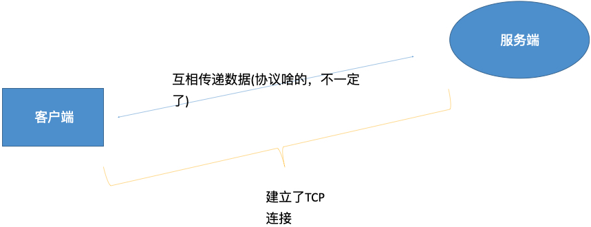

grpc 实战入门

[toc]

### 01. RPC入门、创建中间文件

#### 基本原理

RPC（Remote Procedure Call）远程过程调用，RPC 就是要像调用本地的函数一样去调远程函数。




#### 整体来讲

- 整个过程

 1、客户端 发送 数据（以字节流的方式）

 2、服务端接收，并解析。 根据 约定 知道要知道执行什么。然后把结果返回客户端

-  RPC就是 把  

1、上述过程封装下，使其操作更加优化

2、使用一些大家都认可的协议 使其规范化

3、做成一些框架。直接或间接产生利益

#### grpc

grpc就是一款语言中立、平台中立、开源的远程过程调用(RPC)框架gRpc 。

https://github.com/grpc/grpc-go

安装：`go get -u google.golang.org/grpc`

#### Protobuf

Google Protocol Buffer( 简称 Protobuf)

轻便高效的序列化数据结构的协议，可以用于网络通信和数据存储。

 特点：性能高、传输快、维护方便，反正就是**各种好，各种棒**

一些第三方rpc库都会支持protobuf  

- github地址：https://github.com/protocolbuffers/protobuf

- golang库所属地址：https://github.com/golang/protobuf

#### 安装

- 第一步来到这：

查看 https://github.com/protocolbuffers/protobuf/blob/master/src/README.md#c-installation---windows

继而安装https://github.com/protocolbuffers/protobuf/releases/latest

- protobuf相关文档

https://developers.google.com/protocol-buffers/docs/gotutorial

这是protobuf编译器，将.proto文件，转译成protobuf的原生数据结构

- go 插件

`go get github.com/golang/protobuf/protoc-gen-go`

此时会在你的 `GOPATH` 的 `bin` 目录下生成可执行文件。

`protobuf` 的编译器插件 `protoc-gen-go`

等下我们执行 `protoc` 命令时 就会自动调用这个插件。

-  `Goland` 插件

#### 创建中间文件

以 `.proto` 结尾的中间文件，`gin-grpc/pbfile/Prod.proto`

```
syntax = "proto3";
package services;
message  ProdRequest {
  int32 prod_id = 1;   // 传入的商品ID
}
message ProdResponse{
  int32 prod_stock = 1;// 商品库存
}
```

新建文件 `gin-grpc/services`，在目录 `gin-grpc/pbfile` 下

执行 `protoc --go_out=../services/ Prod.proto`。

`--go_out` 表示调用 `go` 插件， 指定生成的目录，最后是对应的原文件 `Prod.proto`。

这样在 `services` 目录下就生成了 `Prod.pb.go` 文件。

或者在根目录下执行 `protoc --proto_path=pbfile --go_out=services pbfile/Prod.proto` 指定 `proto` 文件的路径。

代码变动 [git commit](https://github.com/custer-go/learn-gin/commit/a744fd338089e1093db7b8d6bd7369284b2fc89f#diff-91be4e775403e5048a6fb19c931abd2fe591204782b7aab11e3ec104bec5825eR1)

### 02. 创建gRPC服务端并运行

上面做了一个 “中间文件”并生成对应的go文件，现在创建真正的服务。

#### 第1步：修改 `.proto` 文件

```protobuf
syntax = "proto3";
package services;
message  ProdRequest {
  int32 prod_id = 1;   // 传入的商品ID
}
message ProdResponse{
  int32 prod_stock = 1;// 商品库存
}
service ProdService {
  rpc GetProdStock (ProdRequest) returns (ProdResponse);
}
```

#### 第2步：重新生成 `.pb.go` 文件

之前执行的是 `protoc --go_out=../services/ Prod.proto`

现在执行的是 `protoc --go_out=plugins=grpc:../services Prod.proto`

或者在根目录下执行

 `protoc --proto_path=pbfile --go_out=plugins=grpc:services pbfile/Prod.proto`。

会自动覆盖之前生成的 `Prod.pb.go` 文件。

此时生成的文件 `Prod.pb.go` 主要变动是有两个接口

```go
// ProdServiceClient is the client API for ProdService service.
//
// For semantics around ctx use and closing/ending streaming RPCs, please refer to https://godoc.org/google.golang.org/grpc#ClientConn.NewStream.
type ProdServiceClient interface {
	GetProdStock(ctx context.Context, in *ProdRequest, opts ...grpc.CallOption) (*ProdResponse, error)
}
...
func NewProdServiceClient(cc *grpc.ClientConn) ProdServiceClient {
	return &prodServiceClient{cc}
}
...
// ProdServiceServer is the server API for ProdService service.
type ProdServiceServer interface {
	GetProdStock(context.Context, *ProdRequest) (*ProdResponse, error)
}
...
func RegisterProdServiceServer(s *grpc.Server, srv ProdServiceServer) {
	s.RegisterService(&_ProdService_serviceDesc, srv)
}
```

发布服务的时候，就需要新建个 `struct` 来继承这个 `interface{}` 接口，即实现 `GetProdStock(context.Context, *ProdRequest) (*ProdResponse, error)` 方法。

#### 第3步：新建具体的实现类

新建文件 `gin-grpc/services/ProdService.go`

```go
package services

import "context"

type ProdService struct{}

func (this *ProdService) GetProdStock(ctx context.Context, request *ProdRequest) (*ProdResponse, error) {
	return &ProdResponse{ProdStock: 20}, nil
}
```

#### 第4步：创建 grpc 服务端并运行

新建文件 `gin-grpc/server.go`

```go
package main

import (
	"gin-grpc/services"
	"google.golang.org/grpc"
	"net"
)

func main() {
	rpcServer := grpc.NewServer()
	services.RegisterProdServiceServer(rpcServer, new(services.ProdService))
	listen, _ := net.Listen("tcp", ":8081")
	rpcServer.Serve(listen)
}
```

代码变动 [git commit](https://github.com/custer-go/learn-gin/commit/0fe343ad58a6696c1cb6607f7e0c6f3f767cf084#diff-91be4e775403e5048a6fb19c931abd2fe591204782b7aab11e3ec104bec5825eL5)

### 03. 创建客户端调用

客户端可以新建一个工程，或者在当前工程下新建 `client` 文件夹表示客户端代码。

在客户端的代码中不需要使用中间 `.proto` 文件，只引用生成的 `.pb.go` 文件。

新建 `main.go` 来完成客户端调用代码

```go
package main

import (
	"context"
	"fmt"
	"gin-grpc/services"
	"google.golang.org/grpc"
	"log"
)

func main() {
	conn, err := grpc.Dial(":8081", grpc.WithInsecure())
	if err != nil {
		log.Fatal(err)
	}
	defer conn.Close()

	prodClient := services.NewProdServiceClient(conn)
	prodRes, err := prodClient.GetProdStock(context.Background(), &services.ProdRequest{ProdId: 12})
	if err != nil {
		log.Fatal(err)
	}
	fmt.Println(prodRes.ProdStock)
}
```

代码变动 [git commit](https://github.com/custer-go/learn-gin/commit/9646a03fa175f50299c830c8294159f9968cb061#diff-dc576b33b5093f4c968f2943df65b7a64afda74e81f771e62d310a3c77e525a5R1)

### 04. 自签证书、服务加入证书验证

在生成环境中不能使用自签证书，在云服务器中，单域名可以免费申请 ssl，或者购买。

Windows 下载 `openssl` 工具： http://slproweb.com/products/Win32OpenSSL.html

#### 第1步：生成 `.key` 私钥文件

`openssl genrsa -des3 -out custer.key 2048`

- `genrsa` : 生成 `rsa` 私钥
- `-des3`: `des3` 算法
- `2048`: 表示 2048 位强度
- `custer.key`: 私钥文件名

输入密码，这里输入两次。填写一样即可。随意填写一个。后续就会删除这个密码。

此时会生成 `custer.key` 这个文件。

#### 第2步： 删除密码

`openssl rsa -in custer.key -out custer.key`

注意这里目录和生成私钥的目录一致，会输入一遍密码。

#### 第3步：创建证书签名请求，生成 `.csr ` 文件

`openssl req -new -key custer.key -out custer.csr`

根据刚刚生成的 `key` 文件来生成证书请求文件。

执行以上命令后，需要依次输入国家、地区、城市、组织、组织单位、Common Name、Email和密码。其中Common Name应该与域名保持一致。密码我们已经删掉了,直接回车即可。

**温馨提示**Common Name就是证书对应的域名地址。

#### 第4步：生成自签名证书

根据以上2个文件生成crt证书文件，终端执行下面命令：

`openssl x509 -req -days 3650 -in custer.csr -signkey custer.key -out ssl.crt`

这里3650是证书有效期(单位：天)。这个随意。最后使用到的文件是key和crt文件。

到这里我们的证书就已经创建成功了(custer.key 和 custer.crt) 可以直接用到https的server中了。

> 需要注意的是，在使用自签名的证书时，浏览器会提示证书的颁发机构是未知的

#### 服务加入证书验证

创建新文件夹 `keys`，把没有密码的 `.key` 文件和 `.crt` 文件放入 `keys` 目录下。

#### 加入证书代码：服务端

```go
package main

import (
	"gin-grpc/services"
	"google.golang.org/grpc"
	"google.golang.org/grpc/credentials"
	"log"
	"net"
)

func main() {
	creds, err := credentials.NewServerTLSFromFile("keys/grpc.crt", "keys/grpc.key")
	if err != nil {
		log.Fatal(err)
	}

	rpcServer := grpc.NewServer(grpc.Creds(creds))
	services.RegisterProdServiceServer(rpcServer, new(services.ProdService))
	listen, _ := net.Listen("tcp", ":8081")
	rpcServer.Serve(listen)
}
```

#### 加入证书代码：客户端

```go
package main

import (
	"gin-grpc/services"
	"google.golang.org/grpc"
	"google.golang.org/grpc/credentials"
	"log"
	"net"
)

func main() {
	creds, err := credentials.NewServerTLSFromFile("keys/grpc.crt", "keys/grpc.key")
	if err != nil {
		log.Fatal(err)
	}
	rpcServer:=grpc.NewServer(grpc.Creds(creds))

	services.RegisterProdServiceServer(rpcServer, new(services.ProdService))
	listen, _ := net.Listen("tcp", ":8081")
	rpcServer.Serve(listen)
}
```

运行会报错

```bash
time="2020-11-18T12:54:48+08:00" level=fatal msg="rpc error: code = Unavailable desc = connection error: desc = \"transport: authentication handshake failed: x509: certificate relies on legacy Common Name field, use SANs or temporarily enable Common Name matching with GODEBUG=x509ignoreCN=0\""
```

如果出现上述报错，是因为 go 1.15 版本开始[废弃 CommonName](https://golang.org/doc/go1.15#commonname)，因此推荐使用 SAN 证书。 如果想兼容之前的方式，需要设置环境变量 GODEBUG 为 `x509ignoreCN=0`。

下面简单示例如何用 openssl 生成 ca 和双方 SAN 证书。

准备默认 OpenSSL 配置文件于当前目录

linux系统在 : `/etc/pki/tls/openssl.cnf`

Mac系统在: `/System/Library/OpenSSL/openssl.cnf`

第1步：cp 目录到项目目录进行修改设置

`cp /System/Library/OpenSSL/openssl.cnf /learn-gin/06.gin-grpc/keys`

第2步：找到 [ CA_default ],打开 copy_extensions = copy

第3步：找到[ req ],打开 req_extensions = v3_req # The extensions to add to a certificate request

第4步：找到[ v3_req ],添加 subjectAltName = @alt_names

第5步：添加新的标签 [ alt_names ] , 和标签字段 

```
[ alt_names ]
DNS.1 = *.org.custer.fun
DNS.2 = *.custer.fun
```

这里填入需要加入到 Subject Alternative Names 段落中的域名名称，可以写入多个。

第6步：生成证书私钥 test.key：

`openssl genpkey -algorithm RSA -out test.key`

第7步：通过私钥test.key生成证书请求文件test.csr：

`openssl req -new -nodes -key test.key -out test.csr -days 3650 -subj "/C=cn/OU=custer/O=custer/CN=custer.fun" -config ./openssl.cnf -extensions v3_req`

第8步：：test.csr是上面生成的证书请求文件。custer.crt/custer.key是CA证书文件和key，用来对test.csr进行签名认证。这两个文件在之前生成的。

第9步：生成SAN证书：

`openssl x509 -req -days 3650 -in test.csr -out test.pem -CA custer.crt -CAkey custer.key -CAcreateserial -extfile ./openssl.cnf -extensions v3_req`

现在 Go 1.15 以上版本的 GRPC 通信，就可以使用了

第10步：服务端 tls 加载

`creds, err := credentials.NewServerTLSFromFile("test.pem", "test.key")`

第11步：客户端加载

`creds,err := credentials.NewClientTLSFromFile("test.pem","*.custer.fun")`

学习参考链接

1. https://www.cnblogs.com/jackluo/p/13841286.html
2. https://blog.csdn.net/cuichenghd/article/details/109230584

代码变动 [git commit]()

