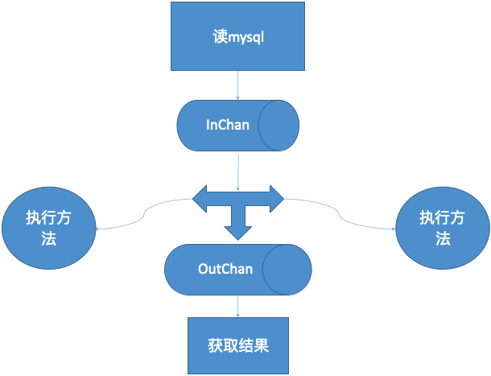

Go 高并发模型之管道模式

[toc]

### 01. 认识管道模式、最初级的代码

例子：Linux命令很经典的命令  `cat log.txt | grep 'abc'`

基本概念是：前面一个进程的输出（`stdout`）直接作为下一个进程的输入（`stdin`）。

可以使用程序实现**类似的模式**。

#### 从最简单的开始

假设有一个切片 `list:=[]int{2,3,6,12,22,16,4,9,23,64,62}`

有两步需求:

1、从里面找到偶数    

2、把偶数乘以10

```go
package main

import (
	"fmt"
)

// Evens 寻找偶数
func Evens(list []int) (ret []int) {
	ret = make([]int, 0)
	for _, num := range list {
		if num%2 == 0 {
			ret = append(ret, num)
		}
	}
	return
}

// Multiply 乘以 10
func Multiply(list []int) (ret []int) {
	ret = make([]int, 0)
	for _, num := range list {
		ret = append(ret, num*10)
	}
	return
}

func main() {
	nums := []int{2, 3, 6, 12, 22, 16, 4, 9, 23, 64, 62}
	fmt.Println(Multiply(Evens(nums))) // 函数的嵌套调用
}
```

如果换成 `Linux` 命令应该怎么敲 `Evens nums | Multiply`

最初级的封装

```go
func p(args []int,c1 Cmd,c2 Cmd) []int {
	 ret:= c1(args)
	 return c2(ret)
}
```

完整代码

```go
package main

import "fmt"

type Cmd func(list []int) (ret []int)

// Evens 寻找偶数
func Evens(list []int) (ret []int) {
	ret = make([]int, 0)
	for _, num := range list {
		if num%2 == 0 {
			ret = append(ret, num)
		}
	}
	return
}

// Multiply 乘以 10
func Multiply(list []int) (ret []int) {
	ret = make([]int, 0)
	for _, num := range list {
		ret = append(ret, num*10)
	}
	return
}

// p 模拟管道函数
func p(args []int, c1 Cmd, c2 Cmd) []int {
	ret := c1(args)
	return c2(ret)
}

func main() {
	nums := []int{2, 3, 6, 12, 22, 16, 4, 9, 23, 64, 62}
	//fmt.Println(Multiply(Evens(nums)))
	fmt.Println(p(nums, Evens, Multiply))
}
```

代码变动 [git commit](https://github.com/custer-go/learn-gin/commit/992e86154ef02f518a640b5f3ee72d53d3111a06#diff-e695b9090228290d541dcaaff7ccf49dc68debd598c1f2520f8d03afe27f98f7R1)

### 02. 使用 channel 改进管道模式

约定：

> 凡是支持管道模式的函数，其参数必须是 channel。返回 channel。

```go
package main

import "fmt"

type Cmd func(list []int) chan int
type PipeCmd func(in chan int) chan int //支持管道的函数

// Evens 求偶数
func Evens(list []int) chan int {
	c := make(chan int)
	go func() {
		defer close(c)
		for _, num := range list {
			if num%2 == 0 { //业务流程
				c <- num
			}
		}
	}()

	return c

}

// M10 乘以10
func M10(in chan int) chan int { //这个函数是支持管道的
	out := make(chan int)
	go func() {
		defer close(out)
		for num := range in {
			out <- num * 10
		}
	}()
	return out
}

//管道函数
func Pipe(args []int, c1 Cmd, c2 PipeCmd) chan int {
	ret := c1(args)
	return c2(ret)
}

func main() {
	nums := []int{2, 3, 6, 12, 22, 16, 4, 9, 23, 64, 62}

	ret := Pipe(nums, Evens, M10)
	for r := range ret {
		fmt.Printf("%d ", r)
	}
}
```

代码变动 [git commit](https://github.com/custer-go/learn-gin/commit/2949e84ca7cadf3cbc73fac5a0f0954c9c311f95#diff-e695b9090228290d541dcaaff7ccf49dc68debd598c1f2520f8d03afe27f98f7L2)

### 03. 管道模式性能对比，可变参数

目录 `v1` 是没有使用 `channel` ，目录 `v2` 是使用 `channel`。

模拟管道的函数 `Pipe` 修改为可变参数

```go
//管道函数
func Pipe(args []int, c1 Cmd, cs ...PipeCmd) chan int {
	ret := c1(args)
	if len(cs) == 0 {
		return ret
	}
	retlist := make([]chan int, 0)
	for index, c := range cs {
		if index == 0 { // 第一次执行
			retlist = append(retlist, c(ret)) // 第一个执行结果放入切片
		} else { // 第二次执行，获取结果切片中最后一个作为结果
			getChan := retlist[len(retlist)-1]
			retlist = append(retlist, c(getChan))
		}
	}
	return retlist[len(retlist)-1] // 返回结果切片中最后一个结果
}
```

代码变动 [git commit](https://github.com/custer-go/learn-gin/commit/e7dd79a999c07337d4eafef86233321a22c8e6c7#diff-e695b9090228290d541dcaaff7ccf49dc68debd598c1f2520f8d03afe27f98f7L1)

### 04. 管道模式之多路复用、提高性能

上面实现的程序，执行顺序是：**找偶数** => **偶数乘以10** => **偶数乘以2**

使用了 `channel` 之后的顺序：**找偶数** => **偶数乘以10** => **偶数乘以2**

-----------只要完成一个操作-----------↓-------- ↗----- ↓---------↗

-------------就放入channel---------channel -------channel

多路复用：               **找偶数**

----------------------------- ↓

-------------------------channel

---------------------↙ ----------- ↘

----------------**偶数乘以10** ----**偶数乘以10** 

多个同样的函数，同时对 `channel` 进行读值。

> 多个函数同时从同一个channel里读取数据。直至channel被关闭
>
> 可以更好的利用多核。

注意要把之前求偶数的函数 `Even()` 中，模拟等待操作时间注释掉

```go
//求偶数
func Evens(list []int) chan int {
	c := make(chan int)
	go func() {
		defer close(c)
		for _, num := range list {
			if num%2 == 0 { //业务流程
				//time.Sleep(time.Second * 1)
				c <- num
			}
		}
	}()
	return c
}
```

原来的管道函数

```go
// Pipe 管道函数
func Pipe(args []int, c1 Cmd, cs ...PipeCmd) chan int {
	ret := c1(args)
	if len(cs) == 0 {
		return ret
	}
	retlist := make([]chan int, 0)
	for index, c := range cs {
		if index == 0 {
			retlist = append(retlist, c(ret))
		} else {
			getChan := retlist[len(retlist)-1]
			retlist = append(retlist, c(getChan))
		}
	}
	return retlist[len(retlist)-1]
}
```

多路复用实现

```go
// Pipe2 多了复用
func Pipe2(args []int, c1 Cmd, cs ...PipeCmd) chan int {
	ret := c1(args)
	out := make(chan int)
	wg := sync.WaitGroup{}
	for _, c := range cs {
		getChan := c(ret)
		wg.Add(1)
		go func(input chan int) {
			defer wg.Done()
			for v := range input {
				out <- v
			}
		}(getChan)
	}
	go func() {
		defer close(out)
		wg.Wait()
	}()
	return out
}
```

 代码变动 [git commit](https://github.com/custer-go/learn-gin/commit/e6bbbf3c561ef06da7bff8d8bc7144b54075231f#diff-e695b9090228290d541dcaaff7ccf49dc68debd598c1f2520f8d03afe27f98f7L20)

### 05. 场景演练：从mysql导出到csv(上)

使用 `data.sql` 文件导入到数据库，创建 `csv` 文件夹。

需求：把book表全部取出出来

1、导入到文本文件中

2、每1000条 一个文件

首先初始化数据库 `AppInit/DBInit.go`

```go
package AppInit

import (
	"gorm.io/driver/mysql"
	"gorm.io/gorm"
	"log"
	"time"
)

var db *gorm.DB

func init() {
	var err error
	dsn := "root:root1234@tcp(localhost:3306)/test?charset=utf8mb4&parseTime=True&loc=Local"
	db, err = gorm.Open(mysql.Open(dsn), &gorm.Config{})
	if err != nil {
		log.Fatal(err)
	}
	// 获取通用数据库对象 sql.DB ，然后使用其提供的功能
	sqlDB, err := db.DB()
	if err != nil {
		log.Fatal(err)
	}
	// SetMaxIdleConns 用于设置连接池中空闲连接的最大数量。
	sqlDB.SetMaxIdleConns(10)
	// SetMaxOpenConns 设置打开数据库连接的最大数量。
	sqlDB.SetMaxOpenConns(100)
	// SetConnMaxLifetime 设置了连接可复用的最大时间。
	sqlDB.SetConnMaxLifetime(time.Hour)
}

func GetDB() *gorm.DB {
	return db
}
```

获取数据 `SELECT * FROM books ORDER BY book_id` 

分批取数据 `SELECT * FROM books ORDER BY book_id LIMIT ? OFFSET ?`

首先建立数据对象

```go
type Book struct {
	BookId   int    `gorm:"column:book_id"`
	BookName string `gorm:"column:book_name"`
}

type BookList struct {
	Data []*Book
	Page int
}
```

实现读取数据库的方法

```go
const sql = "SELECT * FROM books ORDER BY book_id LIMIT ? OFFSET ?"

func ReadData() {
	page := 1
	pageSize := 1000
	for {
		bookList := &BookList{make([]*Book, 0), page}
		db := AppInit.GetDB().Raw(sql, pageSize, (page-1)*pageSize).Find(&bookList.Data)
		if db.Error != nil || db.RowsAffected == 0 {
			break
		}
		err := SaveData(bookList)
		if err != nil {
			log.Println(err)
		}
		page++
	}
}
```

写入 CSV 文件方法

```go
// SaveData 写入到 csv 文件
func SaveData(data *BookList) error {
	file := fmt.Sprintf("./csv/%d.csv", data.Page)
	csvFile, err := os.OpenFile(file, os.O_RDWR|os.O_CREATE|os.O_TRUNC, 0666)
	if err != nil {
		return err
	}
	defer csvFile.Close()
	w := csv.NewWriter(csvFile) // 创建一个新的写入文件流
	header := []string{"book_id", "book_name"}
	export := [][]string{
		header,
	}
	for _, d := range data.Data {
		cnt := []string{
			strconv.Itoa(d.BookId),
			d.BookName,
		}
		export = append(export, cnt)
	}
	err = w.WriteAll(export)
	if err != nil {
		return err
	}
	w.Flush()
	return nil
}
```

获取数据 `getdata/getdata.go` 的完整代码

```go
package getdata

import (
	"encoding/csv"
	"fmt"
	"log"
	"os"
	"pipeline/AppInit"
	"strconv"
)

type Book struct {
	BookId   int    `gorm:"column:book_id"`
	BookName string `gorm:"column:book_name"`
}

type BookList struct {
	Data []*Book
	Page int
}

const sql = "SELECT * FROM books ORDER BY book_id LIMIT ? OFFSET ?"

func ReadData() {
	page := 1
	pageSize := 1000
	for {
		bookList := &BookList{make([]*Book, 0), page}
		db := AppInit.GetDB().Raw(sql, pageSize, (page-1)*pageSize).Find(&bookList.Data)
		if db.Error != nil || db.RowsAffected == 0 {
			break
		}
		err := SaveData(bookList)
		if err != nil {
			log.Println(err)
		}
		page++
	}
}

// SaveData 写入到 csv 文件
func SaveData(data *BookList) error {
	file := fmt.Sprintf("./csv/%d.csv", data.Page)
	csvFile, err := os.OpenFile(file, os.O_RDWR|os.O_CREATE|os.O_TRUNC, 0666)
	if err != nil {
		return err
	}
	defer csvFile.Close()
	w := csv.NewWriter(csvFile) // 创建一个新的写入文件流
	header := []string{"book_id", "book_name"}
	export := [][]string{
		header,
	}
	for _, d := range data.Data {
		cnt := []string{
			strconv.Itoa(d.BookId),
			d.BookName,
		}
		export = append(export, cnt)
	}
	err = w.WriteAll(export)
	if err != nil {
		return err
	}
	w.Flush()
	return nil
}
```

测试代码

```go
func testData() {
	start := time.Now().Unix()
	getdata.ReadData()
	end := time.Now().Unix()
	fmt.Printf("测试--用时:%d秒\r\n", end-start)
}

func main() {
	testData()
}
```

执行查看控制台 `测试--用时:2秒`

代码变动 [git commit](https://github.com/custer-go/learn-gin/commit/5c73fdf523f364f88b425ace8e716f0a82fc2b4a#diff-e7900fc44e9a2eed8b1239df19aa97ca20eace8e20a1122c7498d6a76b1176efR1)

### 06. 场景演练：从mysql导出到csv(下)-管道模式改造



#### 第1步：管道定义

1、管道入参(也就是管道连接点) `type InChan chan *BookList`

 2、结果集

```go
// Result 管道结果集，也就是 OutChan
type Result struct {
	Page int
	Err  error
}
```

3、管道数据输出  `type OutChan chan *Result`

#### 第2步：定义管道命令类型

`DataCmd` 读取数据源的方法类型 `type DataCmd func() InChan`

`DataPipeCmd` 管道方法的类型 `type DataPipeCmd func(in InChan) OutChan`

原读取数据源函数

```go
func ReadData() {
	page := 1
	pageSize := 1000
	for {
		bookList := &BookList{make([]*Book, 0), page}
		db := AppInit.GetDB().Raw(sql, pageSize, (page-1)*pageSize).Find(&bookList.Data)
		if db.Error != nil || db.RowsAffected == 0 {
			break
		}
		err := SaveData(bookList)
		if err != nil {
			log.Println(err)
		}
		page++
	}
}
```

修改读取数据源的方法，以返回 `InChan` 

```go
func ReadData() InChan {
	page := 1
	pageSize := 1000
	in := make(InChan)
	go func() {
		defer close(in)
		for {
			bookList := &BookList{make([]*Book, 0), page}
			db := AppInit.GetDB().Raw(sql, pageSize, (page-1)*pageSize).Find(&bookList.Data)
			if db.Error != nil || db.RowsAffected == 0 {
				break
			}
			in <- bookList
			page++
		}
	}()
	return in
}
```

#### 第3步：管道函数

```go
func Pipe(c1 DataCmd, cs ...DataPipeCmd) OutChan {
	in := c1()
	out := make(OutChan)
	wg := sync.WaitGroup{}
	for _, c := range cs {
		getChan := c(in)
		wg.Add(1)
		go func(input OutChan) {
			defer wg.Done()
			for v := range input {
				out <- v
			}
		}(getChan)
	}
	go func() {
		defer close(out)
		wg.Wait()
	}()
	return out
}
```

#### 第4步：执行函数

```go
// WriteData 执行管道的函数
func WriteData(in InChan) OutChan {
	out := make(OutChan)
	go func() {
		defer close(out)
		for d := range in {
			err := SaveData(d)
			out <- &Result{Page: d.Page, Err: err}
		}
	}()
	return out
}
```

添加测试函数

```go
func Test() {
	out := Pipe(ReadData, WriteData, WriteData, WriteData, WriteData, WriteData)
	for o := range out {
		fmt.Printf("%d.csv文件执行完成,结果:%v\n", o.Page, o.Err)
	}
}
```

```go
func testData() {
	start := time.Now().Unix()
	getdata.Test()
	end := time.Now().Unix()
	fmt.Printf("测试--用时:%d秒\r\n", end-start)
}

func main() {
	testData()
}
```

代码变动 [git commit](https://github.com/custer-go/learn-gin/commit/f1cd7935e5fd4d0d50d05c66d563f2fc96e14f1e#diff-e7900fc44e9a2eed8b1239df19aa97ca20eace8e20a1122c7498d6a76b1176efL3)

### 07. 一个相对通用的管道工具类封装

先封装了一个 `Pipe` 类

```go
package getdata

import "sync"

type InChan chan interface{}                  // InChan 管道入参
type OutChan chan interface{}                 // OutChan 管道数据输出
type CmdFunc func(args ...interface{}) InChan // CmdFunc 读取数据源的普通方法类型
type PipeCmdFunc func(in InChan) OutChan      // PipeCmdFunc 管道方法的类型
type Pipe struct {                            // Pipe 管道的定义
	Cmd     CmdFunc
	PipeCmd PipeCmdFunc
	Count   int
}

func NewPipe() *Pipe {
	return &Pipe{Count: 1}
}

// SetCmd 设置普通取数据方法
func (this *Pipe) SetCmd(c CmdFunc) {
	this.Cmd = c
}

// SetPipeCmd 设置管道的执行方法
func (this *Pipe) SetPipeCmd(c PipeCmdFunc, count int) {
	this.PipeCmd = c
	this.Count = count
}

// Exec 管道的实现
func (this *Pipe) Exec(args ...interface{}) OutChan {
	in := this.Cmd(args)
	out := make(OutChan)
	wg := sync.WaitGroup{}
	for i := 0; i < this.Count; i++ {
		getChan := this.PipeCmd(in)
		wg.Add(1)
		go func(input OutChan) {
			defer wg.Done()
			for v := range input {
				out <- v
			}
		}(getChan)
	}
	go func() {
		defer close(out)
		wg.Wait()
	}()
	return out
}
```

修改了 `getdata.go`

```go
package getdata

import "fmt"

type Book struct {
	BookId   int    `gorm:"column:book_id"`
	BookName string `gorm:"column:book_name"`
}

func (this *Book) String() string {
	return fmt.Sprintf("bookid:%d,book_name:%s\n", this.BookId, this.BookName)
}

type BookList struct {
	Data []*Book
	Page int
}

// Result 管道结果集
type Result struct {
	Page int
	Err  error
}
```

测试函数

```go
package getdata

import (
	"fmt"
	"pipeline/AppInit"
	"time"

	"log"
)

const sql = "select * from books order by book_id limit ? offset ?"

// GetPage 获取页码
func GetPage(args ...interface{}) InChan {
	in := make(InChan)
	go func() {
		defer close(in)
		for i := 1; i <= 80; i++ { // 第 1 页到 80 页
			in <- i
		}
	}()
	return in
}

// GetData 取数据源的普通方法
func GetData(in InChan) OutChan {
	out := make(OutChan)
	go func() {
		defer close(out)
		for d := range in {
			page := d.(int)
			pagesize := 1000
			booklist := &BookList{make([]*Book, 0), page}
			db := AppInit.GetDB().Raw(sql, pagesize, (page-1)*pagesize).Find(&booklist.Data)
			if db.Error != nil {
				log.Println(db.Error)
			}
			out <- booklist.Data
		}
	}()
	return out
}

// DoData 模拟处理数据，必须写成管道函数
func DoData(in InChan) OutChan {
	out := make(OutChan)
	go func() {
		defer close(out)
		for d := range in {
			v := d.([]*Book)
			time.Sleep(time.Second * 1)
			out <- fmt.Sprintf("处理了%d条数据,%d\n", len(v), time.Now().Unix())
		}
	}()
	return out
}
func PipeTest() {
	p1 := NewPipe()           // 新建一个管道
	p1.SetCmd(GetPage)        // 获取原始数据
	p1.SetPipeCmd(GetData, 5) // 5 表示多路复用
	out := p1.Exec()          // 执行管道

	//for item := range out {
	//	v := item.([]*Book)
	//	fmt.Println(v)
	//}

	p2 := NewPipe()
	p2.SetCmd(func(args ...interface{}) InChan {
		return InChan(out)
	})
	p2.SetPipeCmd(DoData, 2)
	out2 := p2.Exec()

	for item := range out2 {
		fmt.Println(item)
	}
}
```

代码变动 [git commit]()

