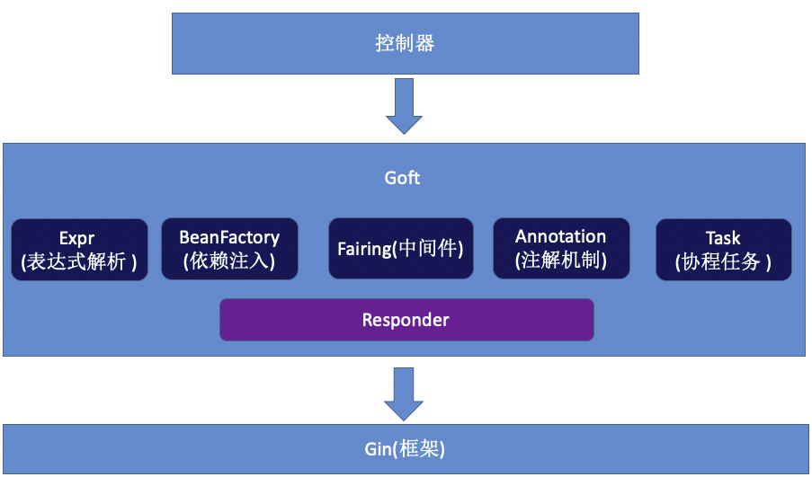

[toc]

jtthink 知识库 https://65480539.gitbook.io/jtthink/

Goft 脚手架使用文档 https://65480539.gitbook.io/goft/

Go微服务+领域驱动+K8s新版实训课开更(第一阶段)  https://65480539.gitbook.io/gop1/

### 01. 控制器的使用：返回String和JSON

基于成熟框架 `gin` 二次开发，或者在此上面做个脚手架 `goft`，定制业务等



安装 `go get -u github.com/shenyisyn/goft-gin@v0.4.1`

新建文件 `src/controllers/IndexController.go`

```go
package controllers

import (
	"github.com/gin-gonic/gin"
	"goft-tutorial/pkg/goft"
)

type IndexController struct{}

func NewIndexController() *IndexController {
	return &IndexController{}
}

// 返回 string
func (this *IndexController) Index(ctx *gin.Context) string {
	return "index"
}

// 返回 json
func (this *IndexController) IndexJSON(ctx *gin.Context) goft.Json {
  goft.Throw("测试异常", 500, ctx)
	return gin.H{"result": "index"}
}

func (this *IndexController) Name() string {
	return "IndexController"
}

func (this *IndexController) Build(goft *goft.Goft) {
	goft.Handle("GET", "/", this.IndexJSON)
}
```

新建启动程序 `main.go`

```go
package main

import (
	"goft-tutorial/pkg/goft"
	"goft-tutorial/src/controllers"
)

func main() {
	goft.Ignite().
		Mount("v1", controllers.NewIndexController()).
		Launch()
}
```

运行访问查看控制台

```bash
[GIN-debug] [WARNING] Running in "debug" mode. Switch to "release" mode in production.
 - using env:	export GIN_MODE=release
 - using code:	gin.SetMode(gin.ReleaseMode)

[GIN-debug] GET    /v1/                      --> goft-tutorial/pkg/goft.StringResponder.RespondTo.func1 (2 handlers)
[GIN-debug] Listening and serving HTTP on :8080
```

访问页面 http://localhost:8080/v1/ 可以看到

- 返回的 `string ` 是`index` 
- 返回的 `json` 是 `{"result":"index"}`
- 返回的 `error` 是 `{"error":"测试异常"}`

代码初始化 [git commit](https://github.com/custer-go/learn-gin/commit/c1390e3fbe9a54c55c647494422474595b21f6e4#diff-5e031c8fe909e21e054d942a61a9503aad9eed28cc4d7bd5718110d4a74cd23eR1)

### 02. 中间件的使用(1)：判断必要参数

考虑可能整合其他的框架，所以没有使用 `gin` 自带的中间件。

所以 `goft` 实现了一个简易的中间件。

接口：

```go
type Fairing interface {
  OnRequest(*gin.Context) error
  OnResponse(result interface{})(interface{}, error)
}
```

`OnRequest` : 执行控制器方法前，修改如头信息、判断参数等等。

`OnResponse` : 执行控制器方法后，可以修改返回值内容。

只要实现了这两个方法一律视为中间件。

新建文件 `src/middlewares/TokenCheck.go`

```go
package middlewares

import "github.com/gin-gonic/gin"

type TokenCheck struct{}

func NewTokenCheck() *TokenCheck {
	return &TokenCheck{}
}

func (this *TokenCheck) OnRequest(ctx *gin.Context) error {}

func (this *TokenCheck) OnResponse(result interface{}) (interface{}, error) {}
```

新增判断是否登录的逻辑

```go
package middlewares

import (
	"fmt"
	"github.com/gin-gonic/gin"
)

type TokenCheck struct{}

func NewTokenCheck() *TokenCheck {
	return &TokenCheck{}
}

func (this *TokenCheck) OnRequest(ctx *gin.Context) error {
	if ctx.Query("token") == "" {
		//goft.Throw("token required", 503, ctx) // 使用 throw 可以自定义 status code
		return fmt.Errorf("token required") // 自定义错误返回的 status code 是 400
	}
	return nil
}

func (this *TokenCheck) OnResponse(result interface{}) (interface{}, error) {
	return result, nil
}
```

把中间件增加到主函数 `main.go`

```go
package main

import (
	"goft-tutorial/pkg/goft"
	"goft-tutorial/src/controllers"
	"goft-tutorial/src/middlewares"
)

func main() {
	goft.Ignite().
		Attach(middlewares.NewTokenCheck()).
		Mount("v1", controllers.NewIndexController()).
		Launch()
}
```

访问页面 http://localhost:8080/v1/ 可以看到返回 400 `{"error":"token required"}`

访问页面 http://localhost:8080/v1/?token=123 可以看到正确的返回 `{"result":"index"}`

使用 `goft.Throw()` 自定义返回的 `status code` 可以看到页面返回 503

代码变动 [git commit](https://github.com/custer-go/learn-gin/commit/d7f1b95a28eee5674aa94a264c86182767950d9f#diff-5e031c8fe909e21e054d942a61a9503aad9eed28cc4d7bd5718110d4a74cd23eL3)

### 03. 中间件的使用(2)：修改响应内容

为了让返回的字段添加 `version`，可以使用 `OnResponse`，为了熟练使用中间件，

这里新建一个中间件 `src/middlewares/AddVersion.go`

```go
package middlewares

import (
	"github.com/gin-gonic/gin"
)

type AddVersion struct{}

func NewAddVersion() *AddVersion {
	return &AddVersion{}
}

func (this *AddVersion) OnRequest(ctx *gin.Context) error {
	return nil
}

func (this *AddVersion) OnResponse(result interface{}) (interface{}, error) {
	return result, nil
}
```

修改逻辑

```go
func (this *AddVersion) OnResponse(result interface{}) (interface{}, error) {
	if m, ok := result.(gin.H); ok {
		m["version"] = "0.4.1"
		return m, nil
	}
	return result, nil
}
```

在主函数 `main.go` 中增加中间件

```go
func main() {
	goft.Ignite().
		Attach(middlewares.NewTokenCheck(), middlewares.NewAddVersion()).
		Mount("v1", controllers.NewIndexController()).
		Launch()
}
```

访问 http://localhost:8080/v1/?token=123 可以看到通过中间件的方式**修改响应结果**

`{"result":"index","version":"0.4.1"}`

代码变动 [git commit](https://github.com/custer-go/learn-gin/commit/be5d2dd2702135835ca3e7c832d8739512cf6f09#diff-5e031c8fe909e21e054d942a61a9503aad9eed28cc4d7bd5718110d4a74cd23eL8)

### 04. 路由级的中间件(1):基本使用

`main.go` 中 `Attach` 是全局中间件，会在请求结束后，修改响应对象，加入 `version` 版本号。

```go
func main() {
	goft.Ignite().
		Attach(middlewares.NewTokenCheck(), middlewares.NewAddVersion()).
		Mount("v1", controllers.NewIndexController()).
		Launch()
}
```

下面针对 `/v1/test` 执行单独中间件，新增中间件 `src/middlewares/IndexTest.go`

```go
package middlewares

import "github.com/gin-gonic/gin"

type IndexTest struct{}

func NewIndexTest() *IndexTest {
	return &IndexTest{}
}

func (this *IndexTest) OnRequest(ctx *gin.Context) error {
	return nil
}

func (this *IndexTest) OnResponse(result interface{}) (interface{}, error) {
	if m, ok := result.(gin.H); ok {
		m["metadata"] = "index test"
		return m, nil
	}
	return result, nil
}
```

然后在控制器中修改

```go
package controllers

import (
	"github.com/gin-gonic/gin"
	"goft-tutorial/pkg/goft"
	"goft-tutorial/src/middlewares"
)

type IndexController struct{}

func NewIndexController() *IndexController {
	return &IndexController{}
}

// 返回 json
func (this *IndexController) Index(ctx *gin.Context) goft.Json {
	//goft.Throw("测试异常", 500, ctx)
	return gin.H{"result": "index"}
}

func (this *IndexController) IndexTest(ctx *gin.Context) goft.Json {
	return gin.H{"result": "index test"}
}

func (this *IndexController) Name() string {
	return "IndexController"
}

func (this *IndexController) Build(goft *goft.Goft) {
	goft.Handle("GET", "/", this.Index).
		HandleWithFairing("GET", "/test", this.IndexTest, middlewares.NewIndexTest())
}
```

针对路由的中间件拦截 `HandleWithFairing("GET", "/test", this.IndexTest, middlewares.NewIndexTest())`

访问页面 http://localhost:8080/v1/test?token=123 可以看到**路由级针对单独`url`中间件的执行 **

`{"metadata":"index test","result":"index test","version":"0.4.1"}`

代码修改 [git commit](https://github.com/custer-go/learn-gin/commit/8afdfce9d0ff57b6bb1393aa5e94b24c412be330#diff-18266a8616923f74411b54b15f0eb4eb72e8d9c6bfba34c4efeaf75aaa711d36L3)

### 05. 路由级的中间件(2):参数验证和业务分离（上）

场景 `GET /user/123` 得到用户 `ID = 123` 的用户信息。

新建一个用户控制器 `src/controllers/UserController.go`

```go
package controllers

import (
	"github.com/gin-gonic/gin"
	"goft-tutorial/pkg/goft"
)

type UserController struct{}

func NewUserController() *UserController {
	return &UserController{}
}

func (this *UserController) Name() string {
	return "UserController"
}

func (this *UserController) Build(goft *goft.Goft) {
	goft.Handle("GET", "/user/:uid", this.UserDetail)
}

func (this *UserController) UserDetail(ctx *gin.Context) goft.Json {
}
```

新增用户的模型 `src/models/UserModel.go`

```go
package models

type UserModel struct {
	UserId   int
	UserName string
}
```

一般是在 `func (this *UserController) UserDetail(ctx *gin.Context) goft.Json {` 控制器中写参数验证。

相对正规的验证方法是先写请求实体，使用 `gin` 原生验证

```go
package models

// UserDetailRequest 用户请求实体 使用 gin 原生请求验证
type UserDetailRequest struct {
	UserId int `binding:"required,gt=0" uri:"uid"`
}

func NewUserDetailRequest() *UserDetailRequest {
	return &UserDetailRequest{}
}

type UserModel struct {
	UserId   int
	UserName string
}

func NewUserModel(userId int, userName string) *UserModel {
	return &UserModel{UserId: userId, UserName: userName}
}
```

然后写业务逻辑

```go
func (this *UserController) UserDetail(ctx *gin.Context) goft.Json {
	req := models.NewUserDetailRequest()
	goft.Error(ctx.BindUri(req)) // 出错就自动抛出异常，没有错误就继续执行
	return gin.H{"result": models.NewUserModel(req.UserId, "testUserName")}
}
```

把控制器增加到 `main.go` 中

```go
func main() {
	goft.Ignite().
		Attach(middlewares.NewTokenCheck(), middlewares.NewAddVersion()).
		Mount("v1", controllers.NewIndexController(),
			controllers.NewUserController()).
		Launch()
}
```

访问 http://localhost:8080/v1/user/123?token=1 可以看到结果

```json
{
  "result": {
    "UserId": 123,
    "UserName": "testUserName"
	},
	"version": "0.4.1"
}
```

下面分离代码在控制器中仅仅处理业务，验证部分代码可以专门封装到中间件中，一旦以后参数验证规则发生改变，就不需要更改 `controller` 代码，只需要修改中间件或者替换中间件。

代码变动 [git commit](https://github.com/custer-go/learn-gin/commit/6b2e020b9ef9568c92c8c5dbb153ea467b1bcb13#diff-5e031c8fe909e21e054d942a61a9503aad9eed28cc4d7bd5718110d4a74cd23eL9)

### 06. 路由级的中间件(2):参数验证和业务分离（下）

由于现在有路由级的中间件，所以可以创建一个中间件 `src/middlewares/UserMiddleware.go`

```go
package middlewares

import (
	"github.com/gin-gonic/gin"
	"goft-tutorial/pkg/goft"
	"goft-tutorial/src/models"
)

type UserMiddleware struct{}

func NewUserMiddleware() *UserMiddleware {
	return &UserMiddleware{}
}

func (this *UserMiddleware) OnRequest(ctx *gin.Context) error {
	req := models.NewUserDetailRequest()
	goft.Error(ctx.BindUri(req))
	ctx.Set("_req", req)
	return nil
}

func (this *UserMiddleware) OnResponse(result interface{}) (interface{}, error) {
	return result, nil
}
```

参数验证放入中间件中，控制器只处理逻辑

```go
func (this *UserController) UserDetail(ctx *gin.Context) goft.Json {
	req, _ := ctx.Get("_req")
	return gin.H{"result": models.NewUserModel(req.(*models.UserDetailRequest).UserId, "testUserName")}
}
```

把中间件和路由匹配到一起

```go
func (this *UserController) Build(goft *goft.Goft) {
	goft.HandleWithFairing("GET", "/user/:uid", this.UserDetail, middlewares.NewUserMiddleware())
}
```

运行代码访问 http://localhost:8080/v1/user/2?token=1 可以看到和之前结果相同。

但是参数处理，和业务处理已经通过路由级中间件分离开来。

代码变动 [git commit](https://github.com/custer-go/learn-gin/commit/caa8cb0a29fd3407387a7dc7681568749db5d256#diff-fe3b020a336c7e0ea80e1ee4f700c33695d0a78c695d938e5b309e99e559e621L3)

### 07. 依赖注入和ORM 使用 (Gorm)

关于依赖注入，`goft` 使用的就是这个

**手撸IoC容器(golang)初级版本 **http://b.jtthink.com/read.php?tid=573&fid=2 

课程地址 https://www.jtthink.com/course/128

代码地址 https://github.com/shenyisyn/goft-ioc

连接字符串 --- 常规写法

新建文件夹 `src/configure/DBConfig.go`

```go
package configure

import (
	"gorm.io/driver/mysql"
	"gorm.io/gorm"
	"gorm.io/gorm/logger"
	"gorm.io/gorm/schema"
	"log"
	"os"
	"time"
)

type DBConfig struct{}

func NewDBConfig() *DBConfig {
	return &DBConfig{}
}

func (this *DBConfig) GormDB() *gorm.DB {
	newLogger := logger.New(
		log.New(os.Stdout, "\r\n", log.LstdFlags), // io writer
		logger.Config{
			LogLevel: logger.Info, // Log level
			Colorful: true,        // 彩色打印
		},
	)
	dsn := "root:root1234@tcp(127.0.0.1:3306)/test?charset=utf8mb4&parseTime=True&loc=Local"
	db, err := gorm.Open(mysql.Open(dsn), &gorm.Config{
		Logger: newLogger,
		NamingStrategy: schema.NamingStrategy{
			TablePrefix:   "t_", // 表名前缀，`User` 的表名应该是 `t_users`
			SingularTable: true, // 使用单数表名，启用该选项，此时，`User` 的表名应该是 `t_user`
		},
	})
	if err != nil {
		log.Fatal(err)
	}
	mysqlDB, err := db.DB()
	if err != nil {
		log.Fatal(err)
	}
	mysqlDB.SetMaxIdleConns(5)                   //最大空闲数
	mysqlDB.SetMaxOpenConns(10)                  //最大打开连接数
	mysqlDB.SetConnMaxLifetime(time.Second * 30) //空闲连接生命周期
	return db
}
```

修改 `main.go` 增加数据库连接的配置

```go
func main() {
	goft.Ignite().
		Config(configure.NewDBConfig()).
		Attach(middlewares.NewTokenCheck(), middlewares.NewAddVersion()).
		Mount("v1", controllers.NewIndexController(),
			controllers.NewUserController()).
		Launch()
}
```

修改`src/controller/UserController.go` 实现从数据库查询用户信息

```go
package controllers

import (
	"github.com/gin-gonic/gin"
	"goft-tutorial/pkg/goft"
	"goft-tutorial/src/middlewares"
	"goft-tutorial/src/models"
	"gorm.io/gorm"
)

type UserController struct {
	Db *gorm.DB `inject:"-"` // 依赖注入 - 表示单例模式
}

func NewUserController() *UserController {
	return &UserController{}
}

func (this *UserController) Name() string {
	return "UserController"
}

func (this *UserController) Build(goft *goft.Goft) {
	goft.HandleWithFairing("GET", "/user/:uid", this.UserDetail, middlewares.NewUserMiddleware())
}

func (this *UserController) UserDetail(ctx *gin.Context) goft.Json {
	req, _ := ctx.Get("_req")
	uid := req.(*models.UserDetailRequest).UserId
	user := &models.UserModel{}
	goft.Error(this.Db.Table("users").Where("user_id=?", uid).Find(user).Error)
	return user
}
```

访问 http://localhost:8080/v1/user/2?token=1 可以看到 `{"UserId":2,"UserName":"lisi"}`

代码变动 [git commit](https://github.com/custer-go/learn-gin/commit/4d8e0ff6954b8c450907907b0200d6d1f035c8df#diff-5e031c8fe909e21e054d942a61a9503aad9eed28cc4d7bd5718110d4a74cd23eL2)

### 08. ORM执行简化:直接返回SQL语句(GORM)

目录结构

```bash
├── README.md
├── go.mod
├── go.sum
├── main.go
└── src                            // 源码目录
    ├── configure                  // 若干个 config 对象
    │   └── DBConfig.go            // 返回需要注入到容器里的对象
    ├── controllers                // 控制器
    │   ├── IndexController.go
    ├── middlewares                // 中间件
    │   ├── AddVersion.go
    └── models                     // 模型包含请求实体和验证
        └── UserModel.go

```

上面访问 http://localhost:8080/v1/user/2?token=1 可以看到 `{"UserId":2,"UserName":"lisi"}`

修改代码`UserDetail ` `src/controllers/UserController.go` 直接返回 `SQL` 语句 `goft.SimpleQuery`

```go
func (this *UserController) UserDetail(ctx *gin.Context) goft.SimpleQuery {
	return "SELECT * FROM users WHERE user_id=2"
}
```

 代码变动 [git commit](https://github.com/custer-go/learn-gin/commit/dee7d9d26daaab08cb76502bb7e1aa957f14d5d4#diff-fe3b020a336c7e0ea80e1ee4f700c33695d0a78c695d938e5b309e99e559e621L4)

### 09. ORM执行简化:控制器直接返回SQL语句(XORM)

上面在控制器中直接返回 `SQL` 语句，下面适配 `xorm`

首先安装 `xorm` `go get xorm.io/xorm` 在文件 `src/configure/DBConfig.go` 中，

初始化 `xorm`

```go
func (this *DBConfig) XOrm() *xorm.Engine {
	engine, err := xorm.NewEngine("mysql", "root:root1234@tcp(127.0.0.1:3306)/test?charset=utf8mb4&parseTime=True&loc=Local")
	if err != nil {
		log.Fatal(err)
	}
	engine.DB().SetMaxIdleConns(5)
	engine.DB().SetMaxOpenConns(10)
	return engine
}
```

修改 `UserController.go`

```go
func (this *UserController) UserDetail(ctx *gin.Context) goft.Json {
	user := &models.UserModel{}
	_, err := this.Db.Table("users").Where("user_id=?", 2).
		Get(user)
	goft.Error(err)
	return user
}
```

访问 http://localhost:8080/v1/user/2?token=1 可以看到 `{"user_id":2,"user_name":"lisi"}`

直接返回 `SQL` 语句

```go
func (this *UserController) UserDetail(ctx *gin.Context) goft.SimpleQuery {
	return "SELECT * FROM users WHERE user_id=2"
}
```

修改 `XormAdapter` 适配器

```go
type XOrmAdapter struct {
	*xorm.Engine
}

func (this *XOrmAdapter) DB() *sql.DB {
	return this.Engine.DB().DB
}

func (this *DBConfig) XOrm() *XOrmAdapter {
	engine, err := xorm.NewEngine("mysql", "root:root1234@tcp(127.0.0.1:3306)/test?charset=utf8mb4&parseTime=True&loc=Local")
	if err != nil {
		log.Fatal(err)
	}
	engine.DB().SetMaxIdleConns(5)
	engine.DB().SetMaxOpenConns(10)
	return &XOrmAdapter{Engine: engine}
}
```

注入：

```go
type UserController struct {
	//Db *gorm.DB `inject:"-"` // 依赖注入 - 表示单例模式
	Db *configure.XOrmAdapter `inject:"-"`
}
```

这样就可以直接返回 `SQL` 语句或者 `JSON`

代码变动 [git commit](https://github.com/custer-go/learn-gin/commit/bb16f7e3d45fb284c29142b2c59cec7d094eb0c7#diff-2583763e3a634de0ff7874859a53ffbb3f375c2686c373cc1536ca5bae00b9b9L1)

### 10. 控制器返回SQL语句：支持参数

```go
func (this *UserController) UserDetail(ctx *gin.Context) goft.Query {
	return goft.SimpleQuery("SELECT * FROM users WHERE user_id=?").
		WithArgs(ctx.Param("uid")).WithFirst() // WithArgs 返回包含对象的数组，WithFirst 直接返回第一个对象
}
```

代码变动 [git commit]()